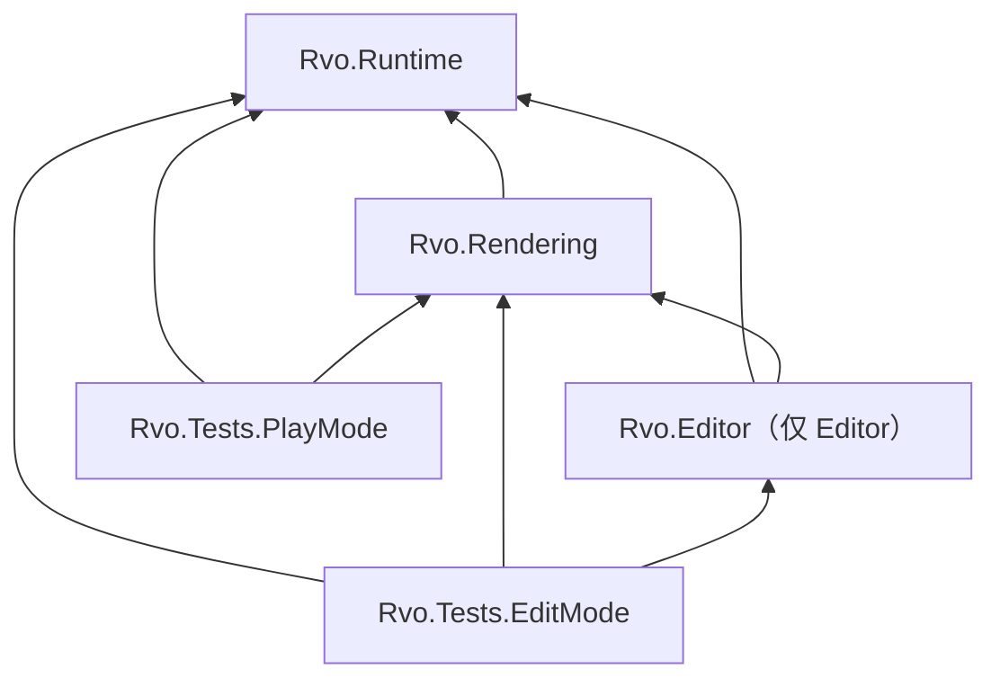
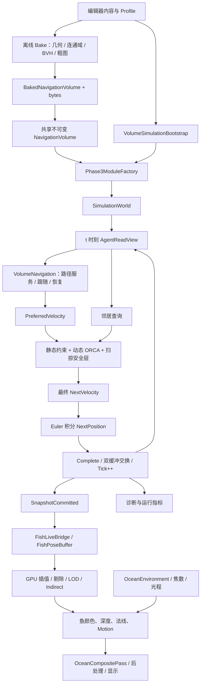

# 3D_RVO 项目整体结构与数据流

本文按 **2026-10-07 工作区中的实际代码与资产**整理，包含尚未提交的礁石多通路实现。它描述当前行为；阶段报告中的历史性能和测试结果仍以各自报告的代码、地图、日期为准。本次文档整理没有重新运行 Unity 仿真或性能测试。

本项目是一个 Unity 多智能体运动与展示实验：从 XZ 平面上的 VO/RVO/ORCA 对照，扩展到 XYZ 体素寻路、球体避障，再将真实仿真状态呈现为 GPU 鱼群和水下环境。核心目标是让大量个体能够在障碍空间内寻找路线、相互避让，并且可以分别观察算法正确性、寻路进度、CPU 成本和渲染成本。

阅读入口：

- [1. 项目范围与场景](#scope)
- [2. 目录与程序集](#layout)
- [3. 总体框架](#framework)
- [4. 核心数据与所有权](#data)
- [5. 从场景启动到世界创建](#startup)
- [6. 一个 Tick 的完整过程](#tick)
- [7. 地图的离线烘焙与加载](#bake)
- [8. 三维寻路与路径跟随](#navigation)
- [9. 邻居查询、ORCA 与安全检查](#avoidance)
- [10. 拥堵与恢复](#traffic)
- [11. 仿真快照到 GPU 鱼群](#rendering)
- [12. 水下环境与 Render Graph](#ocean)
- [13. 最新礁石场景的实际配置](#reef)
- [14. 诊断、测试与性能口径](#validation)
- [15. 扩展边界与后续阅读](#reading)

<a id="scope"></a>
## 1. 项目范围与场景

### 1.1 三条运行路径

| 路径 | 当前用途 | 核心组件 | 当前支持的算法 |
| --- | --- | --- | --- |
| 无地图二维实验 | 对照局部避障与对称停滞 | `SimulationBootstrap` + `Phase1ModuleFactory` | None / VO / RVO / ORCA；BruteForce / SpatialHash / KdTree |
| 二维导航 | XZ 障碍地图上的寻路、避障与交通恢复 | `SimulationBootstrap` + `Phase2ModuleFactory` | ORCA；BruteForce / SpatialHash / KdTree |
| 三维导航 | XYZ 体素地图、球体避障、真实 Live 鱼群 | `VolumeSimulationBootstrap` + `Phase3ModuleFactory` | None / ORCA；BruteForce / SpatialHash |

三个路径都使用 `SimulationWorld`、`AgentStorage` 和同一组阶段接口。三维 VO/RVO、三维 KDTree 当前没有实现；工厂会拒绝这些组合。三维 None 仍包含静态约束和静态扫掠保护，只关闭个体之间的动态避障。

另有 `FishRenderFixture` 合成运动夹具，专门测试渲染。它产生确定性位置和速度，不创建导航世界，也不运行 ORCA；最多 30000 条合成鱼不能作为 30000 个真实导航 agent 的成绩。

### 1.2 场景入口

下表路径均相对项目根目录；点击可打开对应资产。

| 场景 | 用途 |
| --- | --- |
| [OceanReefLive](../../Assets/RVO/Demo/OceanReef/OceanReefLive.unity) | 最新主展示：96 m 范围、多房间和多通口、默认 2048 条真实鱼 |
| [Phase3_Volume](../../Assets/RVO/Demo/Phase3_Volume.unity) | 三维算法调试：球体、体素切片、路径、选中 agent 的速度空间约束 |
| [Phase2_Navigation](../../Assets/RVO/Demo/Phase2_Navigation.unity) | 二维网格寻路与交通恢复对照 |
| [Phase13_Demo](../../Assets/RVO/Demo/Phase13_Demo.unity) | 早期 None / VO / RVO / ORCA 运动对照；文件名保留历史编号 |
| [Phase4_RenderOnly](../../Assets/RVO/Demo/Phase4_RenderOnly.unity) | 无海洋的合成 GPU 渲染夹具 |
| [Phase4_Live](../../Assets/RVO/Demo/Phase4_Live.unity) | 三维真实仿真到 GPU 鱼的基础桥接 |
| [Phase4_Ocean](../../Assets/RVO/Demo/Phase4_Ocean.unity) | 合成鱼与水下环境组合 |
| [Phase4_OceanLive](../../Assets/RVO/Demo/Phase4_OceanLive.unity) | 保留规则障碍的真实仿真与光学回归场景 |
| [Phase4_SurfaceStudy](../../Assets/RVO/Demo/Phase4_SurfaceStudy.unity) | 无导航的材质图案研究与图像对照 |

项目 [EditorBuildSettings.asset](../../ProjectSettings/EditorBuildSettings.asset) 当前只启用 `Assets/Scenes/SampleScene.unity`。在编辑器中直接打开 RVO 场景即可运行；普通 Build Settings 默认场景与 RVO 演示不同。`Phase4DemoBuilder` 的专用构建菜单显式选择对应演示场景。

### 1.3 环境与模型

版本来自 [ProjectVersion.txt](../../ProjectSettings/ProjectVersion.txt) 与 [manifest.json](../../Packages/manifest.json)：Unity 6000.0.63f1、URP 17.0.4、Burst 1.8.25、Collections 2.6.2、Mathematics 1.3.2。安装了 AI Navigation 包，但主导航实现是项目自己的网格/体素 A*。

核心用距离/秒表达速度，默认固定步长为 1/30 秒。二维个体是 XZ 圆盘，三维个体是球体；允许每 Tick 瞬时改变速度，没有加速度或转向半径约束。鱼形、摆尾和转向姿态属于表现层。主体运动没有逐鱼 Rigidbody、Collider 或 Transform 回写，也没有 ECS Entity 世界。

<a id="layout"></a>
## 2. 目录与程序集

```text
Assets/
  RVO/
    Runtime/
      Core/          参数、Agent 视图、SoA 双缓冲、提交快照
      Contracts/     主线程阶段调度接口
      Simulation/    World、时钟、模块工厂、基础运动与积分
      Scenarios/     初态、目标和随机配置
      Neighbors/     暴力、空间哈希、二维 KDTree、邻居缓冲
      Avoidance/     VO/RVO、ORCA 几何、二维/三维速度优化
      Navigation/    二维/三维地图、烘焙、A*、跟随、组合避障、交通恢复
      Diagnostics/   独立质量检查、运行指标、基准报告
      Unity/         Profile、Bootstrap、烘焙资产、调试显示、相机
    Rendering/       快照桥接、姿态、GPU 鱼、海洋、镜头、渲染基准
      Shaders/       Compute、鱼变形/PBR、焦散、接收面、光程与合成
    Editor/          场景/资产生成、重烘焙、调试 Inspector、测量和截图
    Tests/
      EditMode/      框架、几何、寻路、查询、恢复、表现数据测试
      PlayMode/      真实场景、控制、生命周期、GPU 像素/深度/采样测试
    Demo/            各阶段场景、Profile、地图、材质与网格
      OceanReef/     当前礁石主场景及专属资产
    Configurations/  Phase 1 的显式基准配置
  Settings/          项目通用 URP 资产
  Scenes/            Unity 原 SampleScene
Packages/            包版本与锁定信息
ProjectSettings/     Unity 项目设置
Documentation/RVO/   当前说明、专题设计、历史报告与复现脚本
  Verification/      报告对应的 XML、CSV、JSON、图像等原始证据
Verification/        部分测试在项目根目录生成的输出
```

`Library`、`Logs`、`Builds`、`.utmp` 是导入缓存、运行输出、构建或临时目录，不属于核心实现。

程序集依赖由 asmdef 明确规定：



[Runtime asmdef](../../Assets/RVO/Runtime/Rvo.Runtime.asmdef) 不引用 Rendering 或 URP；[Rendering asmdef](../../Assets/RVO/Rendering/Rvo.Rendering.asmdef) 引用 Runtime 与 URP。Runtime 程序集内部仍有 `Runtime/Unity` 的 MonoBehaviour/ScriptableObject 适配，不是全部纯 C#；其中 World 和算法内核不依赖场景或渲染对象。

名称容易混淆的两个文件：`Contracts/SimulationModules.cs` 定义接口；`Simulation/SimulationModules.cs` 定义持有五个模块的对象和 `Phase1ModuleFactory`。`Phase2ModuleFactory` 位于 `Navigation/GridNavigation.cs` 末尾，`Phase3ModuleFactory` 则有独立文件。

<a id="framework"></a>
## 3. 总体框架



这里分为四种责任：

| 层 | 解决的问题 | 关键输出 |
| --- | --- | --- |
| 全局导航 | 从当前位置到目标走哪条静态可行路线 | 路径、游标、期望速度 |
| 局部避障与安全 | 这一小步能用什么速度；整段运动是否会碰撞 | 最终速度、求解状态、安全缩放 |
| 状态推进 | 同步提交所有个体的新位置与速度 | 下一 Tick 的完整状态 |
| 表现 | 怎么朝向、摆尾、插值、选择网格和着色 | GPU 实例数据与屏幕像素 |

路径找到不等于马上能够运动，ORCA 不负责找到跨房间路线，GPU 剔除也不减少参与核心计算的 agent 数。画面中已经到达的个体仍存在于仿真世界，可能为别人让路；默认鱼的展示颜色不随到达状态变白，调试状态色可以另开。

<a id="data"></a>
## 4. 核心数据与所有权

### 4.1 SoA 与双缓冲

[AgentStorage.cs](../../Assets/RVO/Runtime/Core/AgentStorage.cs) 使用 SoA（同类字段连续存放的数组），并且由 World 独占：

| 数组 | 内容 | 一步内的读写方式 |
| --- | --- | --- |
| `ids` | 稳定身份 | 初始化后只读 |
| `positions` / `velocities` | 当前位置、当前速度 | 所有模块读取 t 时刻 |
| `goals` / `parameters` | 目标、Radius、MaxSpeed、ArrivalDistance | 当前步只读 |
| `preferred` | 跟随或直达目标产生的期望速度 | Preferred 阶段写、求解阶段读 |
| `nextVelocities` / `status` | 求解器输出 | 求解阶段全量覆盖，积分读 |
| `nextPositions` | 下一步位置 | 积分阶段全量覆盖 |

`Commit()` 交换当前/下一步的位置数组和速度数组，不逐个复制整批位置。不能先移动第一个 agent，再让第二个 agent 读取这个新位置，否则同一 Tick 的结果会依赖遍历顺序。

[AgentReadView](../../Assets/RVO/Runtime/Core/AgentData.cs) 是 NativeArray 的只读借用；`AgentSnapshot` 在其上附加 Tick、Generation、dt。两者都没有自动深拷贝：回调返回前若要跨 Tick 使用，必须复制到消费者自己的缓冲。

`World.DebugSnapshot` 特意保留**上一步输入**：邻居、Preferred 与约束都是基于那个输入求出来的。当前提交后位置对应 t+1，不能拿它直接解释 t 时刻的约束。三维调试通过 `VolumeAvoidanceSolver.CopyDebug()` 复制选中 agent 的平面、候选和最终速度。

### 4.2 身份、邻居和路径

稳定 `Agent ID` 和数组槽位是两个概念。初始化常用 `ID=i`，渲染夹具使用不连续 ID，姿态历史也按稳定 ID 查找。邻居缓冲中的 `Indices` 保存槽位，不能当成 ID。

[NeighborBuffers.cs](../../Assets/RVO/Runtime/Neighbors/NeighborBuffers.cs) 用 `N*K` 扁平数组存邻居索引与距离：`agentIndex*K+slot`。另有每 agent 的 Counts、DroppedCounts、CandidateCounts、BucketOccupancy。只有 Count 范围内的槽位有效，半径内超过 K 的数量必须报告。

`VolumePathInfo` 保存 AgentId、RequestId、MapVersion、Goal、Status、Count、Cursor、RequestedTick、ReadyTick。`VolumeNavigation` 单独拥有每个 agent 的路径数组，按实际长度从 `ArrayPool<float3>` 租用；搜索上下文按槽数共享，不为每个 agent 创建全图搜索工作区。

当前 `NavigationVolume.Version` 返回烘焙格式版本 `VolumeBake.FormatVersion`（2），不是每次改图都会自增的唯一内容版本。运行中的地图不可变，改图后重烘焙并重建 World；不能仅靠这个字段实施动态地图热更新。

### 4.3 资源归属

| 所有者 | 主要资源 | 释放方式 |
| --- | --- | --- |
| `SimulationWorld` | AgentStorage、NeighborBuffers、五个仿真模块 | 完成 pending Job 后 Dispose |
| `VolumeNavigation` | 搜索槽、Native BVH 查询、地标副本、跟随缓冲、恢复状态、租用路径 | 先搜索槽、再其借用的数据，归还路径数组 |
| `VolumeAvoidanceSolver` | 平面、候选、残差、并查集、安全桶与统计 | Dispose Native 容器 |
| `BakedNavigationVolume` | 解码的托管 NavigationVolume 缓存 | 资产实例缓存，Reset 复用 |
| `FishPoseBuffer` | Previous / Current / scratch、ID 历史 | Clear/Dispose，与核心内存独立 |
| `GpuFishRenderer` | GraphicsBuffer、间接参数、网格、材质、动画纹理、命令缓冲 | 停用/重建/销毁时释放自有资源 |
| `OceanEnvironment` / `CausticField` | 合成材质、双时刻焦散 RT | 停用时释放 |

<a id="startup"></a>
## 5. 从场景启动到世界创建

以 `OceanReefLive` 为例，入口是 [VolumeSimulationBootstrap.cs](../../Assets/RVO/Runtime/Unity/VolumeSimulationBootstrap.cs)。

1. `Start()` 调用 `ResetSimulation()`；组件重新启用也会重建。
2. 释放旧世界，通知 `PresentationCleared` 清空鱼表现，重置时钟和指标，Generation 增加。
3. `Profile.ValidateProfile()` 检查维度、算法、预算和烘焙资产。
4. 复制 `Profile.Simulation`，用 `CountForTier(AgentTier)` 覆盖运行数量；再应用 HUD 的后端/查询/算法覆盖值。这些运行选择不写回 Profile。
5. `BakedVolume.Load()` 校验并取得不可变地图，通常命中解码缓存。
6. [Phase3ModuleFactory.Create()](../../Assets/RVO/Runtime/Simulation/Phase3ModuleFactory.cs) 装配初始化器、导航、邻居查询、组合求解器与三维积分器。
7. `SimulationWorld` 分配持久数组，调用初始化器填入 ID、位置、速度、目标和个体参数，验证有限数值、速度上限和三维初始球体不重叠。
8. 建立 `VolumeRunMetrics`，可选初始化球体调试 Presenter，发布 Tick 0 快照。

Profile 分为 Simulation（核心步长/算法/查询）、Scenario（seed、半径、速度、初态）、Navigation（二维）、Volume（三维）、Benchmark、烘焙资产引用与数量档位。字段含义见 [SimulationProfile.cs](../../Assets/RVO/Runtime/Unity/SimulationProfile.cs)、[SimulationSettings.cs](../../Assets/RVO/Runtime/Core/SimulationSettings.cs)、[ScenarioSettings.cs](../../Assets/RVO/Runtime/Scenarios/ScenarioSettings.cs)。

运行数量尤其要看 Bootstrap：当前 Reef Profile 的 `Simulation.AgentCount=16` 是资产里的基础值，实际场景 `AgentTier=2`，因此启动数量是档位 z 的 2048。

鱼桥接组件在 `OnEnable()` 订阅提交和清空事件。如果订阅时世界已经创建，则主动捕获当前状态；如果世界尚未创建，等待 Tick 0 发布。这样不必依赖两个组件 Start 的先后顺序。

<a id="tick"></a>
## 6. 一个 Tick 的完整过程

### 6.1 渲染帧如何触发 Tick

`VolumeSimulationBootstrap.Update()` 将 `Time.unscaledDeltaTime` 交给 [FixedStepClock](../../Assets/RVO/Runtime/Simulation/FixedStepClock.cs)，按固定 dt 返回本帧要执行的步数。三维默认每帧最多追赶 2 Tick，可配置为 1–8。

超过追赶上限的整 Tick **会被丢弃并计入 DroppedTicks**，只保留小于 dt 的余量。它没有无限排队积压，性能不足时仿真累计时间会落后墙钟。修改最大追赶步数不会改变每步 dt。

暂停不调用时钟推进；单步显式推进一个 Tick。`PresentationAlpha` 用余量/dt 得到显示插值系数，暂停时为 1，显示最新端点。

### 6.2 World 内部步骤

[SimulationWorld.cs](../../Assets/RVO/Runtime/Simulation/SimulationWorld.cs) 的顺序固定：

```text
ScheduleStep()
  创建 StepContext(Tick, settings)，读取 t 时刻状态
  Ready → Scheduled
  PreferredVelocity.Schedule()
  Neighbors.Schedule(previousHandle)
  Avoidance.Schedule(previousHandle)
  Integrator.Schedule(previousHandle)
CompleteStep()
  pending.Complete()
  AgentStorage.Commit()：交换位置/速度双缓冲
  Tick++，写入本步计时，Scheduled → Ready
Bootstrap.StepOnce()
  Metrics.Observe()
  SnapshotCommitted(snapshot)
  可选独立 Quality 检查
  可选调试显示
```

`World.Step()` 是上述 ScheduleStep + CompleteStep 的同步组合。接口定义见 [Contracts/SimulationModules.cs](../../Assets/RVO/Runtime/Contracts/SimulationModules.cs)。接口只在主线程选择模块和调度；逐 agent 的 Burst 热循环使用具体 Job 结构与数组。

Reference 后端直接执行算法内核；JobsBurst 后端提交 Job。不要把“使用 Jobs”理解为整条流水线完全异步：当前 `VolumeNavigation` 的搜索推进/跟随需要同步结果，`VolumeAvoidanceSolver` 也会完成安全 Job 后更新统计；这些阶段内部有 `.Complete()`。搜索槽轮转是预算调度，也不是两条同时运行的 A* 工作线程。

当 `MeasureStages=true`，World 每阶段额外 Complete，测执行加等待的 wall time；关闭时阶段字段为 NaN，总耗时仍涵盖最后完成。阶段计时会影响同步成本。

World 状态是 Ready、Scheduled、Faulted、Disposed。Scheduled 不能读取展示快照或重复调度；异常进入 Faulted，Bootstrap 记录错误、释放世界并暂停。释放首先完成任务，避免 NativeArray 在 Job 使用时被销毁。表现提交订阅者的异常另行记录，不回滚已提交的 World。

<a id="bake"></a>
## 7. 地图的离线烘焙与加载

### 7.1 地图是几何图，不是 Physics 场景

当前最新礁石场景从 [ReefRouteLayout.cs](../../Assets/RVO/Editor/ReefRouteLayout.cs) 的规划长方体开始，[OceanReefBuilder](../../Assets/RVO/Editor/OceanReefBuilder.cs) 在这些体积内生成可视礁石，并把保守代理交给 `VolumeBake`。旧场景曾从网格 bounds 提取代理；最新内容采用先规划障碍体的流程。

运行时导航读取代理 AABB 与 BVH，不查询鱼的 Collider，也不实时扫描礁石三角形。保守代理包含可视网格，但可能挡住部分实际网格之外的空间。

[VolumeBake.Bake()](../../Assets/RVO/Runtime/Navigation/VolumeBake.cs) 做以下工作：

1. 根据 `Resolution*CellSize` 建立以原点为中心的立方导航域。
2. 将源 AABB 的 Min 向下、Max 向上对齐体素面，避免薄障碍落在格心之间而消失。
3. 按 `最大个体半径 + SafetyMargin` 膨胀障碍及域边界，标记不允许放置球心的格子。
4. 生成静态 BVH；空格先按轴向连接生成连通域，再用合法对角段合并，匹配最终 26 邻接的可达关系。
5. 若分辨率至少 64 且能被 8 整除，递归生成分辨率除以 8、cell 放大 8 的保守粗图；粗图无自由空间则保留完整细图。
6. 编码尺寸、净空、障碍、BVH、体素标签 RLE 和粗图，附 SHA256 校验。

`NavigationVolume` 的每个体素标签是 int：-1 表示不可通行，正值表示连通域。体素标签本身是稠密存储；A* 的已访问节点工作区才是稀疏且有容量上限的。这里没有完整的稀疏体素世界。

### 7.2 所有导航层共用净空规则

[NavigationVolume.SegmentClear()](../../Assets/RVO/Runtime/Navigation/NavigationVolume.cs) 对整条球心线段做边界与膨胀 AABB/BVH 检查。图边、端点连接、路径平滑和路径跟随都遵守该规则；Job 使用 [VolumeQuery](../../Assets/RVO/Runtime/Navigation/VolumeGeometry.cs) 的 Native BVH 版本。

静态净空以 AABB 各轴膨胀实现，相比精确球体对箱体圆角是保守近似。`Clearance()` 的距离也是保守 L-infinity 距离，不能当作精确欧氏 SDF。

### 7.3 资产链和失效条件

```text
ReefRouteLayout / 可视网格与代理
  → VolumeBake.Bake / Encode
  → ReefNavigation.bytes（TextAsset）
  → ReefVolume.asset（BakedNavigationVolume）
  → ReefNavigation.asset（SimulationProfile）
  → BakedNavigationVolume.Load / VolumeBake.Decode
  → NavigationVolume + 可选粗图
```

解码检查格式、校验、分辨率、cell、净空半径和安全余量。`BakedNavigationVolume` 缓存解码结果，Reset 不自动重新烘焙。障碍布局、导航尺寸、最大半径或安全余量变化后必须重烘焙；仅改变速度无需重烘焙。

烘焙菜单也有布局边界：`Phase3DemoBuilder.Bake()` 使用固定 `DenseDemoBoxes`，并不从选中场景提取几何；Inspector 的 Bake XYZ demo volume 和 Rebake Selected Phase 3 Profile 都调用它。Reef 的重建使用 `OceanReefBuilder`；自定义地图应显式向 `VolumeBake.Bake()` 提供自己的代理，不能把通用演示菜单当作任意场景烘焙器。

粗图地标表在首次使用时建立，并随共享托管地图复用；它不在 `.bytes` 内。Jobs 世界拥有一份 Native 地标副本供所有搜索槽读取。

<a id="navigation"></a>
## 8. 三维寻路与路径跟随

### 8.1 路径请求生命周期

[VolumeNavigation.cs](../../Assets/RVO/Runtime/Navigation/VolumeNavigation.cs) 同时承担路径服务管理与 `IPreferredVelocityProvider`：

| 状态 | 含义与后续行为 |
| --- | --- |
| Pending | 排队或预算内未完成；当前没有可跟随路径时 preferred 为零 |
| Ready | 已有路径，按游标/可见性跟随 |
| Arrived | 距离目标不超过 ArrivalDistance；若被推离目标，下一步重新请求 |
| NoPath | 图不连通或搜索耗尽，没有找到路线 |
| InvalidEndpoint | 当前起点或目标无法连接导航格；限频轮转重试 |
| CapacityExceeded | 搜索工作区容量耗尽；不伪装成 NoPath |

首次请求、目标变化、已到达后离开目标都会触发请求。目标变化会取消该 agent 正在执行的旧搜索并清除恢复状态。当前位置到目标若静态整段可见且没有活动拥堵代价，可以当 Tick 直接得到两点路径，不排队。

三维失败重试与二维不同：当前三维只自动重试 InvalidEndpoint；静态 NoPath/CapacityExceeded 等待新目标或 Reset。路径失去可见连接也会限频请求重规划。当前核心没有公开的动态改目标命令队列，不能在 Job 运行时直接写借用数组。

### 8.2 有预算的粗图优先 A*

`SearchSlots` 控制上下文数量，`SearchCapacity` 控制每槽访问节点上限。全场每 Tick 共用 `ExpansionsPerTick` 节点预算和 `RequestsPerTick` 完成请求预算，每次轮转推进一个槽最多 256 节点。直达路径不消耗排队搜索的完成额度。

当 `UseCoarseRoutes=true`、`HeuristicWeight>1` 且存在粗图，先搜粗图；粗搜索失败回退细图。粗障碍向外对齐得更保守，所以粗图失败不能直接推断细图无路。端点连接和平滑检查使用细图，粗图内部边使用粗图几何。

| 实现 | 搜索主体 | 关键数据 |
| --- | --- | --- |
| [VolumePathfinder](../../Assets/RVO/Runtime/Navigation/VolumePathfinder.cs) | 托管 Reference A* | 节点数组、二叉堆、Dictionary 稀疏索引 |
| [BurstVolumePathfinder](../../Assets/RVO/Runtime/Navigation/BurstVolumePathfinder.cs) | Burst 的有预算扩展 Job | Native 节点、堆、HashMap、搜索状态、每槽粗边缓存 |

图允许 26 个方向。每条边都验证连续净空，所以斜向连接不能穿过障碍角。基础启发式按坐标差排序 a≤b≤c，使用 `c+(sqrt(2)-1)*b+(sqrt(3)-sqrt(2))*a`，再乘 cell。粗图另外使用 [VolumeLandmarks](../../Assets/RVO/Runtime/Navigation/VolumeLandmarks.cs) 的 4 地标距离差下界，取两者最大值。

默认权重 1.5，偏向更快取得可行图路线；权重 1 会走细图精确 A* 对照。地图路径拉直和实际避障运动都可能改变行程，因此“图最短路”与“实际轨迹最短”是不同问题。当前没有 JPS/JPS+。

节点预算不是硬毫秒预算。直达检查、平滑、路径复制、跟随和恢复还有额外成本。`BurstVolumePathfinder.Advance()` 每次 Schedule 后立即 Complete，主线程仍负责队列、路径重建和存储。

### 8.3 路径如何变成速度

路径回溯后做带净空检查的拉直，存入池化数组。每 Tick 最多向 Native 跟随缓冲复制每 agent 的 5 个剩余拐点，而不是整个路径。

FollowJob 先验证当前 waypoint 可见性，再推进近点并选择可见的更远点；它不能抄近路跨过活动拥堵代价区。方向乘 `min(MaxSpeed, 剩余距离/dt)` 生成 preferred，接近目标时自动减速。

`PreferredSideBias` 在求解前加入较小的侧向偏好，接近目标时衰减；若偏置方向破坏前方可见性，则退回原路径方向。它没有在 ORCA 之后平滑速度，也不构成全局解堵保证。

一个 agent 的典型过程：出生后请求跨房间路线 → 排队得到粗图/细图路径 → 跟随器选择当前可见拐点 → ORCA 让开迎面鱼 → 扫掠层确认本 Tick 可行运动 → 提交新位置 → 继续推进游标 → 最终目标距离满足到达阈值。

<a id="avoidance"></a>
## 9. 邻居查询、ORCA 与安全检查

### 9.1 三种空间索引各自解决什么

| 结构 | 生命周期/对象 | 用途 |
| --- | --- | --- |
| 导航体素及粗图 | 离线生成、运行时不变 | 可达性与路径搜索 |
| 邻居 SpatialHash | 每 Tick 从个体当前位置重建 | ORCA 所需的范围内最近 K 个动态邻居 |
| 静态 BVH / 动态安全桶 | 静态 BVH 离线生成；安全桶每步重建 | 整段静态检查和潜在一步动态接触检查 |

`Simulation.CellSize` 是邻居哈希桶大小，`Volume.CellSize` 是导航体素边长；它们在当前礁石场景分别为 8 m 和 0.5 m。安全桶又独立依据半径、速度和 dt 推导大小，不能共用这三个参数的含义。

[SpatialHashNeighborSearch3D](../../Assets/RVO/Runtime/Neighbors/SpatialHashNeighborSearch3D.cs) 使用完整 `int3` key，负坐标通过 floor 正确分桶。查询遍历感知范围覆盖的桶，先剔除与球形范围不相交的桶，再做精确 XYZ 距离检查。最近 K 按距离平方、稳定 ID 排序，与 BruteForce 语义相同。

当需要遍历的空桶过多时，哈希查询精确回退全扫描。高密度桶、范围过大或小 N 下，哈希未必比暴力快；候选数与 DroppedCounts 是理解其成本与质量的重要指标。

### 9.2 速度空间求解

[VolumeAvoidanceSolver](../../Assets/RVO/Runtime/Navigation/VolumeAvoidanceSolver.cs) 包含每 agent 并行的 SolveJob 和全场 SafetyJob，不是仅一段 ORCA 公式。

1. 生成六个导航域边界平面。
2. 从 BVH 选择附近膨胀障碍的保守支撑平面。静态容量为 38，含 6 个域边界和最多 32 个障碍平面，保留更近约束并记录截断。
3. ORCA 模式下，为每个邻居调用 [OrcaGeometry3D.Build()](../../Assets/RVO/Runtime/Avoidance/OrcaGeometry3D.cs)，生成动态速度平面。
4. [VolumeVelocityOptimizer](../../Assets/RVO/Runtime/Avoidance/VolumeVelocityOptimizer.cs) 在最大速度球与半空间中寻找接近 preferred 的速度。
5. SafetyJob 对候选进行全步检查，必要时缩短运动，再输出最终速度。

每个三维约束的可行侧是 `dot(Normal, velocity) >= Offset`。这是**速度空间半空间**，不是礁石世界坐标表面。无接触的球体关系使用有限 TimeHorizon，已接触或重叠时几何构造使用真实 dt。锥轴、零向量和反向相遇使用稳定身份与参考轴处理退化。

动态责任比例为 `otherPriority/(selfPriority+otherPriority)`，双方比例互补；同等优先级各承担一半。三维速度优化是增量降维：速度球 → 约束平面内圆 → 平面交线上的区间。若组合约束不可行，先尝试仅满足静态硬约束，再对动态约束做 16 次二分共同松弛，返回 Fallback。静态自身不可行返回 Infeasible；非法数值返回 InvalidInput。

早期二维 VO/RVO 采用有限速度采样；二维独立 ORCA 的共同松弛策略也与导航组合求解不同。因此，不能把某一模式的回退结果和保证直接套用到所有场景。

### 9.3 为什么还需要独立扫掠层

ORCA 只使用感知范围内最近 K 个邻居，而静态平面也有数量上限。最终安全检查不能依赖这组已经截断的数据。

SafetyJob 做以下处理：

- 用 Native BVH 的 `SafeFraction()` 检查本 Tick 从 p 到 p+v·dt 的整条静态线段，取得碰撞前的安全比例。
- ORCA 模式下构建独立动态安全桶。桶边长来自最大 `Radius+MaxSpeed*dt`，枚举相邻 27 桶；Reference 后端遍历全 pair 作对照。
- 对潜在接触 pair 使用相对位移解首次接触时间，并拒绝物理重叠或非法输入状态。
- 按 `r_i+r_j+(speed_i+speed_j)*dt+0.002` 的潜在相互作用范围建立并查集连通分量。
- 每个分量取所有安全比例中的最小值，将分量内速度统一乘这个比例。远处分量不会因另一处分量受阻而全部停下。

统一比例很关键：如果只让一条鱼停车，另一条仍按原路径前进，停车后的新相对运动可能产生新的碰撞。分量内同步缩短时间前缀维持同一运动时序，但可能使拥挤连通群体一起减速，增加等待。

[VolumeEulerIntegrator](../../Assets/RVO/Runtime/Simulation/VolumeEulerIntegrator.cs) 最后仅执行 `nextPosition = position + chosenVelocity*dt`。积分器不再次改变速度、不投影位置、不传送个体；保护逻辑已在求解器输出前完成。

<a id="traffic"></a>
## 10. 拥堵与恢复

[VolumeTrafficRecovery.cs](../../Assets/RVO/Runtime/Navigation/VolumeTrafficRecovery.cs) 工作在 preferred 阶段，尝试改善停滞，不修改地图占据。

- 有运动意图但实际进展不足时累积 waiting；恢复进展后重置。每 15 Tick 更新基于等待时长的优先级，默认 30 Hz 下为半秒一次。
- 同样每 15 Tick 轮转协调，最多处理 8 个候选。寻找附近等待较久的高优先级个体，同分使用稳定 ID。
- 低优先级个体尝试两侧、上下、前后的六个方向，在约 5 倍自身半径处选择静态可见且不与其他个体/退让目标挤占的位置。
- 成功退让取得 2 秒租约，preferred 转向该位置；它仍必须经过 ORCA、静态约束和扫掠层。
- 等待超过 3 秒且满足冷却条件，可触发临时拥堵代价重规划。全场每 Tick 最多 4 个恢复请求，每个 agent 冷却 4 秒，代价区持续 8 秒。

恢复代价区位于行进前方约 4 倍半径，区域半径约 6 倍半径；穿过该区的搜索边成本乘 9，仍然可走。路径平滑和前瞻也避免直接穿过该区，减少搜索绕路后又抄回原瓶颈的情况。

这是一种局部等待老化、退让与限频重规划，没有全局时空预约或通口统一排队管理，不能保证任意密集布局最终到达。三维当前协调逻辑包含全体扫描，低频预算可以限制部分工作，但复杂密集场景仍有开销。

二维 [TrafficRecovery](../../Assets/RVO/Runtime/Navigation/TrafficRecovery.cs) 的通行带、优先级类别和租约规则与三维实现不同，详见 [二维交通设计](PHASE2_TRAFFIC.md)；不能把二维的八秒通行租约当成三维退让租约。

<a id="rendering"></a>
## 11. 仿真快照到 GPU 鱼群

### 11.1 桥接与姿态副本

[FishLiveBridge](../../Assets/RVO/Rendering/FishLiveBridge.cs) 监听 `SnapshotCommitted`，把每个已提交 Tick 传给 `GpuFishRenderer.Capture()`。即便一个显示帧追赶两个 Tick，两次提交都会打包，保持转向历史完整。Bridge 的 LateUpdate 更新插值系数，`GpuFishRenderer` 在执行顺序 100 的 LateUpdate 准备 GPU 数据。

[FishPoseBuffer](../../Assets/RVO/Rendering/FishPoseBuffer.cs) 在回调返回前用单个 Burst PackJob 完成复制，并持有 Previous、Current、scratch 和稳定 ID 历史表。它按速度推导朝向：零速保留历史方向，正常转向使用最短弧平行运输，反向采用历史 up 处理非唯一旋转轴，再正交化。

四元数统一半球，避免插值长绕圈。动画频率响应实际速度，振幅平滑，相位持续积分且跨周期处理。上述变化只影响显示，不写回 agent 速度。

C# `FishGpuData` 与 [FishData.hlsl](../../Assets/RVO/Rendering/Shaders/FishData.hlsl) 的结构必须保持一致，每条 64 B：

| 字节 | 字段 | 含义 |
| --- | --- | --- |
| 0–15 | PositionRadius | XYZ 位置、保守视觉包围球半径 |
| 16–31 | Rotation | 四元数 |
| 32–47 | Animation | 相位、振幅、频率、统一缩放 |
| 48–63 | Identity | stable ID、generation、flags、外观 seed |

视觉包围球考虑鱼形和摆尾，区别于核心碰撞半径。Arrived flag 根据当前位置与目标距离计算，停住不自动算到达；无效数据带 Invalid flag，由 GPU 排除。

### 11.2 上传、插值、剔除与 LOD

[GpuFishRenderer.cs](../../Assets/RVO/Rendering/GpuFishRenderer.cs) 的资源与执行流程：

```text
CPU FishPoseBuffer 的端点发生变化
  → 上传 Previous / Current（或复用旧 GPU Current）
每个显示帧
  → 保留前一显示姿态
  → FishCulling.compute 插值到 Prepared
  → 视觉包围球视锥检查 + 屏幕像素 LOD + 滞回
  → 向 4 个 AppendBuffer 写可见槽位
  → CopyCounterValue 写 4 个 indirect args 的 instanceCount
相机开始渲染
  → 注入 FishGeometryPass / 可选 FishMotionPass
  → 各桶 DrawMeshInstancedIndirect
```

连续单 Tick、相同身份/Generation 时，旧 GPU Current 正好是新 Previous，交换 buffer 后只上传新 Current。多 Tick 追赶、身份重排、资源重建时仍上传两个端点。没有新快照的显示帧不上传，只更新插值和可见性。

[FishCulling.compute](../../Assets/RVO/Rendering/Shaders/FishCulling.compute) 每组 128 线程，逐实例生成 Prepared。视锥判断用视觉球，LOD 按投影屏幕尺寸而非固定世界距离；历史按 slot 保存并校验 ID/Generation。裁掉一条鱼只影响绘制，核心仍处理它。

当前 GPU 状态 buffer 为 Previous、Current、Prepared、PreviousDisplay，均为 64N B；另有 16N B LOD 历史、四份可见索引共 16N B，以及四份平台间接参数。自有 buffer 有效载荷是 `288N + 4*IndirectDrawIndexedArgs.size`，不含网格、纹理、URP RT 和驱动分配。旧基础报告的 `224N` 是加入显示历史前的布局。

Compute 准备命令通过 `Graphics.ExecuteCommandBuffer()` 在 graphics queue 提交，随后几何纳入 Render Graph。当前没有异步 compute 队列，也没有常态 CPU 可见数量回读。

### 11.3 两条历史时间线

| 历史 | 含义 | 主要用途 |
| --- | --- | --- |
| 仿真 Previous / Current | 前后两个已提交 Tick 的姿态 | 30 Hz 仿真到显示帧的插值 |
| PreviousDisplay / Prepared | 前一显示帧与当前显示帧实际插值后的姿态 | MotionVectors / TAA |

显示帧可能处于两个 Tick 之间，因此仿真 Previous 不能代替上一显示帧。Generation、身份槽位、表示/容量、相机、投影变化、漏渲染帧或 camera cut 都会使显示历史失效。切镜头和切 AA 时还会重置 TAA 历史。

### 11.4 鱼形、动画与实验表示

[ReefFishMesh](../../Assets/RVO/Rendering/ReefFishMesh.cs) 是主场景的四级同源鱼形，442 / 242 / 116 / 72 顶点；包含身体、眼部、鳃、鳍和分叉尾，低级保留主体轮廓。颜色/种子区分条纹，多个个体共享网格与材质，不为每条创建 GameObject。

[ProceduralFishMesh](../../Assets/RVO/Rendering/ProceduralFishMesh.cs) 保留早期 200 / 128 / 72 / 32 顶点和 2056 顶点近景夹具；[FishAnimationBaker](../../Assets/RVO/Rendering/FishAnimationBaker.cs) 支持程序波形、VertexTexture 和 BoneTexture 对照。纹理由 renderer 共享持有，当前纹理实验针对同一单轴波形，并不代表完整 DCC 动画资产。

CrossQuads / CrossTriangles / Billboard 是解析卡片实验，默认不启用，ReefAppearance 路径始终使用 Reef 网格。当前主展示用 Mesh LOD、程序动画、MotionVectors 与默认 SMAA；TAA 为候选。LOD 滞回已实现，短时交叉淡化与 Hi-Z 遮挡剔除没有实现。

<a id="ocean"></a>
## 12. 水下环境与 Render Graph

### 12.1 相机局部装配

[OceanEnvironment](../../Assets/RVO/Rendering/OceanEnvironment.cs) 绑定一台 Camera，在 beginCameraRendering 中准备环境、设置光学参数、注入合成 Pass，在 endCameraRendering 清除环境启用标记。当前支持非 XR、无相机堆叠的单 Base Camera；跨相机并发共享参数没有完整支持/验收。

三个空间概念各自独立：导航域决定鱼可活动范围，水域 AABB 决定介质范围，`WaterSurfaceHeight` 决定平均水面高度。这个水面目前是光学截面参数，没有完整浪面网格、反射折射或流体模拟。

背景由空深度像素的方向渐变产生，不创建实体背景墙，也不参与导航或深度。`HorizonDistance` 定义背景光学远端，不用 Far Clip 冒充水内距离。SurfaceStudy 的强花纹内箱仅保留作材质实验。

### 12.2 焦散生成、采样与照明

[CausticField](../../Assets/RVO/Rendering/CausticField.cs) 拥有两张 256²/512² R16F RT、完整 mip 和环境时钟。环境到下一步时交换纹理，只生成新的下一端点；显示帧在两个时间端点间插值。可以 Off 或 DirectReference 对照，正常运行不回读。

焦散生成使用 [CausticPattern.hlsl](../../Assets/RVO/Rendering/Shaders/CausticPattern.hlsl) 和 [CausticGenerate.compute](../../Assets/RVO/Rendering/Shaders/CausticGenerate.compute)。[OceanCommon.hlsl](../../Assets/RVO/Rendering/Shaders/OceanCommon.hlsl) 在世界投影空间用三角随机纹理片混合打散重复：旋转/偏移只由空间决定，两张时间纹理使用同一变换，显式导数用于正确 mip。共享路径每个接收点取三个空间片、两个时间端点，合计六次基础纹理采样。

[UnderwaterLighting.hlsl](../../Assets/RVO/Rendering/Shaders/UnderwaterLighting.hlsl) 为鱼和岩石提供共同的主光 BRDF、阴影、太阳水内光程、三色环境光和焦散投影。焦散只调制直射光；[UnderwaterReceiver.shader](../../Assets/RVO/Rendering/Shaders/UnderwaterReceiver.shader) 的岩石层理/粗糙度和鱼的体色保持独立。

间接绘制没有普通 MeshRenderer 自动填写的全部逐对象主光/SH 数据，`GpuFishRenderer.BindLighting()` 显式补齐这些参数，避免鱼与岩石光照口径不一致。

### 12.3 一帧的几何与水下合成

| 阶段 | 资源与作用 |
| --- | --- |
| 焦散准备 | graphics queue 生成共享 RT，供接收面采样 |
| URP Prepass 后的鱼深度/法线 | `FishGeometryPass(prepass=true)` 根据真实 depth/normal 附件决定是否补写 |
| URP Opaque 后的鱼颜色 | `FishGeometryPass(prepass=false)` 写 active color/depth，按 LOD 桶间接绘制 |
| 水下合成、透明之前 | `OceanCompositePass` 读取未雾化颜色与本相机 sampled depth，写独立颜色目标并交换 cameraColor |
| 后处理之前的鱼 Motion | `FishMotionPass` 向 URP motion color 补鱼速度，以实际场景深度遮挡 |
| 后处理与输出 | 当前场景默认 SMAA；可切 None / TAA 候选 |

[FishGeometryPass](../../Assets/RVO/Rendering/FishGeometryPass.cs) 显式声明 Prepared、Visible、Args、阴影与深度/颜色/法线附件；颜色和各几何 Pass 共用变形。Copy Depth 路径与 Prepass 路径都要让后续合成读到真实鱼深度，否则鱼虽然可见，雾却按背景距离计算。

[FishMotionPass](../../Assets/RVO/Rendering/FishMotionPass.cs) 只在符合条件的单采样 Mesh 路径启用。鱼当前接收环境/主光阴影，但没有完整鱼实时投影 ShadowCaster 路径。

[OceanCompositePass](../../Assets/RVO/Rendering/OceanCompositePass.cs) 不原位读写颜色，不用全屏三角形覆盖几何深度。观察消光只算一次，鱼/岩石着色没有再叠一份 view fog。

### 12.4 光学模型

[WaterOptics.cs](../../Assets/RVO/Rendering/WaterOptics.cs) 与 [WaterOptics.hlsl](../../Assets/RVO/Rendering/Shaders/WaterOptics.hlsl) 使用世界距离：先求相机到接收点的线段与有限水域、独立水面以下空间的交段长度 d，再算 `T=exp(-sigma*d)`。

最终颜色由 [OceanFog.shader](../../Assets/RVO/Rendering/Shaders/OceanFog.shader) 合成：`C = C_surface*T + C_water*(1-T)`。太阳到接收点的光程影响直射照明，相机到接收点的光程影响观察透射，两条光路分别处理。

这是 RGB Beer 消光加经验水色，不是完整体积光输运；没有多次散射、物理波面聚焦或通用透明介质处理。环境使用自己的非缩放时钟，暂停仿真不会自动暂停水纹，环境有单独的暂停选项。

<a id="reef"></a>
## 13. 最新礁石场景的实际配置

以下来自当前 [ReefNavigation.asset](../../Assets/RVO/Demo/OceanReef/ReefNavigation.asset)、场景与 Builder，不沿用旧 64 m / 128³ 报告的参数。

| 配置 | 当前值/含义 |
| --- | --- |
| 数量档位与默认 | 128 / 1024 / 2048；场景默认最大档 2048 |
| 导航细图 | 192³，0.5 m，世界边长 96 m |
| 导航粗图 | 24³，4 m，与细图共用世界范围 |
| 障碍代理 | 48：32 分段礁带块 + 12 通口挡礁 + 3 岛礁 + 1 海床 |
| 布局 | 水平 3×3 房间，12 连接位置，各含上下开口，共 24 开口；房间内部可改变高度 |
| 出生/目标 | DistributedRooms；3×3×2 共 18 空间区域；终点循环覆盖其他 17 区域 |
| seed、dt | 7；1/30 秒 |
| 求解/查询/后端 | Full3D / ORCA / SpatialHash / JobsBurst |
| 动态查询 | K=48，NeighborDistance=16 m，哈希 cell=8 m |
| 动态视野与偏置 | TimeHorizon=2 s，PreferredSideBias=0.03 |
| 半径 | 基础 0.65，±30%，实际 0.455–0.845 |
| 最大速度 | 基础 5，±25%，实际 3.75–6.25 |
| 静态导航净空 | 最大半径 0.845 + Volume.SafetyMargin 0.08 = 0.925 m |
| 动态 ORCA 距离余量 | `Simulation.Vo.SafetyMargin=0.08`；与静态 Volume 余量是两个字段 |
| 到达距离 | 0.2 m |
| 寻路预算 | 2 槽，每槽容量 262144；4096 扩展/Tick，16 完成请求/Tick，weight=1.5 |
| GPU LOD | 60 / 22 / 7 像素阈值，20% 滞回，Reef 网格 |
| 水纹 | Shared512，30 Hz，强度 3.2，world scale=0.085，随机采样开启 |
| 镜头与 AA | 总览 / 跟拍 / 俯视；默认 SMAA，TAA 候选 |

起点按 `i%18` 分房，目标用 `startRoom+1+(i/18)%17` 循环。体型/速度通过 seed 与稳定 ID 的独立随机流采样，不消耗出生随机流；数量档位保留相同前缀。起点集合和目标集合分别检查两鱼半径和再加 0.3 m 间距，且选在最大连通域内。

所有体型共用按最大半径烘焙的图，较小鱼也使用同一保守静态净空；没有每种半径各一张导航图。改变体型范围需要同步重烘焙。

[ReefPathOverlay](../../Assets/RVO/Rendering/ReefPathOverlay.cs) 默认显示 18 条实际剩余路径，样本槽为 `sample*113 % agentCount`，每约 3 Tick 更新。它读取导航结果，不自行算路径；未就绪/已到达路线隐藏。18 区域是出生分布概念，18 条线是显示抽样，两者不保证一一对应。

[OceanPresentation](../../Assets/RVO/Rendering/OceanPresentation.cs) 负责专属 `OceanPipeline.asset`、AA 与镜头，退出恢复原质量管线。跟拍查询既有保守代理，遮挡时缩短镜头距离，改变的是相机。默认隐藏的代理立方体仅用于调试显示，显示开关不改导航。

<a id="validation"></a>
## 14. 诊断、测试与性能口径

### 14.1 四种时间和三种进度

| 指标 | 实际含义 |
| --- | --- |
| Tick / simulated seconds | 已执行步数、Tick*dt；与实际等待秒数可能不同 |
| CPU Tick ms | `World.Step()` 的调度、执行、同步等待与提交，不含整个画面 |
| wall-clock | 真实墙钟；取决于是否含初始化、编译、质量检查、渲染和限帧 |
| GPU / frame ms | GPU 有效时间戳或显示循环时间，必须分别报告 |
| First route ready | 各 agent 历史首次拿到路径的数量；不是当前 Pending 的反值 |
| First arrival | 曾经到达过的累计个体数 |
| Current arrived | 当前提交位置满足目标距离的个体数 |

当前 `VolumeRunMetrics.LongestWait` 统计有首路径、未到达且速度低于自身 MaxSpeed 的 10% 的连续时间；交通恢复内部的 waiting 则由“想运动但实际进展不足”计算。两者服务不同用途，不能视为完全相同的堵塞指标。

### 14.2 工具与测试

| 工具/测试 | 主要用途 |
| --- | --- |
| `BenchmarkRunner` | 早期纯仿真基准、配置快照、质量、CSV/JSON |
| `Phase3Performance` / `Phase3Validation` | 首路径等待、分阶段短测、到达矩阵 |
| `ReefPerformance` / `ReefRouteEvidence` | 当前最大档纯 CPU Tick、通口流量、出生与到达、安全观察 |
| `FishBenchmarkRecorder` | 渲染循环、打包、上传、CPU 准备调度、延迟 GPU 时间戳与元数据 |
| `FrameworkContractTests` / `Phase13Tests` / `Phase1AlgorithmTests` | 生命周期、双缓冲、运动、二维几何与后端对照 |
| `Phase2NavigationTests` / `Phase2OptimizationTests` / `TrafficRecoveryTests` | 二维路径、KDTree、约束与交通恢复 |
| `Phase3VolumeTests` / `ReefVariationTests` | XYZ 图/几何、Reference/Burst、粗细回退、大小/速度/房间/通口 |
| `Phase4PresentationTests` | 姿态、结构布局、变形与独立表现副本 |
| `Phase4GpuTests` / `OceanP0Tests` / `CausticSamplingTests` | 实际像素、索引、光程/深度/历史、随机纹理采样 |
| `ReefNetworkPresentationTests` | 实际 2048 场景、HUD、首路径与抽样路径生命周期 |

独立 [QualityEvaluator](../../Assets/RVO/Runtime/Diagnostics/QualityMetrics.cs) 做完整 pair 质量检查，有 O(N²) 开销。关闭 HUD 中的 Independent quality 不会关闭生产扫掠安全层。报告中的抽样零碰撞不等于逐 Tick、所有 pair 的独立证明。

测试和复现脚本会写证据；完整 EditMode 中 `Phase2ThroughputTests` 是普通测试，包含 16/256/1024 档测量，不能认为“Run All 只跑小测试”。准确用法见 [验证指南](VALIDATION.md)。

### 14.3 已留存的当前场景证据

[2048 多通路报告](VERIFICATION_REEF_NETWORK2048.md) 与 [原始 summary.csv](Verification/ReefNetwork2048/Final/summary.csv) 记录三次 1800 Tick：Tick P95 为 12.830–13.014 ms，2048/2048 在约 35.3 秒仿真时间全部到达，逐 Tick 静态扫掠违规为 0，每 30 Tick 抽样动态碰撞为 0，Tick 内主线程分配为 0 B。对应 [导航 XML](Verification/ReefNetwork2048/Tests/navigation.xml) 为 32/32，[实景 XML](Verification/ReefNetwork2048/Tests/presentation.xml) 为 1/1。

这组证据是已保存的 Editor、i7-12650H、seed 7、预热共享地图与地标的无渲染测量。本次文档工作没有重跑，不把 CPU Tick 分位数换算成可见 Player FPS，也不将一个布局/seed 的通过解释为普遍无死锁。

`FishBenchmarkRecorder` 的 GPU 时间戳可能缺失或重复，它只统计有效且不重复的延迟结果；-1 表示未取得有效样本。`submit_ms` 当前主要覆盖 GPU 准备命令的 CPU 调度，没有包含完整 Render Graph 几何执行，更不是 GPU draw 耗时。

<a id="reading"></a>
## 15. 扩展边界与后续阅读

### 15.1 当前边界

- 三维支持 None/ORCA 与暴力/哈希，未支持三维 VO/RVO/KDTree。
- 导航域有界、体素标签稠密、地图静态；没有大世界流式加载、任意凹 Mesh 精确体素化或动态障碍重烘焙。
- 局部恢复不提供普遍无死锁保证；瓶颈预约、全局任务分配、持续群游路线策略没有完整实现。
- 碰撞体为球/圆盘，视觉鱼鳍可能超出代理；没有动力学加速度、转向半径、真实水流耦合。
- 渲染主线是单基础相机、非 XR、单采样 opaque Mesh。卡片、TAA、VAT/Bone 是有边界的候选或对照，鱼实时投影、Hi-Z、多视图 atlas、透明介质和完整波面没有完成。
- 正式可见 Player 的有效 GPU 分项、热稳定规模矩阵、长期显存趋势和同轨迹 AA/LOD 质量对照仍需专门测量；历史短截图与 CPU 数据不替代这些结果。

后续优化应根据当前实测瓶颈选择。当前 2048 布局平均时间主要在邻居查询；首批路径与交通协调可能形成导航尾延迟。只更换 A* 或只降低鱼网格顶点，分别无法解决另一个层的成本。

### 15.2 按兴趣选阅读切口

| 想了解的问题 | 建议先读的源码 | 接下来可以深入的内容 |
| --- | --- | --- |
| 框架为什么这样拆 | [World](../../Assets/RVO/Runtime/Simulation/SimulationWorld.cs)、[调度接口](../../Assets/RVO/Runtime/Contracts/SimulationModules.cs) | 调度依赖、所有权、双缓冲、异常释放 |
| 三维路线怎么找 | [VolumeNavigation](../../Assets/RVO/Runtime/Navigation/VolumeNavigation.cs)、[Burst A*](../../Assets/RVO/Runtime/Navigation/BurstVolumePathfinder.cs) | 队列公平性、26 邻接、地标、粗细图、预算 |
| 怎么保证不穿墙/不对穿 | [组合求解器](../../Assets/RVO/Runtime/Navigation/VolumeAvoidanceSolver.cs)、[三维优化器](../../Assets/RVO/Runtime/Avoidance/VolumeVelocityOptimizer.cs) | 速度平面、硬约束、松弛、接触时间、同步缩放 |
| 鱼为什么会停下或让路 | [VolumeTrafficRecovery](../../Assets/RVO/Runtime/Navigation/VolumeTrafficRecovery.cs) | 等待、优先级、退让租约、拥堵代价 |
| 上千条鱼怎么绘制 | [GpuFishRenderer](../../Assets/RVO/Rendering/GpuFishRenderer.cs)、[FishCulling](../../Assets/RVO/Rendering/Shaders/FishCulling.compute) | Buffer、Append 索引、Indirect args、LOD |
| 为什么朝向/运动历史不抖 | [FishPoseBuffer](../../Assets/RVO/Rendering/FishPoseBuffer.cs)、[FishMotionPass](../../Assets/RVO/Rendering/FishMotionPass.cs) | 平行运输、相位、两个时间域、history 失效 |
| 水纹与水下颜色怎么形成 | [OceanCommon](../../Assets/RVO/Rendering/Shaders/OceanCommon.hlsl)、[UnderwaterLighting](../../Assets/RVO/Rendering/Shaders/UnderwaterLighting.hlsl)、[OceanCompositePass](../../Assets/RVO/Rendering/OceanCompositePass.cs) | 随机采样、mip、光路、RGB 透射、真实深度 |
| 场景如何生成 | [ReefRouteLayout](../../Assets/RVO/Editor/ReefRouteLayout.cs)、[OceanReefBuilder](../../Assets/RVO/Editor/OceanReefBuilder.cs) | 地图拓扑、保守代理、网格和资产同步生成 |
| 性能数字怎么看 | [ReefPerformance](../../Assets/RVO/Editor/ReefPerformance.cs)、[FishBenchmarkRecorder](../../Assets/RVO/Rendering/FishBenchmarkRecorder.cs) | 预热、采样、同步计时、覆盖范围、CPU/GPU 区分 |

[README](README.md) 负责快速操作与文档索引，[VALIDATION](VALIDATION.md) 负责检查与复现，[文档清理记录](DOCUMENTATION_CLEANUP.md) 说明本次移除和保留的依据。保留的阶段文档用于追溯具体设计取舍与历史证据，理解当前系统优先以本文和代码为准。
