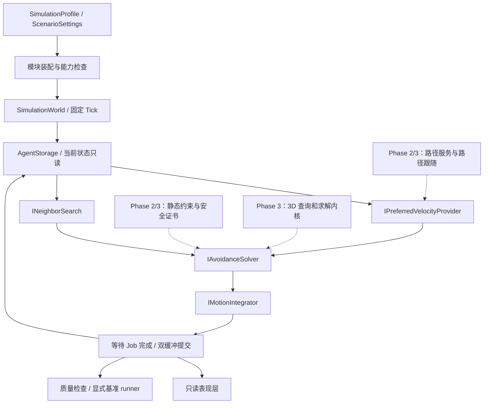

# 仿真架构、Phase 3 实现与表现层边界

2026-10-03：新增 `Rvo.Rendering → Rvo.Runtime` 单向程序集依赖。`VolumeSimulationBootstrap` 在每次提交后发布借用的 `AgentSnapshot`，不引用 Rendering；`FishLiveBridge` 在回调返回前完成表现层副本。渲染帧只使用自有 Previous/Current，GPU 插值、剔除与 LOD 不改写仿真。旧 `VolumePresenter` 继续服务调试场景。具体数据布局、执行顺序与验证边界见 [Phase 4 基础验证](VERIFICATION_P4_FOUNDATION.md)。

2026-10-01：Full3D 已实现并进入收尾。`Phase3ModuleFactory` 装配 `VolumeNavigation`、三维邻居、`VolumeAvoidanceSolver` 和 `VolumeEulerIntegrator`，复用同一 World 和 AgentStorage。下文 Phase 1/2 描述及迁移表保留为历史设计；当前验证见 [Phase 3 收尾记录](VERIFICATION_P3_CLOSEOUT.md)，GPU/VAT/海洋接口约定见 [PHASE4_PRESENTATION.md](PHASE4_PRESENTATION.md)。

三维导航由静态细/粗图、预算队列和池化路径组成。`VolumeLandmarks` 只为小型粗图生成 4 份 ALT 距离表，托管表随地图缓存；每个 Jobs 世界拥有一份只读 Native 拷贝，各搜索槽借用，释放槽后再释放共享表。细图回退不使用粗图下界。拥堵代价仍逐请求计算，不写入静态距离表。

`VolumePresenter` 读取提交后的坐标，以目标距离判断当前到达；状态变化时更新既有球体的顶点颜色。它不更改求解状态或物理半径，也不把速度为零视为到达。Phase 4 可替换球体绘制，调试线和核心保持独立。

Phase 2 通行协调扩展：`GridNavigation` 持有 `TrafficRecovery`，在路径跟随之后修改 preferred 与本步优先级，在局部退让之外按预算发起拥堵重规划；`GridAvoidanceSolver` 使用互补责任构造动态平面，静态约束与扫掠证书保持独立。失败请求限频轮转恢复，导航余量内只改变 preferred、不直接修改位置。表现层目标十字独立于路径开关，并缓存静态几何。详见 [交通与恢复设计](PHASE2_TRAFFIC.md)。

Phase 2 通过 `Phase2ModuleFactory` 接入原有 World：`NavigationGrid` 管离线烘焙占据、净空、连通域、静态 BVH 和共享 ALT/跳跃索引；`GridPathfinder` 管可恢复加权 A*；`GridNavigation` 管预算队列、四搜索上下文、池化路径与 Preferred；`GridAvoidanceSolver` 管动态 ORCA、静态硬约束和局部连通分量安全证书。`NeighborSearchFactory` 在 BruteForce / SpatialHash / KdTree 间选择。地图在一次运行中不可变。Unity 的 `GridMapPresenter` 只读取地图和路径。详细约定见 [Phase 2 设计](PHASE2_PLAN.md)。下文 Phase 1 算法约定仍适用于原有无地图模式。

## 1. 范围与坐标

Phase 1：无地图、无静态障碍、同一 XZ 平面上的圆盘 Agent。位置、速度、目标点统一使用 `float3`；`position.y = PlaneHeight`、`goal.y = PlaneHeight`、`velocity.y = 0`。2D 几何内核显式取 `(x,z)` 为 `float2`。Phase 3 才启用完整 XYZ 和球形 Agent。

`n × n × 1` 表示二维活动域，不要求 Agent 数为完全平方数，也不要求必须建立导航格子。100 / 1k / 10k 是实际 Agent 数。调试背景 Grid、邻居查询 Spatial Hash、导航 Grid 是三个不同概念，不能共用一套含义模糊的网格状态。

Phase 1 假设每步可直接改变速度，仅限制速度上界，不引入加速度、转向半径或 Rigidbody 碰撞响应。后续若加入动力学限制，需要同步修改可行速度域与安全性验证，不能在 ORCA 求解之后随意插值/截断速度并仍沿用原安全结论。

## 2. 模块关系



| 模块 | 职责 | 不承担 |
| --- | --- | --- |
| 配置 / 场景 | 固定参数、seed、初态和目标 | 每帧控制 Agent |
| World | 资源所有权、步骤顺序、Job 依赖、状态提交 | 避障公式、导航几何、绘制 |
| Preferred Velocity | 将当前目标/路径转成期望速度 | 判断相互避碰 |
| Neighbor Search | 从当前快照返回邻居索引 | 修改速度、求路径 |
| Avoidance Solver | 由当前速度、邻居与期望速度选择允许速度 | 移动 Transform、路径规划 |
| Integrator | 使用最终速度计算下一位置 | 二次改变求解速度、处理导航 |
| Presenter | 读取已完成的快照 | 向核心写回 Transform |
| Diagnostics / Benchmark | 质量统计、计时、报告 | 影响仿真决策 |

接口仅在主线程进行模块选择和调度。未来 Burst Job 内使用具体 unmanaged 结构和扁平数组，不在逐 Agent 热循环中调用托管接口。

## 3. 目录与依赖方向

```text
Assets/RVO/
  Runtime/
    Core/           设置、Agent 数据、SoA 存储
    Contracts/      各阶段调度契约
    Simulation/     世界生命周期、模块装配
    Neighbors/      邻居读写视图、扁平缓冲
    Avoidance/      几何约束；后续分别放 VO / RVO / ORCA / Optimization
    
    Scenarios/      可复现场景定义
    Diagnostics/   即时质量检查、指标和报告契约
    Unity/         ScriptableObject / MonoBehaviour 适配
  Editor/          安全创建配置和入口对象
  Rendering/       快照桥接、姿态历史、GPU Buffer/Indirect、鱼 Shader、渲染夹具
  Tests/EditMode/  框架、运动、几何、邻居查询、VO、质量调查
  Tests/PlayMode/  控制、生命周期、实际渲染
  Demo/            可直接运行的场景、6 个配置和材质
  Configurations/  菜单生成的资产（按需）
Documentation/RVO/
  README.md
  ARCHITECTURE.md
  ROADMAP.md
  VALIDATION.md
```

当前轻量渲染适配器在 `Runtime/Unity/AgentMeshPresenter.cs`；真正的 Job 放各自领域模块内。不要为了每个算法再建一套 World、Agent 或渲染器。

## 4. 数据契约

| 数据 | 内容与约束 |
| --- | --- |
| Agent ID | 初始化时唯一；与数组槽位区分；Phase 1 不动态增删 |
| Position / Velocity | 当前步只读；所有 Agent 同步读同一时刻 |
| Goal | Phase 1 固定世界坐标目标；到达后仍参与邻居查询 |
| AgentParameters | Radius、MaxSpeed、ArrivalDistance；默认同质，数据支持异质 |
| PreferredVelocity | 每步每个索引都写入；不可直接当作已避障速度 |
| NextVelocity / Status | 求解器每步全部覆盖；不得沿用上一帧未写槽位 |
| NextPosition | 积分器全部覆盖；完成后与 Current 交换 |
| Neighbor buffers | 固定 `N*K` 扁平数组，加 N 个 Count 与 DroppedCount |
| Constraint | 2D：`dot(normal, velocityXZ) >= offset`；3D 同样使用可行侧法线 |

邻居结果排除自己，不重复，按 `(距离平方, 稳定 ID)` 排序；只保留半径内最近 K 个，未保留数量写入 DroppedCounts。索引指向 Agent 数组槽位，不能把 ID 当数组索引。Count 之外的槽位视为无效，不能读取。

避免每 Agent 一个 List 或 NativeList。原生容器由 World 或对应模块唯一持有；视图是借用，调用者不得 Dispose、缓存到下一次提交之后或跨世界使用。`AgentReadView` 的数组只读，但不等于永久快照；若要留存回放，需显式复制。

Phase 1 固定 N 和 K，World 初始化和模块首次调度时分配持久缓冲，稳态不扩容。若未来允许动态增删，需要命令队列在 Tick 边界提交、稳定 ID 到槽位映射与 generation handle；不要直接在 Job 运行期间改 Count 或数组。

数值约定：统一世界距离/秒；拒绝 NaN/Infinity、非正半径/速度、非法时间参数；规范化法线；位置和速度误差分开在后续内核中定义。当前 Epsilon 是占位的基础数值容差，不应被直接复用为所有物理阈值。

## 5. 一步仿真与生命周期

顺序固定：初始化并验证 → 读 t 时刻快照 → Preferred Velocity → 邻居查询 → 求解全部下一速度 → 计算下一位置 → 完成 Job → 交换缓冲 → Tick++ → 绘制 / 统计。

不能一边遍历 Agent 一边把下一位置写回当前数组；否则求解结果依赖遍历顺序。调度使用串行依赖链；Reference 直接执行同一内核，JobsBurst 调度具体 unmanaged Job。MeasureStages 开启时逐阶段 Complete 计时，关闭时只在提交前 Complete。

World 状态：`Ready → Scheduled → Ready`；异常进入 `Faulted`，只允许释放并重新创建。`Scheduled` 时不能再次调度、读取可展示快照或修改数据。销毁必须先完成已调度任务，随后释放缓冲区和模块；模块释放要求幂等且不抛出异常。

模块调度契约：若 Schedule 在返回 JobHandle 之前失败，模块必须自行完成本次已提交但尚未交还 World 的任务。所有输入的分配器、长度、容量检查应在调度之前完成。

P1.1 驱动器使用独立 accumulator 和配置的 FixedDeltaTime。渲染帧率不决定仿真步长；交互模式限制每帧追赶步数并记录积压/丢步，压测模式按准确 Tick 数推进。暂停、单步、重置均发生在 Job 完成边界。场景切换、组件停用和异常路径都释放世界；不依赖全局静态实例。

## 6. 避障与求解边界

VO、RVO、ORCA 是可切换的独立算法模式，不是在同一帧内依次执行三个过滤器。None 是运动与计时对照组；None / VO / RVO / ORCA 均已实现。

VO / RVO 共用几何和候选速度评估组件，但分别保留自身速度障碍定义；ORCA 将约束构造与低维受限速度优化分开。2D 最接近期望速度的求解同时受半平面和最大速度圆限制。3D 切换为半空间和最大速度球约束，不能仅把 `float2` 换成 `float3`。

统一报告 Success / Fallback / Infeasible / InvalidInput，区分求解成功和退化处理。约束无解时如何选速度、初始重叠如何分离、零向量如何选方向，VO 在 P1.3 中已采用显式风险回退；ORCA 在 P1.5 中另行定义，不能复用未经验证的安全结论。停止不等于保证不碰撞。

仅在满足模型、邻居覆盖和求解前提时讨论 ORCA 的避碰性质。有限 K、有限查询距离、数值误差、初态重叠与不可行约束必须进入质量报告。算法依据见 [ORCA 原始项目](https://gamma-web.iacs.umd.edu/ORCA/) 与 [RVO2 官方文档](https://gamma-web.iacs.umd.edu/RVO2/documentation/2.0/)。

## 7. 邻居搜索与扩展

先用 BruteForce 建立正确性参考，再用 Spatial Hash 替换相同接口。Hash 的单元坐标用 floor(position / cellSize)，包含负坐标；保存完整整数坐标，不将有冲突的 hash 值误当唯一空间格子。

查询需覆盖 `ceil(neighborDistance / cellSize)` 的格子范围，再进行精确距离过滤，不能固定只搜周围 9 格。Phase 1 只枚举 XZ；Phase 3 才枚举 XYZ。cellSize 是性能参数，不是感知半径或导航格大小。

感知范围要与速度上界、时间视野、半径匹配；默认参数仅供开发。邻居截断会改变算法质量，性能对比须同时披露 K、距离和截断率。Hash 不保证所有密度下线性，极密集桶仍可能退化。

## 8. 后续升级路径

| 阶段 | 新增模块 | 保留内容 | 必须重新验证 |
| --- | --- | --- | --- |
| Phase 2 | 单层体素占据/净空/连通性、路径请求/缓存、体素 A*、路径跟随 Preferred、静态边界约束源 | World、Agent float3、动态邻居查询、表现和报告接口 | 路径可达性、墙角/窄道、导航边界与实际避障结果 |
| Phase 3（规划） | 基础三维体素、净空/连通域、3D A* 与跟随；球体邻居、ORCA Plane、3D 优化/积分、静动态扫掠与恢复 | 同一 World / float3 SoA、数据所有权、Tick、请求与模块边界 | 真正上下绕障、高度相遇、垂直回避、三维约束退化、瓶颈等待与性能 |
| Phase 4（预留） | 表现快照适配、GraphicsBuffer、GPU 剔除/LOD、间接绘制、VAT、URP 海洋 | 核心仿真、轻量 Debug、导航与避障结果 | 上传/释放、实例 ID、显示误差、CPU/GPU 分项与端到端开销 |
| 可选导航扩展 | 稀疏/分层图、任意 Mesh 体素化、局部更新/流式加载 | 路径跟随 → Preferred → ORCA 主链 | 不同半径通行性、地图版本/请求失效、平滑后净空 |

Phase 2 已采用单层体素导航，后续扩展完整 XYZ 体素空间；不以 NavMesh 作为主路线。体素占据、净空、连通性、路径和地图版本保持独立边界。当前避障的 Spatial Hash 与导航体素不共用职责。

静态障碍不是“速度为零、各承担一半责任”的普通 Agent。后续为墙段/多边形建立独立空间索引及约束构造，使用完整避让责任，并处理拐角和连续边界；无需改写动态 Agent 存储。

Phase 2 导航服务已输出带 requestId、agentId、mapVersion、路径状态的 waypoint 缓冲；Phase 3 沿用这些语义并改为 float3 waypoint。路径跟随器消费它并实现现有 Preferred 接口。导航和局部避障独立更新频率；路径过期、无路径和目标更新明确处理，不能让 ORCA 充当寻路器。

Jobs / Burst 接入采用 Unity 官方 [Job System](https://docs.unity3d.com/6000.0/Documentation/Manual/job-system.html) 的依赖与内存所有权规则。已接入可切换的 Reference / JobsBurst 后端。Preferred、查询、求解、积分按 Agent 并行；Hash 建桶采用单个 Burst Job。参考后端不经 Burst 编译，复用算法内核。每个 Agent 独占 N*K 中的 K 个槽位，保留容器生命周期/依赖检查；未关闭整个容器安全系统。


## 9. Phase 1 算法与诊断细节

- RVO 候选 `v` 映射成 `2v-v_self-v_other`，在原始有限时域 VO 上检测；与 VO 共用采样和风险排序，不对最终速度取平均。极坐标方向启动缓存，每 Agent 仅旋转方向，不在候选内计算三角函数。
- ORCA：按截断圆/锥腿投影计算修正 u，半平面经过 `v_self + u/2`。接触/重叠改用真实 dt；完全重合与零 w 使用稳定 ID 的相反方向。
- 增量二维优化器在最大速度圆内寻找最近 preferred 的可行点。无法满足时对所有单位法线约束做共同松弛，以 24 次二分近似最小最大违反量，返回 Infeasible；它与 RVO2 的 LP3 回退并不相同。非法法线/数值返回 InvalidInput。
- PreferredSideBias 是求解前的同手性方向偏好，0 为原始对照，演示切换值为 0.05；到目标附近衰减。它不改变求解出的速度，且不能保证解除所有停滞。没有位置投影、碰撞器纠正或求解后平滑。
- Spatial Hash 保存完整 int2 key，floor 处理负坐标，枚举 ceil(range/cellSize) 范围后精确过滤。空格枚举数超过 8N 时精确回退全扫描；统计反映实际候选数。最近 K 按距离平方/稳定 ID 插入排序，Hash 和 BruteForce 使用相同选择语义，另有独立排序测试。
- ORCA 原始约束存于持久 N*K 缓冲，并通过 StepDebugView 借用；诊断和 Scene 图读取求解时的原始约束。不得用主线程重新计算的浮点几何冒充 Burst 当时的约束，锥腿临界分支可能不同。
- 到达后的 Agent 仍承担对称互惠责任，可能被移动离开目标；没有优先级、全局路径或死锁消解系统。未到达且连续低于 0.05 m/s 达 2 秒才计入 stalled，未在 900 Tick 内到达不自动算死锁。
- BenchmarkRunner 显式调用，纯仿真计时与独立 O(N²) 质量检查分离。总计时包含完成 Job 的等待；逐阶段计时会增加同步开销。GC 字段仅覆盖 Step 主线程；Native 字段是有效载荷估算，不是分配器峰值。

Phase 2 静态障碍采用合并格子矩形的保守支撑平面，不等价于完整 RVO2 墙段/凸角约束。动态无解时仅松弛动态约束；独立安全层用静态 BVH 和动态扫掠哈希（Reference 为全 pair）计算安全前缀，触发后在本步潜在相互作用连通分量内统一缩放。不同分量互不拖停；积分器不二次改速。密集分量仍有退让和停滞风险。查询/路径跟随/组合求解/安全层/积分支持 JobsBurst，A* 搜索与路径服务管理为主线程。完整 XYZ 求解尚未实现。

## 10. Phase 3 与表现层的计划契约

先加独立三维装配和几何内核，按需要整理接缝，不重写 World 或预先泛型化所有 2D 算法。现有 Full3D 枚举和 float3 数据不意味着三维已经可用：暴力邻居、质量诊断、路径、Hash/KDTree 与积分仍有显式平面假设，必须逐项替换。

三维静态导航先使用小型稠密体素和 A*。导航边、连通域、路径平滑与跟随采用同一净空/扫掠规则。三维 Avoidance 将静态硬约束、动态 ORCA 和最终全步安全验证组合后输出速度，XYZ Integrator 只积分。三维优化变量是速度球内的 float3，ORCA Plane 表示速度空间半空间，不是世界空间障碍表面。

请求预算、失败重试、等待老化和公平性原则保留；三维退让位置与瓶颈通过关系重新定义。地图只读共享、搜索工作区限制上下文数；体素尺寸和工作区内存必须在创建时检查，不能直接复制二维的 512² 到 512³。

表现层始终在 Commit 后借用状态，若需要跨 Tick/GPU 使用则复制到自有缓冲；核心不持有 GraphicsBuffer 或动画状态。朝向、VAT、显示插值与 GPU 剔除仅改变呈现。World 的调试出口未来通过维度正确的调试提供者取得选中 agent 数据，解除当前对 OrcaSolver2D 的具体类型判断；不在常态每 Tick 保存全体 N×K 平面副本。
