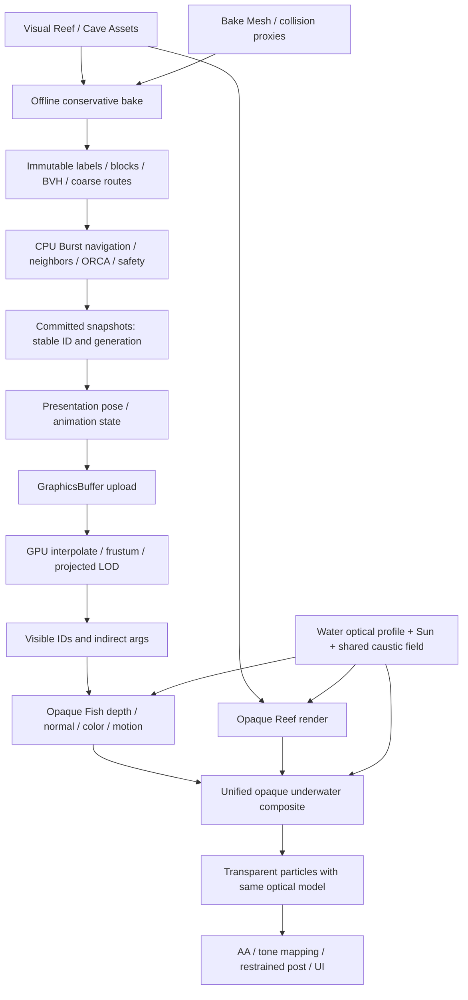

**OceanLive 视觉诊断与渲染架构重构规划**

审查日期：2026-10-04。审查代码基线：`f3d5911`；Unity 6000.0.63f1、URP 17.0.4。以下诊断保留为修改前证据；P0 后续实现与验证见 [P0 结构修正](OCEAN_P0_STRUCTURE.md)，后续礁石场景、PBR、motion/AA 与上传优化见 [P1/P2 展示推进](OCEAN_P1_P2_PRESENTATION.md)。P1/P2 已落地部分实现，尚未满足全部退出条件；P3 仍是规划。

本次阅读了 Rendering 目录全部 C#/HLSL/Shader/Compute、Phase4DemoBuilder、Phase3DemoBuilder、OceanLive 场景与材质、PC URP 配置、Phase4 的 EditMode/PlayMode 测试及历史验证记录；导航重点覆盖 VolumeBake、NavigationVolume、VolumeGeometry/VolumeQuery、VolumeNavigation、两版 VolumePathfinder、VolumeAvoidanceSolver、Phase3ModuleFactory、VolumeSimulationBootstrap、VolumePresenter。另核对项目缓存中的 URP Forward+/DepthNormal/RenderGraph/RealtimeLights 源码。

用户本轮未附新的 1024-agent 截图或实际参考链接，因此图像证据采用仓库 `Verification/Phase4Surface/Ocean-10000/frame.png`、`Regression/ocean.png`、`Regression/fish-Procedural.png`；第一张是 RenderOnly 合成 10000 鱼，不能冒称为 OceanLive 的 1024-agent 截图。Live 的参数与几何判断来自序列化场景和装配代码。本次没有运行 Unity、Frame Debugger、RenderDoc，也没有复跑测试。Shadertoy 页面抓取失败，图案分析依据仓库保存的移植源码及历史说明。

**1. 核心结论与按视觉收益排序的根因**

现有底座值得保留：只读快照、稳定 ID、GPU 插值、视锥剔除、屏幕尺寸 LOD、四桶 indirect draw，以及一次不透明水下合成。主要缺陷在美术语义与系统边界：背景被当作实体接收面；水体参数为展示花纹而弱化；鱼和场景采用不同光照；障碍从导航盒反向生成视觉内容；鱼的高模只增加分段，没有增加物种特征。

| 收益排序 | 根因与证据 | 直接后果 | 重构方向 |
|---|---|---|---|
| 1 | OceanEnvironment 创建世界固定 Cube，queue=2490、Cull Front；OceanSurface 把 `base + pattern*gain` saturate 成表面颜色，背景与障碍共用材质 | 满屏亮纹、六面硬转折、缺少视觉主次；雾中的实体箱壁依然是箱壁 | 去掉作为背景的实体深度，独立低频方向背景；Caustic 退出 albedo |
| 2 | Live Extinction=(0.001,0.0005,0.000375)，只有普通 Ocean 的 1/4；相机是几百单位外的调试全景镜头 | 远鱼仍保留大量原色，缺少距离分层；不能只靠调蓝色 | 固定世界单位、可见距离和艺术镜头，用定量透射率校准介质 |
| 3 | 鱼光向固定为 (-0.3,0.8,-0.5)，环境取场景主光；鱼无真实主光阴影/环境反射；两套 Caustic 投影与尺度 | 鱼与礁石像来自不同场景，洞里仍发亮；同一亮纹不连续 | 共用 Sun、光路衰减、shadow 和表面照明模型 |
| 4 | DenseDemoBoxes 的规则盒阵列，被 Phase4DemoBuilder 逐个生成 Cube | 算法关卡布局直接成为最终美术场景 | 从场景/碰撞代理离线烘焙导航，Debug Cube 独立开关 |
| 5 | DetailedNearMesh 只是 64×32 环形身体，2056 顶点；无眼、鳃、胸鳍结构、物种材质，尾/背鳍仍是平面 | 更多顶点并没有解决“树叶感” | 有明确轮廓的美术 Mesh、背腹材质、眼/鳃与解析游动 |
| 6 | 橙蓝按 hash 连续混色，到达直接变成 0.9 白；镜头继承 Phase3 远景；没有海洋生态构图 | 调试编码和均匀散点主导观看体验 | 展示/调试模式分离；自然群体路线、近中远层次、定向镜头 |
| 7 | AA=None、MSAA=1；LOD 2056→128 跃迁，只有滞回；动画 Caustic 高频与小鱼亚像素细节 | 闪烁、轮廓跳变、细鳍破碎 | 先过滤材质频率和校准 LOD，再选 AA/短过渡 |

第 6 项不能简化成“再加一个 boids 就行”：ORCA 负责避碰，不自动提供鱼群凝聚/对齐。若需要组织群游，在目标/路径/preferred 层设计共享路线与有限的凝聚/对齐，之后仍经过 ORCA 和安全层；不在最终速度之后加视觉随机位移使鱼穿礁。

另一个尺度问题：PC_RPAsset 的 ShadowDistance=50，而 Live 相机位于 (230,180,-330)、约距原点 441。主要导航区远超阴影距离；这会进一步削弱形体。应先设计近景镜头与级联预算，不能盲目把阴影距离拉到 3000。

**2. 对八项已有判断的裁定**

| 项目 | 裁定 | 修正 |
|---|---|---|
| 六面高频海洋破坏空间感 | 正确，应保留 | 不仅是平铺接缝，实体背景深度、法线明暗、亮纹颜色职责都错了；无缝纹理也不能消除实体房间感 |
| Caustic 是直接光调制 | 基本正确但实现方案应修改 | 是接收面辐照度变化；当前项目优先共用 world-space receiver lighting，不默认 Cookie，不乘整个最终颜色 |
| 多层/warp 去重复 | 基本正确但实现方案应修改 | world space 已存在；非整数缩放只是延长组合周期。首先降低对比/可见范围并过滤，再考虑第二层 |
| Beer/RGB 与 Pass 可能有问题 | 部分判断可能错误 | RGB Beer 已实现；代码顺序支持鱼在 Fog 前。尚无鱼深度/数值雾化的充分运行时证据；弱衰减已被代码证实 |
| 复杂 Mesh 离线 voxelize | 正确，应保留，但工程量被低估 | 现有 bake 只收 VolumeBox；查询/静态半空间依赖 BVH，不能只替换体素标签 |
| 近景 Mesh，远景简化 | 正确，应保留；固定四层存在更优方案 | 当前默认已经是 Mesh，卡片关闭；analytic swimming 优先，VAT 与交叉卡不必成为必经层 |
| Navigation/Visual Bounds 解耦 | 正确，应保留 | 尺寸已不同，但 WaterDistance、光路深度和背景仍共享 Ocean AABB；还要拆出 WaterDomain、WaterSurfaceHeight |
| 后处理最后做 | 基本正确但实施次序应修改 | Bloom/调色最后；线性 HDR、MotionVectors 的数据契约须提前建立。SMAA 只是低风险基线，MSAA/TAA 要对照 |

**3. Beer Fog：保留合成职责，重做介质定义与证据**

`OceanCommon.hlsl:17` 已做相机到片元线段与 AABB 求交，得到水内欧氏距离；`:44` 已做逐 RGB 的 Beer 合成。它不是只对 eye-Z 做指数，也不是单通道蓝雾。

Live 当前纯水内路径的透射率：

| d（世界单位） | T_R | T_G | T_B |
|---:|---:|---:|---:|
| 100 | 0.905 | 0.951 | 0.963 |
| 300 | 0.741 | 0.861 | 0.894 |
| 600 | 0.549 | 0.741 | 0.799 |

这是远鱼依然鲜明的充分可能解释，无须先假定它漏过 Fog。不能因水箱做大而自动把消光除以四；只有整个世界的物理尺度映射一起改变时，这种缩放才有明确语义。

以展示距离校准参数比凭感觉改 RGB 更可审查：若目标是在 d=100 时达到 T=(0.1,0.3,0.5)，则 sigma_t=-ln(T)/100≈(0.0230,0.0120,0.00693)。这只是艺术标定例子，不是推荐直接复制的真实海水常数。先确定鱼长、相机距离与单位，再定水体清澈程度；不要在 441 单位外的旧镜头上直接加浓雾，把所有导航内容抹掉。

严格的介质表达应为：

`T = exp(- integral(sigma_t(s), ds))`

`L_camera = T_view * L_surface + integral(T(0,s) * sigma_s(s) * L_incident(s) * phase(s), ds)`

sigma_t=sigma_a+sigma_s。`Cwater*(1-T)` 可保留为均匀介质/近似常量源项的经验实现；它不是完整 scattering。RGB 红光更快衰减适合作为本项目清澈蓝青水的默认，但蓝绿相对衰减取决于水质，不把固定排序当成所有海水定律。[PBRT Transmittance](https://pbr-book.org/4ed/Volume_Scattering/Transmittance)、[Equation of Transfer](https://www.pbr-book.org/4ed/Light_Transport_II_Volume_Rendering/The_Equation_of_Transfer)。

必须区分两段光路：太阳→接收面影响表面光照，接收面→相机影响观察透射。当前只有 Caustic 振幅按 `exp(-depth*0.006)` 衰减，鱼的基础直射/固定 ambient 未按水深变化。两段都衰减并不是重复雾化；把同一段 view extinction 在 Fish 和 fullscreen 各做一次才是错误。

| 路线 | 一致性/成本 | 本项目选择 |
|---|---|---|
| 不透明场景一次 fullscreen depth fog | 鱼和静态场景共享一次可见像素处理；成本主要随分辨率增长；依赖正确 depth | 默认保留，通过独立 Ocean Renderer Feature 管理 |
| 每个 Fish shader 自算 view extinction | 不依赖 depth copy，但可能对重叠鱼反复算，容易和背景/地形模型分叉 | 不作为鱼绕过管线问题的补丁；仅透明材质或受控替代路径使用 |
| Renderer Feature | 是组织 Render Pass 的方式，不是与 fullscreen fog 平级的光学算法 | 用 RenderGraph 明确资源和相机范围；保留当前独立输出后换 cameraColor 的做法 |
| 高度/深度变化 | 允许水下上下层次、太阳光随水深减弱；“表面水深”不能替代 view 积分距离 | P1 加解析或少量稳定采样/LUT，不必立即 ray march |
| Froxel/低分辨率体积散射 | 阴影光束/局部浑浊更真实，有时空重建、泄漏、带宽成本 | P3 选做；替换相应入散射项，不与旧 Cwater 雾简单相加 |

**当前 Pass 判断及必须补的验证。** Fish Shader 的 Queue=Geometry、UniversalForwardOnly、ZWrite On，且 DepthOnly/DepthNormalsOnly 使用同一变形与 clip；LateUpdate 调用 RenderMeshIndirect 是提交，不是“在 Fog 后即时画鱼”。FogPass 在 BeforeRenderingTransparents，请求 Depth。PC Renderer 是 Forward+（枚举 2），启用 SSAO DepthNormals，可能/按配置需要通过 depth-normal prepass 提供深度；不能只看 color pass 写 Z 就认定 sampled cameraDepthTexture 一定含鱼。

`Phase4OceanTests:129` 只断言一个像素蓝通道大于阈值；`:132` 起的严格 Beer 数值测试用黑墙挡在鱼前。因此现有测试证明墙和水体交段，不证明鱼的深度与雾化曲线。需要单独的 3 个距离同材质 Mesh/鱼对照、相机静止/移动、SSAO 开/关、depth copy/prepass 两条路径；关闭 Caustic 固定曝光，导出 fog 前颜色、depth、T_RGB 和最终颜色，比较解析预期。用 Frame Debugger/RenderDoc 确认 Draw Fish→可采样 Depth→Fog 的实际依赖，D3D11/12 分开验收。没有这些证据前，既不能宣布漏雾，也不能宣布完全正确。

**4. Caustic：选择共享接收面光照，而非六面纹理或默认 Cookie**

鱼目前使用 world-space 太阳投影，但光向写死、WorldScale=0.035；环境使用 triplanar、PatternScale=0.008。两者基本周期约 28.6 和 125 单位。鱼的 depth 从 OceanMax.y=400 算，导航区中心 Caustic 深度因子约 exp(-2.4)=0.091；箱壁的 albedo 亮纹完全没有同一水深限制。这会形成“水箱亮、鱼的光学关系弱”的反差。

| 方案 | 画质与一致性 | GPU/工程成本与 indirect 兼容性 | 决定 |
|---|---|---|---|
| URP Directional Light Cookie | 标准 Lit 材质容易统一，世界/光空间投影；单张投影不能独立表达水深展宽和局部水域规则 | 接收面采样较省；可用于 indirect，但自定义鱼必须实现相应光照/keyword | 快速接入标准材质的备选，不作为默认终态 |
| 共享 world-space HLSL，在鱼/礁石光照中采样 | 可统一太阳方向、实际变形后世界坐标、法线、shadow、水深和区域掩码；参数可控 | 不新增全屏遍历，采样随接收面 shading/overdraw；indirect 天然可用 | 本项目默认 |
| 每像素直接执行 MdlXz8 程序 | 可定制，但当前是五轮三角函数且环境 triplanar 最多三份 | 大画面高 ALU，难过滤；重复计算没有必要 | 仅作参考对照，生产用共享场 |
| Screen-space caustic | 能覆盖可见 opaque receiver，成本随屏幕分辨率；需要可靠 depth/normal | Forward+ 后合成不容易把直射、ambient、emission 正确分开；物体/材质 mask 与边缘需要额外数据 | 不作为通用后贴亮纹；特定效果候选 |
| Decal/Projector | 艺术摆放方便；局部接受面可控 | 额外投影覆盖/overdraw、DBuffer/depth-normal 集成；URP 自定义材质不自动接受；许多 projector 不利规模 | 仅局部装饰，不逐鱼挂 projector |
| 波面折射生成光子密度/光线聚焦场 | 与真正波面、太阳一致，深度变化更可信 | 生成、滤波、遮挡、能量控制复杂；对本轮结构修复回报低 | P3 若需要图形专项亮点，再比较离线烘焙和实时生成 |

Cookie 的重要实现事实：本地 URP `RealtimeLights.hlsl:102` 的 GetMainLight(shadowCoord) 不采 Cookie，含 positionWS/shadowMask 的重载才在 `_LIGHT_COOKIES` 下采样。当前 OceanSurface 用前者；鱼连 GetMainLight 都不用。所以给 Sun 挂 Cookie 不能修复当前两个 shader。方向光 Cookie 支持见 [Unity 6 Light reference](https://docs.unity3d.com/6000.0/Documentation/Manual/urp/light-component.html)。Cookie 是载体，不是消除周期、实现折射或生成焦散的算法。

建议拆出 CausticField（生成/纹理）与 UnderwaterLighting.hlsl（投影/光学/BRDF 接入）。以同一 Sun 和平均水面高度计算接收点向水面的投影；低太阳高度时用折射后的水中方向或显式淡出/限域，避免除以接近零的 L.y。先平水面定向投影，未来可让离线波面烘焙场替代生成器。

表面示意：`Lsurface = Lambient + BRDF * Esun * Tsun * Vshadow * Ccaustic`。Caustic 只调制直射；不乘 emission、整个 ambient 或最终 fogged color。面朝光/BRDF 已包含余弦时，Caustic helper 不再重复乘一遍造成 NdotL²。深水的 Ccaustic 应趋向 1（纹理对比趋零），而非把所有直射归零；真正暗化由 Tsun 控制。洞穴里 Vshadow 应抑制直射和焦散。只给鱼“receiveShadows=true”而不实现 shader 采样无效。

这仍是可控的辐照度近似，不伪称物理焦散。[GPU Gems 水焦散](https://developer.nvidia.com/gpugems/gpugems/part-i-natural-effects/chapter-2-rendering-water-caustics)可作为更物理生成与投影的依据。

**去平铺按以下顺序做。** 先让焦散只在可见、受光、较浅接收面局部出现，去掉背景的大面积亮纹；降低方差、保持平均照度基本不变，使用 mip/导数过滤并随水深展宽弱化。然后保留现有共享 256/512 R16F、双时刻插值作为原型，必要时增加第二层较弱、不同旋转/尺度/相位的场。双层若每层两时刻，就是四次纹理采样；预合成可减 receiver 采样，但固定合成 tile 又引入自己的周期。非整数频率和旋转只降低可感知重复，不保证非周期；世界空间只防随物体/相机滑动，不去周期；temporal variation 也不能修复静态一帧的重复。Domain warping 需连续、低频、较小幅度并考虑纹理梯度，最后再尝试。

MdlXz8 移植 `frac(uv)` 有明确重复，线性 p 项使边界不是天然严格连续；当前最后 10% 向 tile 起点混合的 seam repair 是艺术补丁，会改变局部统计。单纯缩小纹理可能把大重复换成高频闪烁。更稳定的终态候选是离线制作/烘焙较大 footprint 的周期波面焦散序列，带可控 mip 和 mean-one 能量；它省运行时三角函数，但付出资产带宽、内存和循环制作成本，不自动比当前生成器便宜。没有测量前不要求替换共享 Compute。

**5. 鱼的表示、动画与规模策略**

OceanLive 序列化值：DetailedNearMesh=1，NearAnimation=Procedural，FarRepresentation=Mesh，EnableFarCards=0，LodPixels=(80,24,8)。因此默认“纸片感”不能归罪于启用 billboard。LOD0 为 2056 顶点，其他为 128/72/32；高模与低模都来自同一简陋体型。头身尾比例、眼睛、鳍连接、背腹材质、粗糙度/反射和观察距离的收益高于切换动画存储格式。

建议首发只做三类 Mesh（层数可按实测调整）：近景精制鱼，中景保轮廓低模，远景极简封闭网格；不强制插入 cross-card。单鱼 screen extent 到数个像素后再测试多视角 impostor，低于约 1–2 px 且光学对比足够低时平滑退场。这些尺寸是候选范围，需以 1080p/1440p、多方向、密集镜头标定；不可将“总鱼数多”当作整群降 LOD 的理由。

当前 `pixels = pixelHeight * abs(P.m11) * radius / max(z-radius,near)` 已是保守的投影球直径近似，近面处理和 15% 滞回值得保留。后续用实际渲染目标尺寸、非抖动投影；加长轴/轮廓误差和物种差异。现有 2056→128 跳变较大，可增加约 200–500 顶点过渡档或重做艺术 LOD，先实测而非固定面数。滞回解决反复切换，不消除第一次跳变；必要时短 dither 过渡，限制双桶成本且所有几何 Pass 使用同一 mask。没有 TAA 时优先轮廓匹配，避免添加显著噪点。

| 动画/表示 | 适用性 | 决定 |
|---|---|---|
| Vertex analytic swimming | 对普通游动，局部轴/权重控制身体波与鳍，ALU 简单；用导数修正法线 | 默认保留并用于美术 Mesh |
| VAT | 适合 DCC 非骨骼形变、复杂鳍与特定 clip；需 position/normal/tangent、采样与 LOD 资产契约 | 有明确动作收益再用；不会自动比 analytic 快 |
| GPU bone palette | 多 clip/混合、更复杂身体动作；按骨骼×帧存储，较 VAT 易跨 LOD 共享 | 少量英雄鱼或复杂物种候选 |
| 每鱼 Animator/SkinnedMeshRenderer | 工具成熟，但对象/动画/提交成本对全体 10000 鱼不合适 | 只给极少交互主角，普通鱼保持 GPU 动画 |
| Cross-card | 端视退化、交叉 overdraw、平面 depth；当前椭球 clip 每像素还做解析求交 | 不作必经层，低模可能更快更稳 |
| 多视角 impostor | 微小远鱼减少几何，有 atlas/phase/法线/深度和视角跳变成本 | 证明等画质收益后启用；不默认 ray-march/SV_Depth |
| Point | 极远覆盖表示，点大小/跨平台形状有限 | 可选小 quad/splat；不要把清晰小鱼变成发光点 |
| Meshlet | 大几何的细粒度剔除/组织方法，不是鱼动画方法；小低模每鱼往往整鱼剔除足够 | 不为履历术语强加新平台路径 |

现有 VertexTexture 只存同一波形的 X 位移+导数，BoneTexture 也是波形的仿射近似，不能把这组结果解释为真正 DCC VAT 对真实骨骼动画的性能结论。骨骼动画纹理与实例化的机制可参照 [GPU Gems 3 Animated Crowd Rendering](https://developer.nvidia.com/gpugems/gpugems3/part-i-geometry/chapter-2-animated-crowd-rendering)，不沿用其历史硬件帧率。

RenderMeshIndirect 一次对应一个 Mesh/RenderParams，可含多个命令；不同 LOD Mesh 不会自动在一次调用中变成跨 Mesh multi-draw。先保留按物种/LOD 分桶和少量提交；合并 mesh/index ranges 或更低层 indirect 仅在提交/驱动成本主导时做。[Unity RenderMeshIndirect](https://docs.unity3d.com/6000.0/Documentation/ScriptReference/Graphics.RenderMeshIndirect.html)。

1000/10000/30000 全部使用当前 2056 顶点分别是 2.056/20.56/61.68 百万输入顶点每几何 Pass，尚未算 Depth/Normals/Shadow/Motion 重复；这是量级说明，不是 VS invocation 或 FPS 测量。10000 条全用 128 顶点则是 1.28 百万每 Pass。LOD 分布、实际屏幕覆盖和 pass 数比总 agent 数更能预测成本。

上传目前每新快照两份 64B，即 128N：1000/10000/30000 每次约 0.128/1.28/3.84 MB，30Hz 为 3.84/38.4/115.2 MB/s 有效载荷。带宽未必先成为瓶颈，FishPoseBuffer 的单 IJob 同步 Complete、Hash ID 映射和主线程等待也要测。可按证据改为稳定槽位、仅上传新增端点并轮换 buffer；catch-up、多 Tick 与 generation/reset 必须保持正确，不能简单交换丢掉历史。

MotionVectors 使用“前一显示帧”的 prepared pose/动画相位，不是“前一 simulation tick”的 Previous。稳定 ID/generation 绑定历史；camera cut、spawn/reset、LOD 拓扑切换做失效/过渡策略。补 MotionVectors Pass 后再移除 ForceNoMotion 并核对 indirect 对象向量；普通刚体 fallback 无法描述 StructuredBuffer 位移与尾摆。[Unity 自定义 MotionVectors](https://docs.unity3d.com/6000.0/Documentation/Manual/urp/features/motion-vectors-custom-shader.html)。

**6. Visual Geometry → 离线导航：分离表示，但共享空间事实**

当前约 104 个源盒（两堵分区墙加 96 个规则障碍），VolumeBake 向体素面外扩 snap，生成半径+margin 对应的 labels、连通分量和 AABB BVH。256³ labels 是一个 int/cell，约 64 MiB；文件 RLE 压缩不等于运行时紧凑，Decode 仍展开 int[]。已存在 32³ 保守粗图、稀疏 A* 搜索工作区、粗图 ALT 和失败回 fine；当前不是 3D JPS。

不能仅导入新 occupancy，然后保留旧 box Query：Burst 搜索、平滑、跟随、静态平面与最终 SafeFraction 都使用几何查询。如果新 labels 与旧 BVH 不一致，连通/路径可能允许穿墙或误判堵死。Bake 数据一致性校验和 source geometry 签名必须进入迁移。

推荐渐进实施：

1. 作者制作 Visual Mesh，同时提供与地形主要轮廓一致的 Bake Mesh/碰撞代理。默认可从视觉 Mesh 导出，但珊瑚细枝、海草、飘动装饰不必全部封死航道。代理必须保守覆盖需阻挡的实体；可穿过的装饰显式标注。
2. 离线三角形—体素保守相交，保留薄壁；对闭合固体做内部填充。洞穴通道、拱门孔、船舱水域不能当作整个资产 AABB 实心填满；开放/非流形 Mesh 需实体语义、厚度或修复，不能依赖一次射线奇偶测试碰运气。体素拓扑的重要性见 [Laine, A Topological Approach to Voxelization](https://research.nvidia.com/sites/default/files/pubs/2013-06_A-Topological-Approach/laine2013egsr_paper.pdf)。
3. P1 将原始 occupied cells 精确合并为不吞空洞的轴对齐实体块，生成少量 VolumeBox + BVH，再复用现有 Bake/Query。这是低风险接入桥梁；原始实体仅在 query/bake 通行语义中膨胀一次 radius+margin，不先膨胀 occupancy 又膨胀 boxes。
4. 测量复杂礁石的 box 数、BVH 候选和 StaticTruncations。当前静态约束 38 中 6 个是边界，仅 32 个障碍平面；碎片化会提高截断与堵塞，即使最终 swept certificate 保守安全也不代表通行效率好。不能为省块数用覆盖整个洞穴的大盒。
5. 若合并块不够好，再引入 sparse brick 占据、局部 DDA/保守扫掠、预烘焙局部边界或有误差界的 clearance field。距离场梯度可指导避障，但不能单独替代连续安全证书；光滑插值 SDF 未经误差修正可能高估净空。
6. 视容量引入 brick-uniform 压缩、bitset occupancy、局部/全局连通编码与 portal coarse graph。粗层失败仍回细层；路径、26 邻接、净空、平滑、跟随和安全检查采用同一规则。JPS 如要实现，独立证明 3D 剪枝和带拥堵代价时正确性，不列为视觉重构前置。

新增 BakeSignature 应含 mesh geometry/content hash、world transform、voxel origin/size/resolution、solid/shell 策略、agent radius class、margin、算法/格式版本。现有 SHA256 只验证 payload 完整性，不验证视觉资产已改变。

场景设计要让导航可读：两条不同高度的通道、一座可上下绕行的拱门、可穿越船舱/洞穴、不同宽度瓶颈和备用路。用错层交通展示 XYZ 搜索，用汇合和狭口展示 ORCA/恢复；不要为更复杂的“装饰”制造所有路线都永久堵住的不可解释关卡。

**7. 背景、海域与导航边界**

拆成 NavBounds（有限 256³）、WaterDomain（实际介质及水面）、VisualSet（礁石和远景布景）、CameraRig（观看路线）。背景只描述视线方向的远处辐亮度，不提供房间的表面法线/几何深度。

| 方案 | 评价 |
|---|---|
| camera-centered cube | 作为不写 depth、只按 world direction 着色的载体可行；不能让水体积分 AABB 也跟相机走 |
| cubemap | 低成本稳定，mip 后低频环境好用；静态内容和相机水深变化需另处理，面采样须无缝 |
| sphere/skydome | 避免 cube 面向突变，但有限球表面的法线/光程若参与 shading 一样有壳感；没有必要仅为背景增加球面网格 |
| world-direction procedural | 无固定表面距离，可控上亮下暗、太阳方向低频变化；世界方向固定且水深可参与 | 
| fog-only horizon | 完全水下可直接在无几何像素算远处极限辐亮度，空间最干净；不能只是清屏成一张纯蓝色 |
| 六面 world-space seamless | 可消除部分纹理缝，无法自动消除箱体深度、折角和墙面明暗；不作为终态 |

选择：world-direction 背景 + 同一介质模型的 horizon/empty-depth 分支，必要时低频 cubemap 作为输入。无几何像素用射线方向与相机水深算 L_infinity；有几何像素做 T*Lsurface+S。不应先把背景预雾化再让 composite 重算一次。水面若可见，另做真实水面边界/折射的低成本方案；先限定 fully-underwater 相机，水上水下过渡不是本轮必需范围。

扩大外部布景、以地形弯折/消光/路线布置隐藏 NavBounds；隐藏边界不等于取消真实导航边界，也不等于靠 clip fish 伪装越界。Far Clip 按能见度与场景遮挡设定，空像素的光学远端不绑定 3000；阴影距离单独设计。Far Clip=3000 是尺度/资源配置问题，不能在 reversed-Z 桌面路径上未经测量直接宣布它是深度精度崩坏根因。

**8. 推荐最终数据流和渲染顺序**

CPU 负责真实仿真、提交快照、少量绘制提交与参数；GPU 负责可见性、LOD、形变、表面光照和水下合成。渲染剔除不停止 agent 仿真，不回写 ORCA。Camera×LOD 可见列表、每相机 LOD history 与前一显示帧 history 归渲染；世界级共享 Caustic field 不应每相机重新生成。

建议独立 Ocean_RendererData / RP quality profile，避免影响 Phase1–3。默认从当前 Forward+ 起步做质量基线，单主光场景再比较 Forward；鱼多不是 Deferred 的理由，决定光照路径的是实际光源分布与 pixel/pass 成本。SSAO 可保留地形价值，但当前自定义鱼不采 AO，不能因为启用了 Feature 就认为鱼得到 AO；根据成效选择 depth-only/normal prepass 和 shadow 预算。

推荐逻辑帧顺序（引擎实际细节以抓帧验证）：

1. CPU 完成仿真提交/表现打包；在 URP 收集此相机绘制前准备 GPU endpoints，执行同队列 Prepare/Cull/LOD/Args，提交 RenderMeshIndirect。
2. 准备共享 Caustic field 和相机光学常量，确保全部接收面 shading 前可读；不强上 async compute。
3. 主光地形阴影；可选近鱼低模 shadow proxy 用光源自己的可见集合，不能用主相机 visible IDs 代替。
4. 需要时 Depth/DepthNormals prepass：鱼与地形使用一致的实际动画/alpha clip。
5. Opaque color：地形和所有 opaque/alpha-clip 鱼，写 active color/depth；共享 UnderwaterLighting，但此处不算 view fog。
6. 确保可采样 depth 与当前 opaque 一致：来自完整 prepass 或 color 后 copy/resolve。MSAA 路径单独检查深度/颜色 resolve 与边缘雾 halo。
7. 若启用 TAA，按 URP 自带调度生成相机/对象 MotionVectors，opaque 动画历史正确。别在任意时刻另打一份和深度不同步的向量。
8. OceanComposite 在全部 opaque/depth 完成后、transparent 前读未雾化 HDR color+depth；有几何算 T/S，无几何算方向 horizon；独立目标并交换 cameraColor。禁止原位读写。
9. Transparent/粒子按自身深度取相同 T/S，在已经雾化的 opaque 上正确混合。若折射读取 scene color，需要明确它读到雾化前还是雾化后的副本；当前 URP opaque copy 在 Fog 前，不应默认拿它当最终水下背景。
10. 交给 URP 的后处理次序执行选定 AA、曝光/tonemapping、克制 Bloom、调色/输出 dithering，最后叠加 UI。TAA 属于时域颜色处理，不能把所有 AA 抽象成 tone mapping 之后一个固定 Pass。

保持一种提交模式：现有 Compute 立即同队列执行后，RenderMeshIndirect 纳入 URP，是可保留的路径。不要把 Compute 延迟进 RenderGraph，而 draw 仍在图外提交且没有依赖。如果将来改自定义 RG fish draw，就统一图内 buffer 读写、args、深度/法线/运动 pass 和顺序，不能只换一个调用。

**9. AA 与后处理选择**

SMAA 不需要历史，适合第一份稳定演示，但不能充分解决小鱼/焦散的时间闪烁。当前 Forward+ 可以比较 2×/4× MSAA：它处理几何覆盖边缘较好，不解决 shader/specular 高频；alpha-clip 若用 alpha-to-coverage，还要重做 coverage 语义并核验 depth/normal/color 一致。Fullscreen Fog 的 depth resolve/边缘行为必须纳入同一测试。

TAA 对亚像素鱼和 LOD 过渡有潜力，但当前没有 MotionVectors Pass 且 ForceNoMotion，不能直接打开当最终答案。需要前一显示帧的姿态/形变/相机投影、camera cut/reset 处理，再评估尾部拖影、disocclusion 和高频动态照明的历史污染。即使 motion 正确，独立变化的 Caustic 明暗也未必能由几何向量重投影，应降低对比/频率，必要时约束历史。Unity 6.0 的 TAA 与 MSAA 不能同时启用。[Unity AA reference](https://docs.unity3d.com/6000.0/Documentation/Manual/urp/anti-aliasing.html)。

候选交付：SMAA 作为低风险质量档；MSAA 作为几何覆盖优先档；补齐 motion 后的 TAA 作为高质量候选，以 10 秒以上同轨迹录像和 GPU 成本选默认。先让 linear HDR 的能量/曝光有稳定基准，再用中性 tonemapping；强风格调色/Bloom 留到 P3。Display dithering 减少低频水色 banding，LOD dithering 是另一件事，不能混为一个选项。

**10. P0 / P1 / P2 / P3 实施与退出条件**

| 优先级 | 必做工作 | 退出条件 |
|---|---|---|
| P0 结构纠正 | 冻结固定相机/曝光证据；分离背景/水域/表面；删除背景 Caustic albedo；校准 RGB 光程；验证鱼 depth/fog；统一 Sun 接口；区分 debug 状态颜色 | 不靠 Bloom 就看不出六面房间；鱼和参照 Mesh 的数值 T 一致；无漏雾/双雾；近中远层次明确 |
| P1 展示质量 | 一条真实礁石/拱门/洞穴路线、离线保守代理 bake；一套美术鱼 + analytic swim + 可靠 Mesh LOD；共享表面焦散/光路衰减/地形遮挡；改展示镜头 | 近鱼具备可辨物种形体；焦散跨鱼/岩石一致、阴影中消失；通道无穿墙且导航可读；所有 bake/query 语义一致 |
| P2 规模与稳定性 | 1k/10k/30k RenderOnly 和 Live 分开测；有效 GPU timing；按瓶颈优化上传/CPU同步/LOD/背面剔除/可选 Hi-Z；补 motion 后比较 AA；复杂地形必要时升级 compact 查询 | 有真实 GPU P50/P95/P99、各 pass、LOD 分布、上传与 Tick 数据；选表示有等画质证据；稳定运行无持续资源增长 |
| P3 表现收尾 | 低频环境精修、少量粒子、受控调色/Bloom、可选局部体积光/波面焦散、演示录像与技术分解 | 无遮蔽结构问题的浓雾/过曝；最终模式和诊断模式一键切换；材料/截图/视频/性能记录可复现 |

P0 就预留 MotionVectors history 所需数据生命周期，P2 才投入完整实现/选择 TAA；P0/P1 的 QA 可用临时 SMAA，但不靠它宣布底层画面合格。P1 先使用现有 mesh renderer/BVH/四桶能力，避免在场景内容尚未定型前开发 meshlet、复杂 impostor、体积光。

**P0 实施状态：** 已拆背景/水域/水面/receiver，完成光程标定、共享 Sun、展示/调试色和显示历史。新 CPU 网格射线对照证实旧 indirect 提交漏鱼深度，已统一改为显式 RG 鱼颜色/深度/法线；没有用逐鱼 view fog 绕过问题。真实 Live 基线与 depth copy/两种 prepass 三距离检查见实施记录。规则障碍仍是回归内容，P1 美术退出条件尚未完成。

**11. 文件级修改清单**

以下记录原始规划与审查时行号，路径相对仓库根目录；P0 已完成子集及新增文件见实施记录，其余继续按 P1–P3 推进。

| 文件与位置 | 应修改内容 |
|---|---|
| Assets/RVO/Rendering/OceanEnvironment.cs:66、76、128、155 | 拆背景几何与介质域；共享 Caustic field 生命周期；相机参数交给 OceanRendererFeature/Pass，保留 swap color 的正确做法 |
| Assets/RVO/Rendering/Shaders/OceanCommon.hlsl:17、35、44 | 拆 WaterOptics/UnderwaterLighting；独立 WaterSurfaceHeight、真实 Sun、view/sun 光路、统一投影；不依赖背景 Cube 顶面 |
| Assets/RVO/Rendering/Shaders/OceanSurface.shader:40、53、57 | 原 shader 限定在 SurfaceStudy；新增地形 PBR receiver shader，Caustic 从 albedo 移到直射 irradiance，保留材质本色和粗糙度 |
| Assets/RVO/Rendering/Shaders/OceanFog.shader | 加 empty-depth/horizon、有限水域/水面规则、线性 HDR 和光学 debug 输出；明确 MSAA/depth 与透明材质契约 |
| Assets/RVO/Rendering/Shaders/CausticPattern.hlsl、CausticGenerate.compute | 图案参考与生产场分开；过滤/归一化/弱第二层按需要；不先重写为昂贵实时光线追踪 |
| Assets/RVO/Rendering/Shaders/ProceduralFish.shader:52、67、86 | debug appearance 分离；主光/PBR/环境与 shadow receiver；closed body cull back、薄鳍独立处理；MotionVectors 与已有 depth/normal 共用形变 |
| Assets/RVO/Rendering/ProceduralFishMesh.cs:15 | 增加美术 Mesh 配置入口，程序网格保留为性能基线，避免只增分段 |
| Assets/RVO/Rendering/FishAnimationBaker.cs、Shaders/FishAnimation.hlsl | analytic 权重接美术鱼；真正 VAT/Bone 才新增资产流程；所有 Pass 一致 |
| Assets/RVO/Rendering/GpuFishRenderer.cs:82、116、157、164 | mesh/material/species 描述配置、buffer 轮换/容量、前一显示帧历史、shadow receiver 与 motion 设置；保留提交模式的一致性 |
| Assets/RVO/Rendering/Shaders/FishCulling.compute:27 | 实际 target 尺寸、LOD 误差/滞回、可选 opacity/contrast cutoff；更大规模才测 Hi-Z/压紧，主视图/阴影/多相机列表分离 |
| Assets/RVO/Rendering/FishPoseBuffer.cs:69、98 | 测同步 pack/ID map，再决定稳定槽位/并行与静动态数据拆分；不污染 simulation |
| Assets/RVO/Editor/Phase4DemoBuilder.cs:47、61、86、107 | 移除旧 Live 弱雾缩放和视觉 Cube 装配；创建独立展示 profile/相机/reef；新建场景时不只复用旧 preset |
| Assets/RVO/Demo/Phase4_OceanLive.unity:4261、5334；Phase4_OceanSurface.mat | 实际场景/材质也要迁移；仅改 builder 不更新已存在场景，因为 CreateScene 在存在时直接返回 |
| Assets/Settings/PC_Renderer.asset、PC_RPAsset.asset | 新建 Ocean 专用资产测试 Forward/Forward+、SSAO、depth/opaque、阴影、AA，不全局改变算法场景 |
| Assets/RVO/Editor/Phase3DemoBuilder.cs:69；NavigationBakeEditor.cs | 新增 Mesh/BakeProxy 源入口，旧 DenseDemoBoxes 保留回归 |
| Assets/RVO/Runtime/Navigation/VolumeBake.cs:45、120、142；Unity/BakedNavigationVolume.cs | 源几何→原始 solids→导航 bake；格式/签名/内存统计；复杂拓扑验证 |
| Assets/RVO/Runtime/Navigation/NavigationVolume.cs:60；VolumeGeometry.cs:69 | Geometry/occupancy 查询契约统一；实现紧凑查询时同时更新 managed/Burst 路径 |
| Assets/RVO/Runtime/Navigation/BurstVolumePathfinder.cs、VolumePathfinder.cs、VolumeNavigation.cs、VolumeAvoidanceSolver.cs:14 | 统一边/平滑/跟随/静态约束/连续扫掠；复杂地形记录 32 障碍平面截断和粗图 fallback |
| Assets/RVO/Rendering/FishBenchmarkRecorder.cs、Tests/PlayMode/Phase4OceanTests.cs:129、Phase4SurfaceTests.cs | 实际鱼光程断言、Pass/depth/normal/motion 图像；基准记录有效 GPU、可见/LOD、实际渲染尺寸；旧强表面纹理测试保留为 SurfaceStudy，不作为 OceanLive 画质门槛 |

建议新增文件名只是职责建议：OceanWaterProfile.cs、CausticField.cs、OceanRendererFeature.cs、WaterOptics.hlsl、UnderwaterLighting.hlsl、UnderwaterReef.shader、FishVisualProfile.cs、MeshVolumeBakeEditor.cs。无需先造空泛框架；以 P0 最小闭环落地。

**12. 面向简历展示的目标与验收口径**

目标画面：前景可辨眼睛、鳍和身体转向的鱼，中景沿礁石/拱门分流，远景鱼群对比与颜色自然进入蓝青水体；焦散是浅层受光表面的细节；洞穴和外海有清楚光照差异，镜头运动中没有墙角、纹理漂移、尾摆拖影或明显 LOD 跳变。

展示应有三个镜头：近景侧前方随游；中景分层洞口/拱门汇合；远景大规模鱼群。诊断模式能叠加 NavBounds、voxel slice、path、ORCA planes、LOD/color/depth/T/motion；关闭后恢复完整美术，不再把到达鱼染白。导航指标要显示 actual live 数、路径请求/到达、拥堵等待、CPU Tick 与 dropped ticks；渲染指标单独显示可见数/LOD、上传/GPU frame。

初始性能目标可设为本机 RTX 4060 Laptop、1080p 非 Development 可见 Player：10k RenderOnly GPU P95≤8ms，端到端 P95≤16.7ms；30k 为扩展压力档，Live 先验证 1024、再上探 10k。它们是待测预算，非承诺或已有成绩。每档记录同相机路径、画质、seed、TGP/电源、时钟/温度、驱动、API、版本，热稳定后重复测量。GPU 多个 frame 与 CPU/提交可能重叠，不能把各部分直接相加推导 FPS。

历史 18 次 10k/20k/30k 都没有有效 GPU timestamp；后续 Surface 10k 也是 latest_gpu_ms=-1，且离屏不包含窗口呈现。不得引用这些数据宣称本轮 OceanLive 达成高 FPS 或 30k ORCA。RenderOnly 的 synthetic 模式明确没有导航，Live 默认档位最多 1024。最终作品应同时交付：Live 导航录像、RenderOnly 规模矩阵、关键 pass capture、可复现 Player 与清楚的数据边界说明。

质量门槛：单鱼 RGB 透射率与几何距离一致；同材质鱼/参考 Mesh 的误差在约定阈值内；所有典型视向无箱面；洞穴不漏主光焦散；近鱼轮廓/游动有可信体积；固定轨迹动态 AA 对照无明显鬼影；烘焙代理与碰撞测试一致；关闭渲染不改变仿真结果。只有通过这些门槛，项目才可准确展示为“大规模三维鱼群导航 + GPU-driven underwater rendering”，其价值同时来自算法、渲染和可验证的工程取舍。
