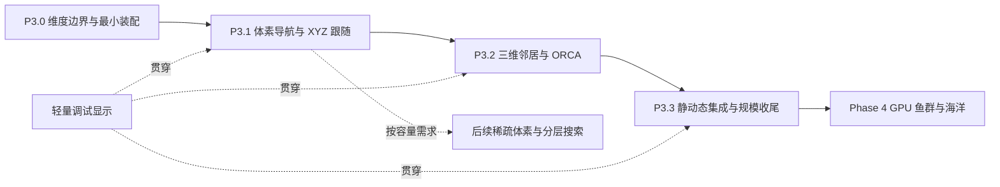

# Phase 3：真正 XYZ 空间的多智能体导航

状态：Phase 3 核心已实施，2026-10-01 完成到达标识与首路径等待优化。本文下文保留原设计提案；当前实现和证据见 [收尾验证](VERIFICATION_P3_CLOSEOUT.md)，前一轮记录见 [性能验证报告](VERIFICATION_P3_OPTIMIZATION.md)。下一轮进入 Phase 4。

## 1. Phase 2 收尾与本阶段目标

用户已完成后续人工验证：256 agent 约 1–2 分钟完成；1024 agent 在高频通行路径有长时间滞留，最终约 20 分钟完成。按用户决定，2D 阶段告一段落，进入 3D。原场景、配置与报告保留为对照，不把继续优化 2D 拥堵作为 Phase 3 的前置阻塞。

上述时长是用户观察到的整体完成耗时，尚无本次运行的逐 Tick 报告、硬件、seed 或时间基准说明，不能解释为纯 A* 计算耗时或每帧性能。本阶段必须区分路径请求延迟、实际行进时间、拥堵等待和 CPU Tick 耗时。1024 档的长尾作为已知质量债务带入 3D；可向上下绕行不会自动解决窄洞口拥堵。

最终目标是：球形 agent 在有限、静态的三维障碍空间内生成路线，沿 XYZ 路径行进，以 3D ORCA 协调动态避障，并保有可观察、可复现的恢复和安全检查。后续鱼群外观、VAT 与海洋接在表现层，不改变这一目标。

## 2. 采用的顺序与简化

| 原提议 | 本次决定 | 原因 |
| --- | --- | --- |
| 先彻底稳定并重构全部 2D | 收尾接受，P3.0 只做维度接缝所需整理 | 避免重写已工作的框架，现有行为保留作对照 |
| 3D 导航与 XYZ 积分分开 | 积分、初始化和基础球体显示提前并入 P3.1 | 静态绕障演示本身就必须能上下移动 |
| 3D A* / JPS 同时上 | 先精确 A*，再按瓶颈启用加权/启发式优化 | 3D 剪枝规则、净空和拥堵代价需要独立处理，不直接移植 2D 跳跃表 |
| VO → RVO → ORCA 各做完整演示 | 实现必要的球体相对运动/有限时域 VO 几何，直接服务 ORCA | 不重复 Phase 1 的全套采样算法；Full3D 首期只支持 None 与 ORCA |
| Hash 与 KDTree 同时做 | 暴力参考 + 3D SpatialHash 必做，KDTree 由测量触发 | 保留清晰的正确性对照，避免多条实现一起扩大范围 |
| Debug Rendering 独立最后做 | 每个里程碑带上对应调试图 | 几何、净空、半空间方向需要伴随实现观察 |
| 体素导航留到原 Phase 4 | 基础体素导航并入 Phase 3 | 先有静态路线才能形成完整多智能体导航闭环 |

不设额外的“先重做 2D 性能验收”阶段。Phase 3 内的 2D 回归仅保护被共用代码影响的行为，不补跑历史全部性能矩阵作为开工门槛。

## 3. 模型边界

- 活动域是有限 AABB，位置、目标、速度使用真实 XYZ；球形碰撞体，固定 Tick，同步读取当前状态、统一提交下一状态。
- 首期固定 agent 数量、静态障碍、同一导航半径等级。速度可不同；增加不同半径时，先以场景最大半径生成共享通行图，接受保守损失，再按需要引入半径分层图。
- 没有重力、流体力、惯性、最大转向角或加速度约束。鱼的朝向和动画可在表现层平滑，不能在 ORCA 后平滑物理速度。
- 到达者默认继续作为物理球体存在，允许因主动让路离开目标，再重新到达。目标区域不得靠互相重叠来制造“全员完成”；记录首次到达与当前在目标内数量两种指标。
- 海面未来只是显示，默认不改变可导航域；若要限制水面高度，使用显式导航边界。海流、动态海床/障碍、异步改图和流式地图单独立项。
- 遇到不支持的算法、地图或维度组合，装配阶段报错；不隐式回落到 XZ。旧 PlanarXZ Profile 保持原行为。

## 4. 现有代码的复用与替换边界

本轮已阅读 World 调度、模块契约、装配、积分、导航与邻居关键入口；完整几何精读随对应实施块进行，不宣称已逐行审计整个工程。

| 现有入口 | 保留部分 | Phase 3 必须处理 |
| --- | --- | --- |
| `Simulation/SimulationWorld.cs` | 固定 Tick、依赖链、状态机、双缓冲提交与释放 | 维度相关初态校验；调试数据当前硬编码识别 `OrcaSolver2D`，需解除具体类型依赖 |
| `Core/AgentStorage.cs`、`AgentData.cs` | float3 SoA、稳定 ID、参数和借用视图 | 不新建第二套 agent 存储，不加入 GPU Buffer 所有权 |
| `Contracts/SimulationModules.cs` | Preferred / Neighbor / Avoidance / Integrator 调度边界 | 用装配检查支持组合；接口只在主线程，Burst Job 内仍使用具体数据 |
| `Simulation/SimulationModules.cs`、`Navigation/GridNavigation.cs` 内的工厂 | Phase 1/2 工厂及原配置 | 新增独立 Phase 3 装配入口；当前工厂拒绝 Full3D 是正确现状 |
| `Navigation/GridNavigation.cs` | 请求号、版本、取消、轮转预算、池化路径的设计 | 几何和 waypoint 目前是 float2，三维实现独立；等两个版本稳定后再提取确有重复的调度代码 |
| `Navigation/NavigationGrid.cs`、`ObstacleBvh.cs` | 离线地图、净空、连通与加速结构的职责 | 三维体素索引、球体净空、XYZ BVH 与完整线段扫掠 |
| `Navigation/GridPathfinder.cs`、`GridPathFollower.cs` | 增量搜索、预算、直达、平滑与恢复思路 | 三维边合法性、启发式、XYZ lookahead；不复用二维 jump targets |
| `Neighbors/*` | 最近 K、距离/ID 顺序、截断统计与缓冲契约 | 连暴力参考目前也取 `.xz`；Hash 为 int3，KDTree 若启用需三轴 AABB |
| `Avoidance/OrcaGeometry2D.cs`、`PlanarVelocityOptimizer.cs` | 约束/优化分离及状态语义 | 独立 `OrcaGeometry3D` / 三维速度优化器，不能只换向量类型 |
| `Simulation/BasicMotionModules.cs` | 固定步长、输出槽位全覆盖 | 新 XYZ 积分不再强制 `position.y = PlaneHeight` |
| `Navigation/TrafficRecovery.cs` | 等待老化、稳定通行状态、限频与公平性原则 | 退让空间、通行关系和临时代价区域全部重新按 XYZ 定义 |
| `Diagnostics/QualityMetrics.cs`、`StepDebugView.cs` | 独立诊断、输入 Tick 对齐、显式复制 | 当前碰撞检查使用 XZ；新增 XYZ 质量内核、三维约束快照与阶段指标 |
| `Unity/*Presenter`、Profile / Bootstrap | 仿真提交后读取、开关、暂停/单步/Reset | 三维镜头、球体、切片与体积场景配置；渲染不写回 World |

### 拟议数据和装配契约

这些名称仅用于设计对齐，尚未新增代码；不为了预留接口创建空实现。

| 对象 | 主要数据 / 行为 | 所有权与边界 |
| --- | --- | --- |
| `BakedNavigationVolume` | 版本、尺寸 int3、原点 float3、cellSize、占据、净空、连通域、障碍 BVH、BakeSignature | Unity 资产；运行时加载不可变数据；签名含源几何、分辨率、半径等级、margin、边规则、格式版本 |
| `NavigationVolume` | PointClear / SegmentClear / Anchor / Connected / 静态范围查询 | 地图句柄管理共享数据；World 活着或搜索未完成时不可释放 |
| `VolumeNavigation` | 请求队列、有限搜索上下文、float3 waypoints、恢复状态、preferred 输出 | 每 World 一份；沿用 Pending / Ready / Arrived / NoPath / InvalidEndpoint 的语义；版本取消与调度超时分别报告，不能伪装成 NoPath |
| `VolumeAvoidanceSolver` | 静态速度约束、动态 ORCA、最终逐步安全验证 | 求解器内组合阶段，不让 Integrator 再纠正位置 |
| `VelocityPlane3D` | 单位法线 n、offset b、来源类型/ID | 统一可行侧 `dot(n,v) >= b`；静态硬约束与动态可松弛约束明确分组 |
| `StepDebugView3D` | 输入 Tick、选中 agent、邻居、preferred、候选/最终速度、约束与安全限制原因 | 调试适配器从模块取得；只抓指定 agent 或小集合，关闭时不保留 N×K 平面历史 |
| `Phase3ModuleFactory` | 选择维度正确的初始化、导航、查询、求解和积分 | P3.1 允许 StaticOnly，P3.2/3 支持 ORCA；VO/RVO/KDTree 未实现时显式拒绝 |

## 5. P3.0 — 有界整理与三维装配

交付一个可独立选择的 Full3D 配置入口，保留 Phase 1/2 场景。整理 `.xz`、PlaneHeight、int2、float2 waypoint、2D 调试转换等维度依赖，形成实施清单。第一批只改装配、初始化/积分与诊断接缝，不提前把所有算法抽成泛型维度框架。

约定好实际单位、世界边界、半径/margin 和容差：位置/扫掠容差与速度/平面残差分别定义，不能拿一个 Epsilon 同时代表世界净空与所有数值误差。初态要求球体互不穿透静态障碍与彼此；异常重叠作为诊断专用案例，不能暗中投影到合法位置。

退出条件（未来实施时检查）：旧场景仍能通过原工厂构建；Full3D 不使用平面积分；错误组合有明确原因；新增资源归属和销毁路径清楚。最小直达 XYZ 场景和球体显示可与 P3.1 同一交付完成，不单独扩成一个大重构周期。

## 6. P3.1 — 先做到真实三维静态寻路

### 地图与净空

首版使用规则、稠密、扁平数组的 Voxel Grid，默认小体积（例如 64³），先支持程序化 AABB 障碍与边界。用高低错开的开口、上下通道和封闭体积构造示例；不先引入任意 Mesh 体素化、八叉树或海底美术导入。

导航图采用 26 邻接，边长为 cellSize、√2×cellSize、√3×cellSize。每条边必须满足统一的球体/保守膨胀盒扫掠规则，不能只看终点体素为空；连通域使用同一组合法边。净空数值的含义必须是到占据实体边界的保守距离，不能把到障碍体素中心的距离直接当作球体净空。起点/终点连接到 anchor 的线段也需验证。

首版可对 AABB 按 `radius + margin` 各轴膨胀后做线段检查，作为保守的球体扫掠：角部可能多拒绝一些路径，记录这种损失，但不会把它称为精确球体距离。图边、平滑、跟随和最终静态证书必须在同一占据语义下工作。后续精确球体/盒距离、距离场或 Mesh 碰撞不得只替换其中一层。

地图边界同样按球半径内缩。无净空、不同连通域、无合法 anchor 分别快速失败，禁止穿角和跨层抄近道。

### 搜索、路径与跟随

先采用可跨 Tick 恢复的精确 A*，Euclidean 启发式与真实边长，weight=1 做参考。保留直线可达快速路径、请求取消、搜索上下文轮转、扩展节点预算、请求完成预算及临时路径缓冲复用。`NoPath` 只表示在当前地图与半径规则下搜索失败，预算耗尽仍为 Pending。

有正确性基线后才提供显式加权 A*；ALT/地标与分层路线在扩展数或内存成为瓶颈时评估。JPS 不是 Phase 3 核心退出条件：需要另行推导 26 邻接剪枝与净空规则，且临时拥堵代价下不能无条件跳过中间格。

路径输出 float3。平滑与 lookahead 都走完整静态球体扫掠，接近终点限制本步剩余位移，偏离路线触发限频恢复。合法位置落入额外 margin 时只改变 preferred 引导回到净空，不传送、不每 Tick 重发所有请求。

P3.1 的 StaticOnly 模式是“没有 agent-agent 动态避障”，仍必须经过静态扫掠保护；不能把原 PassThroughSolver 直接用于有障碍的多 agent 安全演示。单 agent 是本阶段主要验收对象，多 agent 只用于调度/路径展示，不宣称已经完成群体避碰。

### 防止体素容量爆炸

不将现有 512×512 地图机械扩大成 512³。以占据 byte、净空 float、连通域 int 为示意载荷（每格 9 bytes），尚不含 BVH、资产副本或附加索引：

| 体积 | 体素数 | 地图示意载荷 | 沿用当前七个 4-byte A* 数组时，单搜索上下文 |
| --- | ---: | ---: | ---: |
| 64³ | 262,144 | 2.25 MiB | 7 MiB |
| 128³ | 2,097,152 | 18 MiB | 56 MiB |
| 256³ | 16,777,216 | 144 MiB | 448 MiB |

四个 128³ 搜索上下文仅这些数组就需 224 MiB；数字是设计估算，不是本项目实测。首版从 64³、少量上下文起步，在 Bake/装配前检查乘积溢出和容量预算。更大体积先减少/压缩搜索工作区或使用分块/分层图，不能只提升每 Tick 预算。运行时地图数据只共享一份；允许 3D 的上下文数与 2D 不同。

退出条件：存在必须改变 Y 才能到达的固定场景；合法终点可达、封闭终点失败；每个路径段及每 Tick 移动不穿静态障碍；默认关闭动态避障的限制在 HUD 中明确。连通域不能与实际可走边矛盾。

## 7. P3.2 — 三维邻居、球体几何与 ORCA

### 动态查询

先独立实现 XYZ 暴力参考，再上 int3 SpatialHash。邻居仍按完整 XYZ 距离平方/稳定 ID 排序，半径边界规则和 K 截断语义与旧契约一致。查询范围覆盖各轴 `ceil(neighborDistance / cellSize)`，精确过滤，不固定只搜 27 桶。空域大、桶特别密时保留可观测的降级路径。

动态索引每 Tick 从同一输入快照重建，先持久容量复用，再考虑增量维护。KDTree 不因名字更高级而成为默认；若实测 Hash 在分布不均时成为主开销，再加三轴 KDTree，以暴力集合对照。物理安全查询必须覆盖一整步可能相遇的球体，不复用可能被 K 截断的避障邻居列表。

### ORCA 几何与速度求解

参考 [RVO2-3D 官方实现](https://github.com/snape/RVO2-3D) 的球体互惠避障。其[项目说明](https://gamma.cs.unc.edu/RVO2/)明确指出 3D 版本不含静态障碍支持，因此它只作为动态几何和求解对照，不代替本项目体素导航/静态安全层。

按相对位置、相对速度、合并球半径、time horizon 构造有限时域速度障碍（截断锥及其球冠），相交/紧急情况使用实际 dt。默认双方各承担 0.5；交通优先级以后接入时，双方份额必须互补，使用同一 Tick 的优先级快照。不能把二维切线左右支选择照搬为三维锥面解。

约束统一写成 `dot(n, v) >= b`，目标是在 `|v| <= maxSpeed` 内尽量接近 preferred。拟采用增量求解：三维速度球 → 违反平面的二维可行圆 → 相交直线的一维区间；处理平行/近共面约束、相反法线、近零向量与重合球心。实现路径参考 [Agent.cc 的低维子问题](https://github.com/snape/RVO2-3D/blob/main/src/Agent.cc)，不要求逐位轨迹相同。

回退保留 Success / Fallback / Infeasible / InvalidInput，显式记录残差和失败约束。不把简单平均速度或无条件归零当作有安全保证的求解；动态约束的软化不能牺牲静态硬约束。正常初态要求物理合法；异常重叠优先报错/单独诊断，不宣传仅靠 ORCA 可恢复所有重叠。

第一版不加惯性。打破完全对称时只允许可配置的 preferred 偏置，局部坐标系必须能处理竖直行进；法线/退化方向由几何和稳定 ID 确定，禁止随机抖动随帧变化。

退出条件：无静态障碍的三维对向、竖直交叉、同 XZ 不同高度、球面交换可观察和数值检查；查询与 XYZ 暴力一致；求解速度有限且不超上限；平面可行侧可独立复核。少量球体先完成参考，再接 Jobs/Burst，不能以画面没穿透代替检查。

## 8. P3.3 — 组合安全、拥堵恢复与规模收尾

### 组合调度

保持原 World 顺序：Navigation/Preferred → Neighbor → Avoidance → Integrator → Commit。Avoidance 内部顺序为静态约束 + 动态平面构造 → 速度求解 → 完整一 Tick 静态/动态扫掠证书 → 输出最终速度。Integrator 只做 `nextPosition = position + velocity * dt`。

静态约束从局部障碍面与地图边界构造，区别于动态 ORCA 平面；不要把每个障碍体素当成一个会互惠移动的球。复杂角部由保守扫掠证书兜底；半空间近似过保守导致滞留也必须有统计。

三维动态证书用相对线性运动的最近距离或碰撞时刻检查球体，静态用 swept sphere/保守膨胀 AABB。BVH 与安全宽相必须覆盖整段位移。任何缩速都会改变双方轨迹，需要重新验证受影响 pair；局部连通分量采用一致、安全的回退策略，不能逐 agent 独立缩速后直接认定安全。安全回退本身要有有限迭代预算和失败状态。

### 将 2D 拥堵经验带入 3D

恢复层保留阶段性通行优先级、等待老化、租约/释放与重规划限频；几何全部重做。围绕行进方向构造稳定的两条正交侧向轴，候选退让位可在上/下/两侧/后方寻找，并检查静态净空、局部占用及已有退让目标。竖直方向接近参考轴时切换备用轴，不能退化成零侧向向量。

临时拥堵代价是三维球形/局部区域，按请求快照固定，不烘焙成永久墙。跟随器不能把带代价的绕行又拉直回拥堵区；没有替代路时仍允许通过。重试和恢复使用公平游标与全场预算，连续失败不饿死高 ID agent。

针对高频洞口，先提供等待时间、队列长度与通过量观察。若固定案例反复出现长时间互相退让，则在 P3.3 内增加**局部瓶颈方向租约与入口排队**：一批同向放行、清空后换向，容量/超时有上限，按等待老化换批；不直接扩大为全地图时空预约。无退路、终点永久占口等结构性问题单列失败原因，不靠无限增加运行时间掩盖。

### 性能顺序

先测路径扩展/请求等待、邻居候选、ORCA 平面数、扫掠候选、受限制比例、恢复次数，再优化占主导的环节。优先采用持久数组、共享地图、固定容量搜索池、Job 并行查询/跟随/求解、低频局部协调。路径搜索 Job 化、ALT、KDTree、分层图按证据推进；JPS 和增量 KDTree 都不是默认交付项。

主线规模先 16，再 256；1024 是本阶段必须交付报告的压力档，10k 延后。256 的固定可解案例要求在预先设定的有限 Tick 内全部到达；1024 必须报告到达曲线与最长等待，即使超过阈值也保留失败，不以最终总能到达视为高吞吐达标。阈值在场景尺寸、速度和通道容量确定后、首次正式运行前写入配置，不事后追着结果放宽。

退出条件：三维静动态组合场景通过约定的安全/到达检查；Reference / JobsBurst 的状态与容差一致；Reset/停用无资源泄漏；有 16/256 回归和 1024 压力结果及限制说明。若 1024 仍有明显长尾，可明确标成“功能完成、规模优化待办”，不能把 GPU 绘制当作拥堵修复。

## 9. 调试呈现贯穿实施

| 视图 | 首次引入 | 显示内容及预算 |
| --- | --- | --- |
| 体素 / 净空 / 连通域 | P3.1 | 障碍外表面、选区和 X/Y/Z 切片；不逐个创建所有体素 GameObject |
| Sphere / Goal / Path | P3.1 | 简单球体或线框球、三轴目标十字，选中路径；可环绕/自由飞行镜头，暂停/单步/聚焦 |
| Neighbor / Preferred / Final | P3.2 | 指定 agent 的邻居和两种速度；同 XZ 不同高度可分辨 |
| ORCA Plane | P3.2 | **速度空间**原点附近的有限平面片、法线、速度球及当前解；平面来源/残差，避免误画成世界障碍面 |
| 静态扫掠 / 安全限制 | P3.3 | 世界空间的移动线段/包围体、命中来源；候选速度和最终受限速度分开 |
| 等待 / 退让 / 通行队列 | P3.3 | 退让目标、通行方向、租约剩余与最长等待，不全量绘制 N×K 连接 |

调试输入必须与构造约束时的 Tick 对齐。选中对象变更或需要跨 Tick 留存时显式复制少量数据；不能保留 AgentReadView 到下一次提交。显示开关不得修改仿真结果，关闭调试后不做大规模约束复制。

## 10. 后续验收规格（本次不执行）

| 组别 | 固定案例 | 核心判定 |
| --- | --- | --- |
| 维度 | 上下直达、同 XZ 不同高度、纯竖直速度 | Y 真正变化，XYZ 查询/质量统计不误判成平面碰撞 |
| 静态导航 | 错层开口、顶/底绕行、斜向擦角、封闭腔体、边界 | 路径连续、无穿角、净空正确、不可达状态明确 |
| 动态几何 | 对向、追赶、竖直交叉、球面交换、不同速度/半径 | 相对运动检查、速度界、平面残差、到达与对称停滞记录 |
| 集成交通 | 细洞口对向、多入口腔室、目标靠近通道、退让后重入 | 无静动态穿透、公平排队、恢复有效、等待长尾不过预设上限 |
| 生命周期 | 取消/替换目标、非法端点恢复、Reset、禁用/启用、错误配置 | 无旧请求写回、无未写槽位、无借用视图越界与泄漏 |
| 性能 | 同 seed 的 16 / 256 / 1024，关闭/开启 Debug 对照 | Tick P50/P95/P99、分阶段开销、GC、地图/搜索/邻居内存、到达曲线 |

必须分别输出：wall-clock 用时、累计仿真秒数、执行 Tick 数、首次路径 Ready 的 P50/P95/最大延迟、首次/当前到达率、全员到达时间、最长连续等待、通过瓶颈的单位仿真时间数量、重规划次数与碰撞/安全限制次数。报告应注明停止条件与未到达者，不能只对已到达 agent 统计延迟而隐去剩余者。

正确性基线用独立 XYZ 球体扫掠检查，不能仅复用生产碰撞函数给自己作证。全量 O(N²) 诊断仅在小规模或离线验收使用；正式性能采样分离诊断、调试绘制与核心开销。初步实时目标为默认 30 Hz 下核心能跟上固定步长，具体硬件上的预算在基线确定后固化，不预先承诺 1024 FPS。

## 11. 实施批次和最终交付

1. **第一批：P3.0 + P3.1。** 交付可运行的真实 XYZ 静态体素导航、小型错层地图、球体/路径/切片调试；这是下一轮编码的默认范围。暂不要求群体动态避障。
2. **第二批：P3.2。** 交付三维邻居、球体 VO 几何、ORCA Plane 和速度球求解，独立无静态障碍场景、平面调试与参考对照。
3. **第三批：P3.3。** 交付静动态组合、三维恢复/瓶颈管理、Jobs/Burst 主线、规模报告和 Phase 3 总结。
4. **Phase 4。** 核心功能达到声明的完成等级后，再实施 GPU 鱼群、VAT 与海洋；1024 的功能/性能限制继续保留在报告中。

每批更新对应实现状态、操作说明和实际证据。稀疏体素/分层导航是容量需求驱动的后续扩展，可独立于美术推进；它不再阻塞基础 3D 导航，也不与 GPU 呈现捆绑。

表现层预留契约及海洋参考的处理见 [PHASE4_PRESENTATION.md](PHASE4_PRESENTATION.md)。总体顺序以 [ROADMAP.md](ROADMAP.md) 为索引，本文件作为 Phase 3 详细设计来源。
