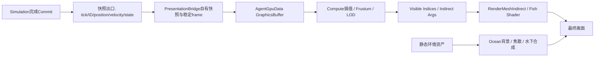

# Phase 4：大规模全三维鱼群与伪海洋 GPU 可视化规划

研究日期：2026-10-02（始于10月1日）；实施更新：2026-10-03。适用：Unity **6000.0.63f1 / URP 17.0.4**。**P4.0–P4.2 基础代码、场景与针对性验证已完成**，实际结果与未完成的验收项见 [基础验证记录](VERIFICATION_P4_FOUNDATION.md)。P4.3–P4.7 的后续实现、实验替代与未达验收项见 [续阶段实施](PHASE4_CONTINUATION.md) 和 [验证记录](VERIFICATION_P4_CONTINUATION.md)。下文终态门槛保持有效，不能由代码存在推定全部通过。下文研究核查、推导预算和终态候选保留原口径，不应当作当前画质或完整 GPU 压测结果。

2026-10-04 视觉目标修正：用户代码首先用于环境外表材质的流动明暗图案，弱雾仅辅助空间层次。执行方案和截图见 [表面表现修正](PHASE4_SURFACE_CORRECTION.md)，取代初版近乎纯蓝雾的视觉选择。

## 1. 推荐终态与决策

采用“**已提交快照单向输出 → 独立表现状态 → GPU 视锥剔除与屏幕 LOD → 间接绘制 → 水下合成**”。主力表示是约200顶点的程序化鱼；近景用1000～2000顶点真实Mesh，VAT与Bone Texture通过相同资产对照选择；远景实验三面impostor和单张多视图billboard，再远使用简单billboard。

四级LOD是候选表示集合，不是必须启用四级的固定流水线。**如果交叉面在目标画质下没有稳定优于低模，就跳过LOD2。** 不将2000顶点VAT固定为全部鱼的唯一表示，也不预先认定VAT本身低效。

| 决策 | 推荐默认值 | 何时重新选择 |
|---|---|---|
| 首个可见里程碑 | 约200顶点程序化鱼、稳定XYZ姿态、间接实例 | 先验证边界与成本，再接近景动画资产 |
| LOD0 | 已有优质变形资产时VAT；少骨骼、多片段/多Mesh时实验Bone Texture | 相同画质的GPU时间、显存、资产制作成本 |
| LOD2 | 三纵向交叉面为实验候选，端视先回退低模 | 全方向转台、密集overdraw与相同画质基准 |
| 鱼材质 | 主体opaque，薄鳍/卡片alpha clip；外观由共享TextureArray/参数区分 | 不默认给全鱼群使用alpha blending |
| 焦散 | 共享256²/512²低清动态纹理，直接计算和离线贴图作对照 | 按用户源码实测生成与采样成本 |
| 海洋 | inward六面背景、一次opaque水下雾合成、有限粒子 | 六面背景不作六层透明水体 |
| 剔除 | 保守Frustum + 屏幕尺寸LOD；Hi-Z后置 | 只有遮挡收益超过深度金字塔/同步成本时才加入 |
| 边界 | Simulation只输出状态，Rendering拥有朝向、动画、LOD和GPU资源 | 渲染开关不得改变同Tick仿真结果 |

本文的数量、内存和公式是推导；阈值、毫秒预算是拟议验收目标，**不是实测结果**。网站资料说明机制，本项目性能须由Player验证。

## 2. 项目核查与接入边界

### 2.1 实施前核查（2026-10-02）

| 文件/模块 | 已核实事实 | 对实施的影响 |
|---|---|---|
| `Runtime/Core/AgentData.cs` | `AgentReadView`借用Ids、Positions、Velocities、Goals、Parameters；仅提交/释放前有效 | 不是可跨帧保留的AgentSnapshot，必须复制到表现层自有存储 |
| `Runtime/Simulation/SimulationWorld.cs` | Ready→Scheduled→Ready；提交后Tick++，Snapshot只在Ready可读 | 复制应在下一次调度前完成，或具有明确Job依赖 |
| `Runtime/Contracts/SimulationModules.cs` | `ISimulationPresenter.Present`禁止修改仿真、保留借用视图 | 保留原则，不将GraphicsBuffer加入核心 |
| `Runtime/Unity/VolumeSimulationBootstrap.cs` | 直接引用VolumePresenter，仅初始化/推进Tick后Present | 需分离“消费提交状态”与“每渲染帧绘制”，不是换一个接口实现就结束 |
| `Runtime/Unity/VolumePresenter.cs` | 每Agent 63顶点球体，CPU更新合并Mesh；也读取Navigation/Solver做调试 | 保留Debug显示，正式FishRenderer只消费快照 |
| `Runtime/Rvo.Runtime.asmdef` | Core、Simulation与Unity适配在同一程序集 | 新建Rendering程序集单向引用Runtime，装配入口放引用双方的外层 |
| PC URP配置 | Forward+、Depth Texture、Opaque Texture、SSAO开启；MSAA=1 | 需统计额外深度/法线Pass及颜色拷贝带宽 |
| URP全局配置 | Render Graph兼容模式关闭，即Render Graph开启 | 自定义RendererFeature按URP17 Render Graph资源依赖集成 |

版本来自`ProjectVersion.txt`和`Packages/manifest.json`；Forward+值2已与本地URP包`UniversalRenderer.cs`核对。当前`AgentColors.shader`是轻量顶点色显示，不能代表最终Lit Fish成本。

本次检查的Full3D主路径为预算化粗/细图A*、Burst搜索与粗图ALT；不能因历史/二维内容涉及JPS而宣称三维JPS已经实现。P4.0–P4.2 未修改导航算法；新增 `AgentSnapshot` 与提交事件后，实际边界以基础验证记录为准。

### 2.2 性能证据不能越界

[Phase 3收尾](VERIFICATION_P3_CLOSEOUT.md)覆盖16/256/1024 Agent；1024档全程CPU Tick P95为6.989 ms，Editor/i7-12650H，含质量观察但不含渲染。历史图形验证记录RTX 4060 Laptop、D3D11；它不是本次实时设备探测，也不是1万～3万的性能承诺。

必须分开验收：

1. **渲染能力**：确定性回放或合成Snapshot，测1万、2万、3万实例。
2. **完整Demo**：真实导航/ORCA+快照+GPU，报告CPU Tick、GPU帧、追赶丢Tick、仿真时间/墙钟比。

3万回放渲染达标但CPU仿真不实时，只能宣布3万渲染能力达标。GPU LOD不降低ORCA邻居查询或寻路负担。

## 3. 多表示LOD与“全部VAT”的公平比较

### 3.1 成本从哪里减少

2000顶点×3万实例=6000万模型顶点/主Pass；200顶点×3万=600万。十倍顶点减少不等于十倍GPU加速：像素、纹理、微三角形、寄存器压力、阴影与深度重复都可能主导。

| 表示 | 1万实例的名义顶点量 | 3万实例 | 风险 |
|---|---:|---:|---|
| 2000顶点Mesh | 2000万 | 6000万 | 变形与多Pass重复、微三角形 |
| 200顶点Mesh | 200万 | 600万 | 近景轮廓有限 |
| 3 quad，12顶点/6三角形 | 12万 | 36万 | alpha空白、交叉覆盖、端视消失 |
| 3 triangle，9顶点/3三角形 | 9万 | 27万 | 可表达轮廓/摆尾很有限 |
| 单quad，4顶点/2三角形 | 4万 | 12万 | 视角/深度近似、亚像素闪烁 |

这些是`Mesh顶点数×实例数`，**不是硬件vertex invocation测量**；索引缓存、顶点拆分和额外Pass会改变真实计数。

算例：3万可见鱼按5% LOD0、25% LOD1、50%三quad、20%billboard，约470.4万名义顶点/主Pass，较全部2000顶点少约12.8倍。占比只是示意，不能保证镜头钻入密集鱼群时仍成立，也不能为达标静默降质。

### 3.2 VAT不等于没有LOD

必须比较三类：固定2000顶点VAT；多级Mesh+VAT/Bone；多表示混合。VAT贴图是共享资产，不按实例数成倍分配；满足顶点映射约束时，不同Mesh LOD也可能共享动画数据。因此混合表示是否更优，要看它相对**合理全VAT LOD**的收益，而不是只战胜无LOD高模。

多表示更适合远处鱼多、屏幕尺寸跨度大的场景。若多数鱼都近景，低模/卡片没有可接受的画质空间；若像素/透明已主导，减少顶点收益有限。多表示还增加烘焙、跨LOD法线/phase一致性与调试成本，必须以实际收益支付这些复杂度。

### 3.3 屏幕误差驱动而非固定世界距离

起始阈值：最长投影尺寸>80 px用LOD0；20～80 px用LOD1；6～20 px实验LOD2；1.5～6 px用LOD3；更小按覆盖率衰减。之后按参考图像、屏幕分辨率、运动与镜头标定。

远离近裁剪面时，球体投影直径近似`Dpx=H*r/(z*tan(FovY/2))`。H为实际渲染高度，z为相机空间正深度；近面相交时保守升LOD，不使用z≈0的近似。细长鱼还要看投影中心线长度、截面厚度与面积，避免端视很小却误选交叉面。

加入10%～20%滞回，历史状态按camera与稳定身份管理。先验证滞回硬切，再实验短时互补dither；过渡双绘、噪点与阴影也要计时，不能默认项目已有TAA。跨LOD保持相同原点、尺度、姿态、phase、pattern和颜色。

## 4. VAT、Bone Texture与程序化动画

### 4.1 显存与vertex访问的量化

统一算例：一个物种/一个120帧循环，2000个烘焙顶点，24根骨骼，未压缩无mip；MiB=2²⁰ bytes。不把共享动画贴图乘3万实例。

| 路线 | 动画存储 | 每顶点逻辑访问示意 | 适用LOD |
|---|---|---|---|
| VAT，position/normal均RGBAHalf | 2000×120×16=3.66 MiB；2048×120为3.75 MiB；补到2048×128为4 MiB | 两帧position+normal插值共4次读取 | 任意复杂变形/已有DCC动画，LOD0 |
| VAT，压缩或重建normal | position理论1.83 MiB，normal依编码而定 | 少存储/采样换解码、质量损失 | 按镜面/轮廓质量决定 |
| Bone Texture，3×float4矩阵/RGBAHalf | 24×120×3×8=67.5 KiB；float32为135 KiB | W权重、两帧为6W次float4读取；W=2/4时12/24次 | 少骨骼、多片段、多Mesh，LOD0/可选LOD1 |
| 程序化travelling-wave | 共享包络参数+每实例phase/amplitude，无逐帧动画贴图 | 无动画贴图；sin/cos、包络和法线修正ALU | LOD1为主；规则鱼形也可LOD0 |

Bone Texture参考[NVIDIA Animated Crowd Rendering](https://developer.nvidia.com/gpugems/gpugems3/part-i-geometry/chapter-2-animated-crowd-rendering)。表中数字是本方案布局推导，逻辑读取数不等于显存事务数；小骨纹理复用好，但多权重乘加可能比VAT慢。

3万×2000顶点×4读取×8 bytes=1.92 GB/主Pass的**名义请求量**，不代表真实DRAM读取；phase、缓存和pass数量均影响带宽。不能仅凭这个数字判定VAT必然受显存瓶颈限制。

Bone矩阵逐元素插值不保持刚性；明显出现缩放/剪切时比较quaternion+translation或dual quaternion，计入额外ALU。采用统一有限权重数，不创建每鱼Animator/SkinnedMeshRenderer。多片段、物种、额外normal/tangent和padding均需单独计入资产预算。

### 4.2 资产和shader契约

- 全资产统一+Z Forward、+Y Up、原点、长度单位；去除root motion。记录全周期视觉bounds、clip时间、位置解码范围、normal/tangent空间。
- VAT使用导入后最终顶点映射；UV/法线接缝拆顶点，DCC point index不自动等于Unity vertex ID。
- 动画数据禁用sRGB；避免普通mip与跨顶点过滤。若纹理布局不能严格限制沿时间轴过滤，用精确读两个帧后插值。
- LOD必须分别烘焙或有明确point/barycentric映射，不能沿用失效索引。[SideFX VAT](https://www.sidefx.com/docs/houdini/nodes/out/labs--vertex_animation_textures-3.1.html)提供受约束的LOD贴图共享方法；不代表已验证其插件与Unity6兼容。
- Forward、DepthOnly、DepthNormals、ShadowCaster和可选MotionVectors执行一致变形与alpha clip；不能只有颜色Pass会游动。
- 外观参数和TextureArray减少Material切换，不会自动合并不同拓扑Mesh。少量鱼种按原型分桶，避免每种花纹一套draw/material。

### 4.3 travelling-wave的质量细节

局部+Z为前进方向，另定义`s∈[0,1]`从头到尾，避免符号歧义：

`d(s,t)=A(s,v)*sin(k*s-θ(t)+φ)`，`θ(t)=∫ω(v(t))dt`。

候选`A(s,v)=a(v)*smoothstep(s0,1,s)^p`，头部接近零、尾部逐渐增强。慢放确认波从头传尾；不同物种调整包络。不能用`ω(currentSpeed)*absoluteTime`，速度改变会跳相。

用**提交后的最终实际速度**驱动朝向、频率和幅度，包括安全层最终采用的速度；不直接读取preferred或中间ORCA candidate。表现层可平滑/限幅频率与振幅，零速保留轻微鳍动；堵塞零速不等于到达。

简单`x'=x+d(z)`属于剪切变形，至少用Jacobian逆转置修正normal：`n'∝(nx,ny,nz-d'(z)*nx)`并归一化。更好的轮廓可让横截面随中心线切线旋转，减轻伸缩；这是ALU与画质的可测取舍。转弯附加弯曲或鳍局部波作为质量档。

3个triangle/quad只有少量纵向采样点，无法真正表达连续弯曲。LOD2可增加纵向分段，或fragment逆向UV warp；后者不自动改变几何深度/轮廓，要为摆尾保留包围余量。分段之后必须报告实际顶点数，不能继续称作9/12顶点。

若shader profiler证明三角函数主导，可固定每物种k，把`sin(k*s)`/`cos(k*s)`预存网格属性，每鱼每显示帧计算一次phase的sin/cos，再用角差公式还原顶点波与导数；代价是属性带宽和参数灵活性。先验证简单sin版本，再做这种优化，不能预设ALU换带宽一定更快。

多Pass重复蒙皮严重时才考虑compute skin cache。3万×2000顶点×position/normal各float3，单份输出就约1.44 GB，尚无tangent/历史；全群缓存明显不适合作为默认。若仅对少数近鱼缓存，需要把可见性、shadow并集、输出索引与复用收益一起设计，不能只节省VS算术而忽略巨大写读流量。

## 5. 稳定全三维frame与时钟

保存上次显示的quaternion或forward/up，由Rendering持有。固定world-up LookRotation在竖直附近不稳定；从forward临时选择备用轴只解决单帧数值问题，不能保证跨帧roll连续。

建议离散parallel transport：

1. 低于速度阈值保留forward，进入/退出阈值采用滞回，抑制零速噪声。
2. 一般情况下由`f0→f1`构造最短旋转`qΔ=normalize((cross(f0,f1),1+dot(f0,f1)))`，同时旋转旧up/right，明确quaternion分量顺序。
3. 同向近似单位旋转；近180°时轴不唯一，使用旧up在f0垂面的稳定方向，退化再用旧right/确定性轴。骤变速度无法唯一决定生物学转向，需要明确可重复的显示规则。
4. 将transported up投影到f1垂面并归一化，`right=normalize(cross(up,f1))`，再`up=cross(f1,right)`；验证正交与determinant=+1。
5. 可选缓慢背朝上回正/banking，接近竖直时其权重平滑降为0，避免重新引入极点翻转。

旋转最小化frame研究见[Microsoft Research论文](https://www.microsoft.com/en-us/research/wp-content/uploads/2016/12/Computation-of-rotation-minimizing-frames.pdf)；本方案采用简单离散最短弧，不声称实现其中double-reflection算法。本次可检索摘要，PDF全文打开失败。首次初始化/退化构基可参考[JCGT Building an Orthonormal Basis, Revisited](https://jcgt.org/published/0006/01/02/paper.pdf)，它不替代历史transport。

相邻quaternion先调整到同半球再slerp；phase插值处理2π跨界，使用连续累积相位或显式unwrap，不能从接近2π向0反向扫一整圈。位置只在两份已提交快照间插值，不外推或写回仿真。记录一Tick显示延迟并可关闭。默认鱼的phase随展示仿真时间暂停，环境可以独立运行；Benchmark统一固定回放时钟。

同渲染帧有多个追赶Tick时，适配器**逐提交**维护相邻快照与frame，但只进行一次最终GPU上传。若只读最后一次速度，中间转向路径会丢失，transport会依赖渲染FPS。GPU姿态预计算是后续优化，不能因此忽略多Tick语义。

验收轨迹包括穿越上下极点、竖直盘旋、螺旋、近180°反向、零速扰动、暂停恢复、相机环绕和Reset换代。连续输入无意外180°roll；骤变输入按既定规则处理。绕行后的transport roll不一定是数值错误，可用缓慢回正调节。

## 6. 3-plane / 3-triangle impostor的完整设计

### 6.1 几何与端视问题

三张纵向面都包含Forward轴，绕轴0°/60°/120°定义三种无向平面；六个有向侧面要考虑背/腹非对称，不能全部镜像同一侧视纹理。三quad是6三角形、通常12顶点；三triangle是3三角形、通常9顶点，表达能力不同。

鱼到相机方向为v，面法线ni，正对程度`wi=abs(dot(ni,v))`。**沿Forward看时三个wi都趋近0，增加绕轴平面数无法修复端视消失。** 可用`abs(dot(v,forward))>0.85`作为回退起点并加滞回，最终按像素误差调节。

首版端视回退LOD1；后续比较头/尾端盖、camera-facing端视贴图。升LOD后的顶点数计入性能统计，不把端视修复成本隐藏。

### 6.2 三种实验候选

| 实现 | 视角/混合 | 主要代价 |
|---|---|---|
| A 固定三面全部clip | 每面取正反侧纹理，弱化侧立面 | 最简单；交叉重叠、自遮挡和缝隙 |
| B 选最正对面 | compute/instance层选择；相邻面滞回或短过渡 | 更少像素重叠，但几何切换可见、端视仍退化 |
| C 单面多视图impostor | camera-facing quad，局部view direction选全球atlas近邻2～3视图，在同一fragment混合 | 减少交叉overdraw，增加采样与视差/重影误差 |

绕轴三面只采样方位变化，不覆盖完整三维视向。C需要包含头/尾/背/腹的球面视图，可用octahedral编码或规则方向表，不只烘焙一圈侧面。

视图统一投影范围、原点、尺度与phase。先静态轮廓+程序化warp；加入动画帧后内存按`视图数×动画帧×物种`增长。例如16视图×128²×RGBA8为1 MiB，albedo+normal为2 MiB；8动画相位为16 MiB，含完整mip约21.3 MiB，尚无depth。

复杂深度重建/ray-marched impostor把几何工作转移到fragment，不是微小鱼的首发选择。[NVIDIA True Impostors](https://developer.nvidia.com/gpugems/gpugems3/part-iv-image-effects/chapter-21-true-impostors)支持这种机制，不证明本场景必然更快。

### 6.3 轮廓、法线、阴影与overdraw

- 轮廓使用紧包围几何、alpha dilation/gutter与coverage-preserving mip；远景细鳍逐级并入主体。大三角形可能比quad留下更多空白像素，三角形少不一定更快。
- 多视图先按premultiplied颜色/覆盖率混合，避免透明边黑边；法线在同一object space混合后归一化并旋转至世界。不同视图深度不一致会重影，应接受到指定小尺寸、改滞回单视图或回低模。
- 不用平面法线冒充鱼皮法线。可烘焙object-space normal，或解析椭圆截面normal；明确背面与背腹材质。假体积不能修复几何轮廓或视差。
- LOD2/3默认不投实时鱼影；近鱼使用低模shadow proxy。若impostor投影，必须从光视角取表示，不能直接使用主相机billboard。
- 主体alpha clip+ZWrite；透明blending需要排序且弱化深度遮挡，不作为鱼群默认。clip也消耗采样/fragment，early-Z效果由GPU与shader决定。
- 双面并不自动将同一三角形栅格化两遍，但会失去背面剔除收益。交叉面造成的实际多层覆盖才是主要问题。
- 首版卡片写平面深度，限制到小像素尺寸。fragment修正depth可能削弱early-Z，单独实验。
- 当前MSAA=1，不能依赖alpha-to-coverage。开MSAA或TAA须计成本；TAA需要正确motion/history，且不同面之间dither不保证屏幕覆盖严格互补。

建议保留门槛：目标6～20px、全方向、稀疏/密集镜头质量通过，且GPU时间相对低模稳定节省至少10%、超过测量噪声。否则默认路线跳过LOD2，保留实验资产与结论。

## 7. Snapshot、Buffer与GPU管线设计

### 7.1 严格单向依赖

拟议Snapshot header包含world generation、tick、simulationTime、count；条目包含stable ID、position、最终velocity、collision radius及按需state。核心可输出只读借用，边界适配器立刻复制到表现层自有数组；不强迫核心维护GPU友好AoS，也不让其持有GraphicsBuffer。

当前AgentReadView没有SolveStatus；DebugSnapshot对应上一步输入。需要求解状态时新增小型、时间语义明确的已提交状态出口，不把整个DebugView、Navigation或Solver传给FishRenderer。到达标记可先由适配器按position/goal/ArrivalDistance计算；区分Arrived、Stopped、Blocked、Invalid，不能用零速替代。

`Rvo.Rendering`只依赖Runtime与必要URP包；外层装配入口依赖双方，SimulationWorld不引用Rendering。旧调试Presenter继续独立使用。未来若拆分现有Runtime程序集，应另做小迁移，不重写World。

外观以`hash(worldSeed,stableId)`初始化phase、uniform scale、pattern、TextureArray slice；stable ID不是数组槽位，Reset用generation失效历史。表现插值/frame/LOD不会改变物理半径、导航、ORCA或积分输出。

程序化条纹/斑点同样可能消耗fragment与产生远景混叠；使用屏幕导数过滤、随LOD降低频率，或将复杂pattern预生成TextureArray并使用mip。纹理层尺寸/格式统一，只有外观参数变化才共享同材质；shader keyword不按单鱼生成，避免variant与draw分裂。

### 7.2 明确布局与真实内存账本

首版采用16-byte单元，CPU/HLSL逐项核验stride/offset/位解释。Unity要求StructuredBuffer stride一致，并建议16的倍数；不依赖float3/bool的隐式跨API布局。[Unity StructuredBuffer](https://docs.unity3d.com/6000.0/Documentation/ScriptReference/GraphicsBuffer.Target.Structured.html)

| 缓冲 | 拟议布局 | 所有权/更新 |
|---|---|---|
| DynamicSnapshot，64 B/鱼 | float4(position,visualRadius)、float4(velocity,normalizedSpeed)、float4(quaternion)、float4(phase,amplitude,frequency,displayTime) | 表现层前/后端点；位置/速度来自提交状态，其余表现派生 |
| StaticAppearance，32 B/鱼 | float4(scale,patternA,patternB,phaseSeed)、uint4(idBits,species,textureSlice,seed) | 初始化/身份变化更新；先只支持uniform scale |
| CommittedFlags，16 B/鱼 | uint4(stateFlags,generation,idBits,definedZero) | 每Tick或变更时更新；不把动态state塞进只上传一次的外观 |
| CullSphere，16 B/鱼，可选 | float4(center,radius) | 若AoS读取足够快则不额外复制；局部包围中心偏移需随姿态旋转 |
| VisibleIndices | uint32原slot | camera×LOD分组，每帧生成 |
| LODHistory | uint32或明确16 B记录 | camera×稳定slot；有过渡则保存额外字段 |
| IndirectArgs | Unity平台定义结构 | 静态mesh字段初始化，GPU更新instanceCount |

这是可审查的起始布局，不要求同时分配所有可选缓冲。GPU可拆hot/cold字段，让剔除不读取动画/外观；CPU继续SoA。VS读quaternion避免常态上传4×4矩阵；非均匀scale以后单独设计normal与bound规则。

3万鱼：64 B动态单份1.83 MiB、双份3.66 MiB；32 B静态0.916 MiB；16 B flags 0.458 MiB；4桶各N容量uint索引共0.458 MiB；一份uint LODHistory 0.114 MiB。若另有三槽64 B上传环再加5.49 MiB；不能把快照双份、staging环、MotionVectors历史算作同一份。

每次上传动态64 B+flags16 B，3万为2.4 MB，30 Hz约72 MB/s、60 Hz约144 MB/s（十进制有效载荷，未含driver/copy开销）。如果前后端点都重复上传则更高，优先只传新增端点。全体移动时连续全量上传先于dirty-range优化；先测SetData等待与打包成本。

### 7.3 每帧、每相机与draw顺序

1. 在提交边界复制/打包、更新姿态；多Tick时不重复上传GPU。没有新Tick仍每渲染帧绘制并更新相机剔除/显示插值。
2. 准备保守bounds，包括最大摆尾、鳍、uniform scale及插值范围。collision radius不能替代visual radius；首版只在已提交位置间线性插值，不用易越界的曲线位置外推。
3. 清空4个append counter，每Agent一线程做sphere/frustum与屏幕LOD，保守处理近面和camera cut。不要在每个vertex重算历史frame。
4. 写入各LOD原slot索引；短过渡最多写两桶。各桶N容量允许全员进入；若改共用compact区，容量需覆盖最多2N过渡记录，避免越界。
5. GPU counter复制到args的instanceCount；0可见时必须为0。容量扩容只在受控边界进行，常态不GetData等待GPU；诊断计数可低频AsyncGPUReadback。
6. Shader用`VisibleIndices[resolvedInstanceId]`读取完整数据，压紧instance ID不等于stable ID或原slot。

初期Append+CopyCount足够简单；只有原子争用/压紧成本成为瓶颈再比较group-local汇总或prefix scan。线程组64/128/256实测，不能由CPU核心数推定。首版全部在graphics queue排序，不启用async compute。

### 7.4 Unity/URP执行模型的关键限制

RenderMeshIndirect一次调用对应一个Mesh和一套RenderParams，可含多命令；四个不同LOD Mesh通常仍需四次提交。worldBounds是整批裁剪/排序边界，不是逐实例GPU剔除。使用真实范围+最大视觉包围，shader按UnityIndirect.cginc规则解析ID，args使用`GraphicsBuffer.IndirectDrawIndexedArgs`及其size。[Unity RenderMeshIndirect](https://docs.unity3d.com/6000.0/Documentation/ScriptReference/Graphics.RenderMeshIndirect.html)

CopyCount的offset单位为byte，D3D目标须Raw或IndirectArguments；instanceCount字段偏移集中管理并核验当前API布局，不把某后端“五个uint、第二字段”的实现推广成跨平台保证。[Unity CopyCount](https://docs.unity3d.com/6000.0/Documentation/ScriptReference/GraphicsBuffer.CopyCount.html)

采用两步接入：

- **单相机最小链路**：先证明graphics queue上Compute→CopyCount→RenderMeshIndirect实际顺序，关闭鱼投影，抓帧核对本Unity版本的pass与深度输出。不可把Compute仅录入稍后执行的Render Graph，却假定Update的draw已能读取新args。
- **URP整合**：可保留已验证的高层API；若需要精确插入点/多视图资源，统一进入RendererFeature，ImportBuffer与UseBuffer声明读写，让compute/raster依赖明确。本地URP17的RasterCommandBuffer有DrawMeshInstancedIndirect包装，它与高层RenderMeshIndirect不是同一个调用；采用此路径需记录API调整、args约定，以及谁负责depth/shadow/motion提交，不能混报为同一路径。

参考[URP Render Graph Compute](https://docs.unity3d.com/6000.0/Documentation/Manual/urp/render-graph-compute-shader-run.html)及本地`Samples~/URPRenderGraphSamples/Compute/ComputeRendererFeature.cs`；示例中的GetData/Debug.Log仅作演示，不照搬到热路径。不在Render Graph回调里随意调用静态Graphics并假装已经建立资源依赖。

生命周期先用持久Native staging+SetData并记录等待，优化时再引入映射写入/上传环。双/三缓冲本身不保证安全，GPU落后超过槽数时要用fence/引擎支持的同步规则等待或延迟复用。Reset停止新提交并安全退役GPU资源；尚未执行的Render Graph不能引用已Dispose缓冲，打包Job不能在World释放后继续借用数组。

### 7.5 不能遗漏的视图与异常

- 主相机列表不能直接当shadow列表，离屏鱼也可能向可见处投影。近景shadow proxy使用独立光源/级联保守列表，或首版明确禁用鱼投影。
- 若启用MotionVectors，保存上一显示帧的位置/姿态/phase和相机矩阵，求前后变形位置；新生/Reset/LOD换表示时定义历史失效。只有root位移的motion无法描述摆尾，不能假定indirect实例自动获得正确运动矢量。
- Game/Scene/Reflection camera分别管理可见性/LOD；姿态与phase每Tick/帧只更新一次。首发只承诺单Game Camera，Scene视图可用Debug代理。
- Hi-Z后置，优先遮挡多的104障碍场景；处理reversed-Z、保守mip、近面相交、前帧移动和camera cut。空海水无有效遮挡时可能净亏。
- 非法位置/速度、NaN frame、无效物种、counter overflow提供debug计数与确定性降级，不让单个Agent破坏args。
- 无compute/indirect能力保留小规模实例或旧Debug显示，不施加给CPU测试，不承诺3万回退性能。

## 8. 用户提供焦散源码的具体分析

### 8.1 已知输入、出处和成本

本节依据用户在本轮提供的完整`mainImage`代码，不再把源码视作未知。注释署名David Hoskins，原始turbulence效果署名joltz0r；这是代码中的作者说明，**不是已核实的授权条款**。[MdlXz8页面](https://www.shadertoy.com/view/MdlXz8)本次读取失败，许可仍待实施前核验。

源码只使用iTime、iResolution，没有iChannel采样；输出alpha=1，本质为二维程序化亮度图案，不是raymarch、海面几何、光线折射或体积渲染。五轮递归迭代，每轮更新i含4次sin/cos，强度项含2次sin/cos，合计约**30次三角函数源码求值/像素**，另有除法、length/倒数、pow。实际指令数依编译器、融合与平台而变。

每轮依赖上一轮i，不能无损改成5个独立并行项。MAX_ITER降低会改变归一化、峰值分布和图案，不仅仅是降低精度；若做3/4/5档要重新标定强度并比较质量。

### 8.2 平铺不等于边界连续

`p=mod(uv*TAU,TAU)-250`使uv+整数时重复，但左右边界的p.x从约-243.716跳回-250。迭代的三角项可在2π位移下重复，强度表达式仍直接使用p.x/p.y作分子，因此边界两侧强度不必相等。模运算只保证重复，不能自动保证C0/C1连续。

本轮作了独立双精度数值抽样：iTime取0、1、7、23、60秒；每次沿y取256点，分别比较p.x=-250与p.x=-250+2π两侧极限，共1280对；在**加蓝绿色之前的原始强度**上，平均绝对差约0.005946、最大约0.013829。该结果是公式抽样，不是图像误差验收或GPU实测，也不证明其它时间/接缝的最大值。

推荐先验证Repeat采样与边缘mip；如可见缝隙，可在bake时做周期边界修补/overlap混合并记录质量变化，或以真正周期函数改写强度项。直接路径中不要在shader里先frac再Sample普通纹理，以免边界导数破坏mip选择；共享贴图优先用连续world UV+Repeat sampler。直接函数仍要处理高频minification，不能认为无纹理就无混叠。

### 8.3 时间周期不是几秒

五个时间倍率`1-3.5/(n+1)`分别为`-5/2、-3/4、-1/6、1/8、3/10`。统一分母120后为`-300、-90、-20、15、36`，整数最大公约数为1。按理想精确系数，所有驱动三角相位共同复现需要内部time增加`240π`；而`time=0.5*iTime+23`，因此iTime的共同周期为`480π≈1507.964秒≈25.13分钟`。

这是同时复现驱动相位的共同周期，不承诺有限精度shader逐位相等，也不推断图像没有更短的近似相似段。双精度抽样在该周期后的强度差约1e-12量级；float32系数误差/长期时钟精度需在GPU另验。

所以不能直接截8秒贴图后Repeat并宣称无缝。两条可实施路线：

1. **保留原运动**：低分辨率实时生成共享纹理，不要求短时间loop；对长时钟用谨慎的周期归约/相位管理并实测误差。
2. **短loop烘焙版**：重新设计时间谐波或闭环参数，使指定8～16秒周期成立；或对首尾做交叉淡化，但要接受亮峰变糊/双图案。它是独立艺术变体，需要A/B确认。把原大整数谐波直接压到8秒会大幅加速，不等价于原动画。

### 8.4 数值稳定与URP颜色处理

原强度项含`p.x/(sin(...)/inten)`及`p.y/(cos(...)/inten)`。sin/cos近零时中间值可非常大，半精度尤其容易溢出；不能为了省ALU直接全改half。生成过程优先float32，结果纹理再选择R8/R16F。GLSL的mod对负数与HLSL fmod语义不同；世界坐标可能为负，移植应使用等价floor/frac周期化并做跨原点测试，不能机械替换函数名。

令`s=sin(i.x+t)`、`q=cos(i.y+t)`，inten为正，则一轮贡献可代数改写为：

`abs(s*q) / (inten*sqrt(p.x²*q²+p.y²*s²))`。

在非零分母时与原式相等，避免先除以接近零的s/q；分母与分子同时退化时按连续极限取0，并用与尺度匹配的极小保护。不得粗暴给s/q加大epsilon改变细亮线。双精度样本中两式最大差约7.3e-16；**float32/HLSL性能及误差仍待测**，不据此宣布优化已完成。

保留原`c`初始值1、除以MAX_ITER以及`1.17-pow(c,1.4)`，先做忠实参考；可将整数8次幂实验为平方链，是否更快由编译结果决定。把`pow(abs(c),8)`结果作为候选单通道caustic intensity；共享纹理保存单通道强度；环境外表材质按用户 2026-10-04 纠正重建最终 `clamp(baseColor + intensity, 0, 1)`，不再只依赖 Ocean/Fog 产生可见水色。在linear HDR里控制亮峰/均值，再统一tone mapping；Shadertoy显示观感不自动等同URP linear/HDR输出。

焦散用于照明调制时可归一均值约1并限制峰值；艺术发光则单独声明。鱼的照明调制继续只采样强度，保留鱼皮本色；环境外表材质则显式使用原式的颜色映射。两者与较轻的深度消光分开，避免无意重复染色。

## 9. Ocean Volume与鱼群的组合

### 9.1 六面背景与world-space mapping

六面inward box是远背景/接收表面，不代表体积水或真实折射。使用向内winding+Cull Back，或外向mesh+Cull Front，不能双重反转。当前Fit相机会放到导航体积外：Ocean Volume要更大，或提供水下Fit；不能假定同尺寸box适配现有相机。

底面用world XZ，侧面XY/YZ，`uv=dot(worldPosition-origin,axisU/V)*scale+offset`。统一世界尺度不保证不同面投影接缝消失；角落可用雾/强度衰减，或局部triplanar/连续3D调制，额外采样纳入预算。顶面弱化焦散，避免六面同亮形成“水箱”。

鱼和障碍的焦散应使用变形后world position，沿主光方向投影到水面参考平面或light-space二维坐标，乘朝光权重、深度衰减和可选shadow visibility；不贴鱼UV使光斑随鱼游动。箱壁的艺术平面映射与此照明投影是两种用途，不强求完全相同。

静态障碍需有对应外表面mesh，来源可为共享关卡数据/不可变烘焙输出，按版本重建；不能只显示鱼与箱体，让导航墙全部隐形。环境资产不反向控制Simulation。

### 9.2 焦散直接计算、低清生成与离线采样

| 路线 | 成本模型 | 建议 |
|---|---|---|
| 接收fragment直接算原函数 | 可见接收像素×5轮迭代；overdraw/多Pass重复 | 质量/性能参考与可选高档，不预判其一定不可用 |
| 256²/512² Compute或RT共享生成 | R²×原函数×更新Hz + 每接收像素1～2采样 | 首选实验15/30/60 Hz；保留原时间运动 |
| 离线短loop TextureArray | 存储与每像素相邻帧两采样，无生成dispatch | 先解决时间闭环与接缝；不是原源码直接截帧即可 |
| 静态tile双层流动 | 约两采样与混合 | 最低质量回退，运动结构与原作不同 |

1080p约207万像素；256²约6.55万、512²约26.2万生成点，约少31.6/7.9倍；还要加RT写入、mip、dispatch与全场景采样，不能换算成同倍GPU加速。

512²×64帧R8基础级16 MiB，完整mip约21.3 MiB；R16F翻倍。实时512² R16F双纹理基础级约1 MiB。低频更新可预计算包围当前环境时间的两个端点并插值；每帧只拿上一张贴图会形成15Hz运动。两帧强度插值可能抹平移动亮峰，须与60Hz直接参考比较。

R8可能裁掉高动态峰；R16F保真但带宽更高。验证UAV格式支持、mip生成和周期边界过滤。小纹理降低空间质量，低Hz降低时间质量，两者分开扫描。压缩贴图亮峰损失单独测，不默认BC压缩无代价。

### 9.3 Beer–Lambert与深度色调

`T(d)=exp(-σt*d)`，`σt=σa+σs`按RGB，单位为世界距离的倒数；d是相机到表面的**水内光程**，不是raw depth或简单view-z。[PBRT Transmittance](https://pbr-book.org/4ed/Volume_Scattering/Transmittance)

纯水下相机且线段都在Volume内，可取欧氏距离；相机/对象在外部时用ray-box交段裁剪水内距离。拟议廉价合成`Cout=T*Csurface+(1-T)*Cwater(depth)`，这是Beer消光+经验入射散射色，不是完整参与介质积分。随深度变化的σt需要积分或明确中点近似。

鱼的直接光还可乘“水面到鱼”的照明透射率，与“鱼到相机”是两段不同路径；可以同时存在。不可再无意叠加同距离的线性雾，造成双重消光。世界单位/海水参数统一，红光衰减更快等艺术设定通过参数表现，不绑定固定蓝色输出。

### 9.4 默认合成顺序与fill成本

1. 静态环境、鱼Mesh与alpha-clipped impostor写正确深度；执行选定的Depth/Normals/Shadow pass。
2. 六面背景采用不透明深度语义，条件允许时后绘、ZTest，只填前景未覆盖区域；写入实际远背景深度。若用sky式不写深度，Fog对无深度像素必须用ray-box exit距离。
3. opaque之后、transparent之前执行一次fullscreen水下合成，读取颜色/深度，统一作用于鱼、障碍和背景。Render Graph用独立目标或受支持的input attachment，避免非法同纹理读写，并计入RT带宽。
4. 泡泡/浮游粒子随后绘制，使用各自深度和同一水下函数；不能用后方不透明物体的雾距离代表粒子距离。
5. 统一曝光、tone mapping和必要后处理。

若一次fullscreen读写实测更贵，可切换所有opaque shader内联同一Fog函数的档位，两方案互斥。**只在六面墙shader加雾不会让鱼自动正确消光。**

相机在凸box内时，每条射线通常仅一个出口面，六面不等于六层overdraw；不要用六层alpha blending“模拟水”。背景可被前景深度挡住，但实际early-Z须抓帧核验。

远鱼默认不投影，光照使用主方向光+廉价环境，不跑全附加光循环。SSAO/DepthNormals需显式一致配置，不能只漏掉部分鱼导致黑边。无折射需要时实验关闭Opaque Texture拷贝；Depth Texture按Fog/soft particle/Hi-Z真实需求启用。使用独立Phase4质量资产，不直接覆盖旧场景配置。

泡泡/浮游粒子用独立GPU表现状态与procedural quad，SV_VertexID展开，point sprite能力不可靠时不强依赖它，也不将geometry shader扩点作为跨平台默认。限制数量、屏幕覆盖和近相机尺寸，保留ZTest；soft particle比较自身深度与scene depth。泡泡首版用廉价Fresnel亮边，避免大量折射scene-color采样。仅当粒子fill确实主导才实验半分辨率+深度感知上采样，并计resolve/RT成本。

## 10. Phase 4实施阶段与验收门槛

2026-10-03 进度：P4.0–P4.2 的功能已交付，使用 200/128/72/32 顶点程序化鱼验证四桶链路；未提前制作最终 VAT、Bone 或卡片资产。D3D11 自动测试、Player 构建与短基线已有证据；D3D12、外部 GPU 抓帧、全应用零 GC / 长时显存趋势及正式重复性能矩阵仍待补测。以下退出条件保留为完整验收目标，不能因为代码完成就将未测项标为通过。

前一阶段建立可回归基线，后续视觉效果不得掩盖已有错误。资产来源、平台试验完成前不承诺固定工期，以交付与门槛控制范围。

| 阶段 | 交付 | 验收/退出条件 |
|---|---|---|
| P4.0 冻结与测量夹具 | 独立渲染配置、固定camera轨迹、合成/回放Snapshot、render-only/live两模式 | 旧16/256/1024行为保留；空URP/旧球体基线；明确D3D11主支持与D3D12验证范围；大规模夹具不冒充真实仿真 |
| P4.1 快照与姿态 | SnapshotBridge、自有端点、ID/generation、parallel transport、基础实例鱼 | Reset/禁用/退出无泄漏；30/60/144渲染Hz下同Tick仿真不变；极点/反向/零速轨迹通过；稳态无逐帧GC |
| P4.2 GPU主链路 | Buffer、frustum、4桶LOD/args、约200顶点程序化鱼 | CPU保守参考无误剔除；全不可见/全同LOD/近面/3万无越界；args与画面一致；无同步readback；抓帧证实Compute→Args→Draw |
| P4.3 近景动画 | 同鱼VAT/Bone/procedural对照、统一轴/原点/phase、完整变形Pass | 全周期bounds覆盖；depth/normal/shadow一致；给出质量、显存和GPU时间，选默认LOD0 |
| P4.4 远景表示 | 3quad/3triangle、端视回退、单多视图quad、LOD3 | 全方向转台与动态镜头通过；跨LOD身份/phase连续；LOD2等画质收益过门槛，否则发布档跳过 |
| P4.5 Ocean隔离实验 | 用户焦散参考实现与稳定式对照、低清生成/短loop变体、六面背景、Beer雾 | 空间接缝/时间循环明确；float32无非有限值；相机内外/角落测试；鱼与环境消光一致；分效果增量GPU报告 |
| P4.6 URP整合 | 明确Render Graph资源依赖、Pass策略、shadow proxy、有限粒子与质量档 | 无陈旧args/重复提交/错误深度；配置记录SSAO/MSAA/TAA/拷贝；多camera未完成则显式限定；有逐项回退 |
| P4.7 Player冻结 | 原始CSV/JSON、截图/视频、capture索引、基准与默认质量配置 | render-only/live规模分开；性能结论有配对实验和质量证据；未达3万live需说明CPU/上传/GPU瓶颈 |

首个可见里程碑是P4.0～P4.2。先完成表示/动画选择，再做完整海洋集成；P4.5可独立场景研究，许可未核验不阻塞快照/GPU基础工作。

拟议跨阶段质量门槛：Reset/场景切换100次无持续资源增长；主路径无Native/GPU泄漏与每帧托管分配；保守剔除无false-negative；连续姿态无意外翻转。图像以同姿态高模为参考，对可评估尺寸平均轮廓偏差≤1 px、P95≤2 px，同时人工检查动态闪烁；极小目标改用覆盖率/亮度误差。先固定提取轮廓方法、曝光与背景，不能用浓雾隐藏错误通过验收。

## 11. 最终Benchmark方案

### 11.1 环境与重复性

历史RTX 4060 Laptop作为候选参考设备，实际记录GPU/VRAM/驱动/TGP、电源模式、温度/时钟、CPU、内存、OS、Unity/URP精确版本、commit、Build后端和shader关键字。先D3D11对齐旧验证，再D3D12；不同API不混平均。

Player固定1920×1080、render scale=1，关闭VSync、动态分辨率、自适应质量；另跑2560×1440压力档。固定并记录FOV、near/far、相机轨迹、主光、阴影级联/分辨率、SSAO、MSAA/TAA、Depth/Opaque Texture、HDR和后处理。Development诊断版与近发布配置计时版分开，不开Deep Profile测正式帧率。

预热shader/Burst/资源至少10秒且确认无编译/上传尖峰，每case采60秒、至少5次，交错或随机化A/B顺序减少热降频偏差。相机/快照使用同一时间轴与起止窗口；图像误差在固定采样时间比较，避免更快方案仅因走到不同姿态而不可比。冷启动/导入/初次分配另报。

### 11.2 分层矩阵，避免无意义全排列

| 实验层 | 必跑组 | 回答的问题 |
|---|---|---|
| A 固定表示 | 2000顶点VAT、2000顶点Bone、200顶点procedural、3quad、3triangle、single billboard | 1k/10k/20k/30k全可见，固定root/phase/尺寸；无海洋/粒子/阴影，unlit与标准鱼光照分别测 |
| B 公平LOD | 固定高模VAT、Mesh LOD全VAT、Mesh LOD Bone、混合、跳过LOD2混合 | 同镜头、同可接受画质；报告LOD占比/过渡双绘与端视回退 |
| C GPU管线 | 无剔除、frustum、frustum+LOD、可选Hi-Z | 0/25/50/100%可见率；分解Compute/compact/counter/args/raster收益 |
| D 像素压力 | 稀疏侧视、密集重叠、头尾端视、近景穿群 | 1080p/1440p、屏幕覆盖与fragment工作；是否把vertex节省换成fill负担 |
| E 海洋增量 | solid背景、直接焦散、低清动态、离线loop，加雾，加粒子 | 同鱼群与无鱼场景各测；焦散分辨率/Hz/格式/迭代数单独记录 |
| F 额外Pass | 无鱼阴影、近鱼proxy、完整阴影对照，SSAO/DepthNormals，可选motion | 相同camera/light下每Pass时间、顶点/像素；不拿多Pass VAT对比单Pass卡片 |
| G Live Demo | 1024逐步上探1万/2万/3万，能力允许才推进 | 固定seed、地图、K、dt、路径预算、安全层；丢Tick、sim/wall与回放分表 |

额外隔离动画本身：在**同一2000顶点Mesh**上测静态/VAT/Bone/procedural。2000 VAT对200 procedural同时改变拓扑和动画，不能归因成“VAT单独慢多少”。

镜头工作负载有两个口径：固定每鱼像素大小/方向分布，观察真实整群增长；另固定总覆盖率，观察实例/几何/提交增长。不得让某方案鱼更小、更透明或少画鱼再宣称更快。

### 11.3 指标、工具与常见误读

| 指标 | 方法与解释 |
|---|---|
| CPU Tick P50/P95/P99 | 复用仿真计时，Live/回放分开；render-only不重复导航 |
| Pack / Upload / Submit | CPU区间与RenderThread时间；SetData耗时含潜在等待，不等于DMA耗时 |
| GPU frame P50/P95/P99 | 支持当前API的GPU时间戳/Profiler；正式统计关闭重型capture |
| GPU各区间 | Prepare、Cull/LOD、Compact/Args、LOD Forward/Depth/Shadow、Caustic Generate、Ocean Background/Fog、Particles/Post |
| Vertex invocation/primitive | GPU capture的pipeline statistics，按Pass；区分IA顶点/索引数、VS invocation、triangle数，不以Unity Stats替代indirect真实统计 |
| Fragment cost | 可用时PS invocation、各Pass GPU时间、overdraw图、shader limiter、分辨率缩放斜率；记录MSAA sample频率 |
| VRAM | mesh/animation/instance/index/args/staging/RT估算明细+工具allocated/resident/peak；CPU Native/managed另列 |
| Draw indirect cost | CPU调用/RenderThread、逻辑draw数、实际pass数、counter/args GPU时间；API调用耗时不是GPU draw耗时 |
| 正确性/实时性 | GC、资源增长、snapshot age、显示延迟、LOD分布、误剔除、像素误差、丢Tick、sim/wall |

Unity Profiler/Frame Debugger用于区间和Pass；RenderDoc或适用API的Nsight/PIX核验args、buffer与pipeline counter。实际硬件/API不提供的计数写N/A并给替代测法，不用推导值冒充实测。shader limiter参考[NVIDIA Nsight Shader Profiler](https://docs.nvidia.com/nsight-graphics/UserGuide/shader-profiler.html)；采样剖析与trace有扰动，capture不作为正式FPS样本。

小billboard可能受2×2 pixel quad效率限制，alpha空白/helper lane不等于不执行。检查texture latency、ALU/SFU、occupancy、寄存器与带宽；不能看到sin就断言ALU主导，看到VAT就断言DRAM主导。

Indirect固定成本实验：保持总鱼数、mesh、shader与覆盖不变，拆成1/4/16批测CPU与GPU增量；空draw仅是驱动路径参考。少量LOD桶可能因额外dispatch/draw固定成本抵消减少的顶点量。

### 11.4 结果格式与初始预算

保存机器/构建元数据JSON、逐帧CSV、汇总CSV、固定视角截图、短视频和capture索引。每帧至少记录case/run/frame、snapshotTick、CPU区间、GPU区间、各LOD visible、过渡/端视/阴影数、upload bytes、draws、VS/PS计数来源、VRAM、droppedTicks。GPU异步结果关联正确frame，不将当前CPU与上一GPU帧混配。

| Case | N/visible | LOD占比 | GPU P50/P95/P99 ms | Fish ms | Cull+Args ms | Ocean ms | VS/PS invocation | VRAM MiB | CPU上传/提交 ms | 质量 |
|---|---|---|---|---|---|---|---|---|---|---|
| VAT2000 | 待测 | 固定LOD0 | 待测 | 待测 | 待测 | 关闭 | 待测 | 待测 | 待测 | 同屏幕尺寸 |
| Procedural200 | 待测 | 固定LOD1 | 待测 | 待测 | 待测 | 关闭 | 待测 | 待测 | 待测 | 同屏幕尺寸 |
| Cross3 / Billboard | 待测 | 固定LOD2/3 | 待测 | 待测 | 待测 | 关闭 | 待测 | 待测 | 待测 | 端视/overdraw |
| Hybrid + Ocean | 待测 | 实测分布 | 待测 | 待测 | 待测 | 待测 | 待测 | 待测 | 待测 | render-only/live分开 |

**拟议目标，不是承诺**：参考设备1080p、3万render-only标准混合镜头，GPU P95≤10 ms，为60Hz端到端16.67 ms留余量。分项目标：Fish主绘≤4 ms，Cull/LOD/Args≤0.5 ms，Ocean≤2 ms，鱼阴影/必要额外Pass≤1 ms，其余≤2.5 ms；CPU打包+上传+提交P95初定≤1.5 ms。P4.0测空URP后可修订并版本化，不在测试后静默放宽。

Live另要求呈现间隔P95≤16.67 ms、不持续丢固定Tick、仿真时间与墙钟一致。CPU/GPU有重叠，不能简单相加预测FPS；GPU达标不等于Live达标。报告配对收益的分布/置信范围与噪声，不只取最好的一次。所有规模结论附可见率、画质、镜头与阴影条件。

## 12. 返工风险与最终交付定义

| 风险 | 防线 |
|---|---|
| Compute/Graphics看似串联实际执行时序不同 | P4.2先抓帧；高层API与Render Graph路线明确区分 |
| 竖直翻滚或朝向依赖FPS | 历史transport、逐提交更新、180°规则与极点轨迹 |
| 卡片顶点少但更慢 | 早测端视/密集overdraw，允许删除LOD2 |
| 全VAT对照不公平 | 加入Mesh LOD全VAT/Bone与同Mesh动画隔离 |
| 焦散短loop跳变、接缝或half溢出 | 本文第8节数值结论、float32参考、GPU图像对照 |
| 海洋掩盖错误或fill主导 | 无雾质量基线、一次消光合成、每效果预算 |
| 阴影/SSAO令顶点工作翻倍 | 按Pass分项、变形一致、近鱼proxy |
| 鱼超出球体代理而穿墙 | visual bounds与collision radius分离；要改变物理半径须另重验导航，不能Rendering私自修改 |
| Reset旧身份/旧GPU资源残留 | generation与安全退役、100次生命周期验收 |
| 用丢Tick掩盖CPU性能不足 | Live报告backlog/drop与sim/wall，不只GPU frame |

最终可交付包含：独立快照边界、实测选定的表示组合、至少一种低成本焦散与正确水下消光、可切换质量档、render-only/live基准、原始证据与限制说明。Hi-Z、全方向高级深度impostor、复杂折射/反射、全鱼实时阴影、GPU compute skin cache均按瓶颈后置，不作为首发必做。

每个性能结论应能回答：快在哪里、哪些细节被近似、哪些镜头/平台未覆盖、关掉视觉后仿真为什么保持一致。

## 13. 一手资料与核查范围

检索于2026-10-01～02；Unity优先6000.0，并用本地URP17.0.4核验。历史论文只用于机制，不用旧硬件FPS外推。

- [Unity RenderMeshIndirect](https://docs.unity3d.com/6000.0/Documentation/ScriptReference/Graphics.RenderMeshIndirect.html)：单Mesh、多命令、worldBounds、indirect ID。
- [Unity StructuredBuffer](https://docs.unity3d.com/6000.0/Documentation/ScriptReference/GraphicsBuffer.Target.Structured.html)：stride与跨API布局。
- [Unity CopyCount](https://docs.unity3d.com/6000.0/Documentation/ScriptReference/GraphicsBuffer.CopyCount.html)：counter与args复制限制。
- [Unity URP Render Graph Compute](https://docs.unity3d.com/6000.0/Documentation/Manual/urp/render-graph-compute-shader-run.html)：资源声明与compute依赖。
- [NVIDIA Animated Crowd Rendering](https://developer.nvidia.com/gpugems/gpugems3/part-i-geometry/chapter-2-animated-crowd-rendering)：骨骼纹理实例化机制。
- [SideFX VAT文档](https://www.sidefx.com/docs/houdini/nodes/out/labs--vertex_animation_textures-3.1.html)：VAT资产与LOD映射选项。
- [NVIDIA True Impostors](https://developer.nvidia.com/gpugems/gpugems3/part-iv-image-effects/chapter-21-true-impostors)：图像式几何与fragment重建取舍。
- [Microsoft Research Rotation Minimizing Frames](https://www.microsoft.com/en-us/research/wp-content/uploads/2016/12/Computation-of-rotation-minimizing-frames.pdf)：研究方向；本次全文读取失败，仅据可检索摘要定位，不引用未读算法细节。
- [JCGT Orthonormal Basis](https://jcgt.org/published/0006/01/02/paper.pdf)：数值稳定构基。
- [PBRT Transmittance](https://pbr-book.org/4ed/Volume_Scattering/Transmittance)：介质透射率与Beer定律。
- [Nsight Shader Profiler](https://docs.nvidia.com/nsight-graphics/UserGuide/shader-profiler.html)：shader瓶颈诊断。
- [Shadertoy MdlXz8](https://www.shadertoy.com/view/MdlXz8)：网页读取失败；算法分析依据用户提供源码，署名来自其注释，许可未核验。
