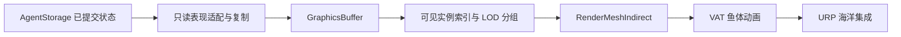

# 后续表现层：GPU 鱼群、VAT 与海洋

状态：接口与路线规划，未实现。更新：2026-09-29。Phase 3 只交付轻量算法调试显示；本文件不要求现在编写 GPU、VAT 或海洋代码，也不创建实际分支。

## 1. 最终演示目标与边界

目标是“大规模 3D 鱼群在复杂海洋环境中自主寻路 + ORCA 群体避障”。导航与运动由 CPU/Jobs 核心负责，表现层读取完成的状态。海洋画面、鱼形网格、动画、相机和光照都不成为寻路依赖。

先完成 [Phase 3](PHASE3_PLAN.md) 的真实 XYZ 静动态导航。开发 GPU 表现时保持一套可关闭渲染的核心场景，分别记录仿真、上传、GPU 与端到端开销。渲染剔除/LOD 不移除物理 agent，也不能解决 CPU 窄口排队问题。

## 2. 现在约定、之后实施的接口

保留 `ISimulationPresenter` 的只读和提交后调用原则；以下为未来适配数据，不向 AgentStorage 增加 GraphicsBuffer，不提前修改现有接口。

| 数据边界 | 拟议字段 / 约束 | 生命周期 |
| --- | --- | --- |
| 核心 → 表现快照 | Tick、SimulationTime、Count、稳定 ID、float3 位置/速度、半径；目标/求解状态按需附加 | 仅在 World Ready 后读取；异步使用前复制到表现层自有缓冲 |
| 表现实例状态 | 位置、朝向 quaternion、缩放、颜色/种类、动画相位/速度、LOD 分组 | 朝向由速度推导，近零速保留上次朝向；稳定 ID 关联外观，不把数组槽位当永久身份 |
| 表现 → GPU | 显式布局的实例数组、可见实例索引、绘制参数 | renderer 自己创建/扩容/释放，字段对齐与 stride 在实现时固定；与 CPU 核心内存解耦 |
| 调试数据 | 选中 agent、路径、邻居、约束、扫掠/恢复状态 | 独立小容量通道，关闭时不上传全体约束 |
| 地图显示 | 不可变体积版本、障碍外表面/分块边界 | 版本变化时重建，不逐帧转换全部体素 |

若以后做插值，只在前后两次已完成状态之间生成显示姿态，不写回位置/速度、不外推物理结果。异步 GPU 读取必须保证上传缓冲在 GPU 用完前不被复用；Reset/释放同样尊重该生命周期。Phase 3 不为这些行为加入每 Tick GPU 同步。

## 3. GPU 呈现实施顺序

1. **简单实例网格。** 先上传球体/低模鱼，确认坐标、朝向、缩放、ID 和 Reset 正确，再采用间接绘制。暂不加 VAT 或海洋，以便定位问题。
2. **剔除与 LOD。** 按可见性生成实例索引，各 mesh/material/LOD 使用独立分组与绘制命令；验证阴影等额外 pass 的成本。Unity 的 `RenderMeshIndirect` 接收间接参数，但 `worldBounds` 是整批裁剪/排序边界，不能把它当作自动逐实例 GPU 剔除；绘制参数使用 `GraphicsBuffer.IndirectDrawIndexedArgs` 的平台布局。[Unity 6 API](https://docs.unity3d.com/6000.0/Documentation/ScriptReference/Graphics.RenderMeshIndirect.html)
3. **VAT 鱼群。** 增加动画资产、每实例相位和由速度驱动的播放速率。鱼形轮廓与球形碰撞代理的差异必须可见；采用能包住需要保护部位的半径，或明确纯视觉尾鳍可能相交。弯曲/摇摆不得改变导航位置。
4. **URP 海洋。** 加入海面、水下雾、色调、深度和必要的光照效果；先确认低成本基础组合，再加反射、折射、泡沫等选项。效果质量可缩放，导航能在关闭海洋时运行。

GPU buffer 的创建、上传与显式释放依据 [Unity GraphicsBuffer](https://docs.unity3d.com/6000.0/Documentation/ScriptReference/GraphicsBuffer.html)；目标平台能力和缺少 compute 支持时的轻量回退在实施时确定，不把高端渲染要求施加给算法测试。

## 4. 用户提供的海洋参考

保留 [Shadertoy MdlXz8](https://www.shadertoy.com/view/MdlXz8) 作为视觉研究入口。本次网页抓取失败，未核实其源码、作者许可、依赖、可移植性或实际性能，因此不把“高性能”写成已测结论，也不承诺原样接入 URP。

实施海洋时再查看原作、许可和完整依赖：确认它是屏幕空间/射线步进还是网格海面方案，哪些效果可提取到 URP，是否需要深度、相机或环境贴图；先做隔离原型再决定移植范围。最终画面以鱼群观察和性能预算为准，不能让海面遮挡全部算法观察入口。

海面几何与仿真边界分开。若要让鱼随浪、海流或流体运动，属于动力学/导航模型扩展，需要重新定义 preferred、可行速度和安全检查，不作为渲染附带功能实现。

## 5. 完成等级与报告

Phase 4 开工前记录 Phase 3 的功能完成情况及未解决的压力档问题。Phase 4 分别给出纯仿真、简单网格、GPU 剔除/LOD、VAT、海洋各档结果，区分 CPU Tick、上传耗时、GPU frame、显存与整体 FPS。没有测量之前不承诺大规模数量或帧率。

稀疏体素、分层路径图、大世界流式加载归导航扩展，是否实施由体积内存/搜索成本决定。它们可以与后续表现开发独立排期，不因开始做海洋就自动成为必做项。
