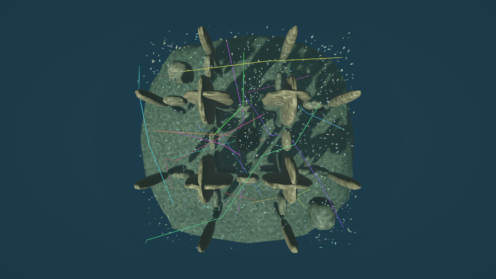
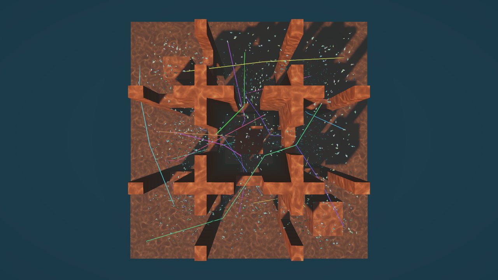

# 多区域、多通路礁石场景与 2048 agents（2026-10-06）

> 已保存的多通路场景验证记录；测试 XML 对应 2026-10-06 的运行。本次 2026-10-07 文档整理未重跑，当前框架与阅读入口见 [ARCHITECTURE.md](ARCHITECTURE.md)。

本轮按用户澄清重做地图拓扑，取代“加密中央洞口”的布局。焦散采样沿用已完成的去重复版本；A*、ORCA 和搜索预算没有替换为 JPS。

## 已实现的布局

| 项目 | 当前实现 |
| --- | --- |
| 地图 | 96 m 立方体，192³，0.5 m 体素；粗体素仍为 4 m |
| 空间区域 | 水平 3×3，加上下两层，共 18 个起终点区域 |
| 区域连接 | 12 个空间位置不同的连接口，每个有上下开口，共 24 个通口；另有外围环路和越顶空间 |
| 障碍 | 48 个预规划体积，礁石网格生成在这些体积内；不是往旧洞口叠加石柱 |
| agents | 默认 2048；UI 档位 128 / 1024 / 2048 |
| 起终点 | 每个区域有 113–114 个起点；目标循环覆盖其他区域，不再只有左右两端 |
| 展示 | 总览、俯视、跟拍、导航代理开关、18 条真实剩余路径抽样 |

设计源为 `Assets/RVO/Editor/ReefRouteLayout.cs`。其中简化长方体定义地图结构，`OceanReefBuilder` 随后生成包裹在体积内的礁石并烘焙同一组保守代理。三维路径可经不同区域绕行和改变深度，单个连接口不是全图必经之路。当前配置、数据流与布局说明见 [项目架构](ARCHITECTURE.md#reef)。

## 实际分流证据

记录每个 Tick 的扫掠轨迹与区域边界交点，而不是仅用静态连通性推断流量。每个通口分别保存通过事件和独立 agent 数；单条鱼可能经过多个通口，不能把表中的独立数相加当作鱼总数。

| 边界 | 通口沿向坐标 | 下层独立 agents | 上层独立 agents |
| --- | ---: | ---: | ---: |
| X = −16 | Z = −30 | 61 | 164 |
| X = −16 | Z = 0 | 213 | 231 |
| X = −16 | Z = 30 | 147 | 68 |
| X = 16 | Z = −30 | 119 | 111 |
| X = 16 | Z = 0 | 317 | 119 |
| X = 16 | Z = 30 | 59 | 159 |
| Z = −16 | X = −30 | 109 | 115 |
| Z = −16 | X = 0 | 311 | 125 |
| Z = −16 | X = 30 | 64 | 145 |
| Z = 16 | X = −30 | 147 | 52 |
| Z = 16 | X = 0 | 125 | 328 |
| Z = 16 | X = 30 | 102 | 96 |

三次运行的通口统计一致。全部 12 个连接位置、全部 24 个开口都被使用，每个开口 52–328 条鱼。此外记录到外围环路跨界 301 次、越顶跨界 45 次，单独计数，不计入上述通口。

2048 对起终点中，1767 对（86.3%）直线受到障碍阻挡，需要搜索绕行；281 对可直达。位移超过 20 m 的流向计数为：+X/−X = 660/659，+Y/−Y = 552/551，+Z/−Z = 673/653。一个请求可计入多个轴向，数据证明起终点不再集中于两个大方向。

原始证据位于 `Verification/ReefNetwork2048/Final/`：`spawns-*.csv`、`portals-*.csv`、`bypasses-*.txt`。

## 性能与安全

环境：Unity 6000.0.63f1、i7-12650H、Jobs/Burst、seed 7、30 Hz。每次独立创建世界，连续运行 1800 ticks（60 秒仿真时间），共 3 次。使用独立小世界预热、共享不可变解码地图及已预热的地标表；不是冷启动地标构建基准。原计时器元数据中“每次重新解码”不符合 `BakedNavigationVolume.Load` 的缓存行为，本轮已更正这一表述。

| 指标 | 三次正式结果 |
| --- | ---: |
| Tick P95 | 12.830–13.014 ms |
| Tick P99 | 16.275–17.048 ms |
| 导航均值（三次平均） | 1.459 ms |
| 邻居查询均值 | 4.127 ms |
| 避碰均值 | 1.551 ms |
| 首路径等待 P50 / P95 / 最大 | 1.533 / 3.467 / 3.667 s |
| 全部到达 | tick 1059，约 35.3 s；2048/2048 |
| 最长连续低速等待 | 3.6 s |
| 请求 / 粗图成功 / 细图回退 | 6099 / 3508 / 0 |
| 扩展节点 | 84,146 |
| 最终未就绪 / 未到达 / 失败 | 0 / 0 / 0 |
| 逐 Tick 静态扫掠违规 | 0 |
| 每 30 Tick 抽样成对扫掠碰撞 | 0 |
| Tick 内主线程托管分配 | 0 B |

平均耗时仍主要在邻居查询，约占导航、邻居、避碰、积分四阶段总均值的 58%。地图扩大并分散起终点后，agent 翻倍不等同于局部密度翻倍；不能用这组结果声称算法获得了等比例加速。

计时不含渲染、HUD、路径示踪、路线统计和安全观察；它不是整帧或 GPU 性能结论。成对碰撞只做抽样，零计数不等于逐 Tick 成对安全证明。静态扫掠逐 Tick 检查所有 agents。

## UI 与操作

打开 `Assets/RVO/Demo/OceanReef/OceanReefLive.unity` 后进入 Play，或使用 **Tools → RVO → Open Reef Presentation**。

- 左侧默认显示当前 coarse + fine A*、权重、待寻路/行进/到达/失败、首路径进度、扩展节点、粗细图统计、Tick、相对渲染帧数、仿真时间、单 Tick 耗时及掉 Tick 数。
- 保留暂停、单步、重置、数量档位和 ORCA/查询/后端切换。
- 右下角可开关 18 条实际剩余路径，按固定分散样本选择，未就绪或已到达的路径隐藏。
- 底部镜头按钮在总览、跟拍、俯视间切换；导航代理开关用于查看简化体积。

实景 PlayMode 检查在 tick 120 确认：2048 agents、HUD 已启用、首路径全部就绪、失败为 0、18 条抽样路径有效。证据：`presentation-state.txt`。

## 验证与画面

- **32/32 EditMode 通过**：多通口几何、2048 分散出生/目标间距和可通行性、六方向覆盖、跨数量前缀稳定性，以及既有三维导航/交通恢复回归。
- **1/1 PlayMode 通过**：真实场景、2048 agents、策略 HUD 状态和路径示踪生命周期。
- 检查了连续三个时间点的总览、俯视和简化代理画面。图像为离屏场景渲染，包含路径线，不包含 IMGUI 面板；HUD 的运行状态由 PlayMode 检查并在正常 Game 视图显示。





## 重现

先关闭占用本项目的 Unity 实例，选用尚不存在的证据目录：

```powershell
./Documentation/RVO/RunReefNetwork2048.ps1 -Stage Profile -Output Documentation/RVO/Verification/ReefNetwork2048/Reprofile
./Documentation/RVO/RunReefNetwork2048.ps1 -Stage Tests -Output Documentation/RVO/Verification/ReefNetwork2048/Retest
./Documentation/RVO/RunReefNetwork2048.ps1 -Stage Capture -Output Documentation/RVO/Verification/ReefNetwork2048/Recapture
```

`Profile` 重建当前场景和导航资产并测量；`Tests` 运行本轮回归；`Capture` 输出总览、俯视、代理体的连续帧。正式数据以 `Final` 为准，`Pilot` 为试跑。
